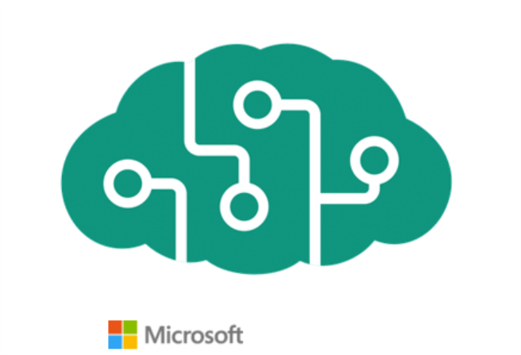
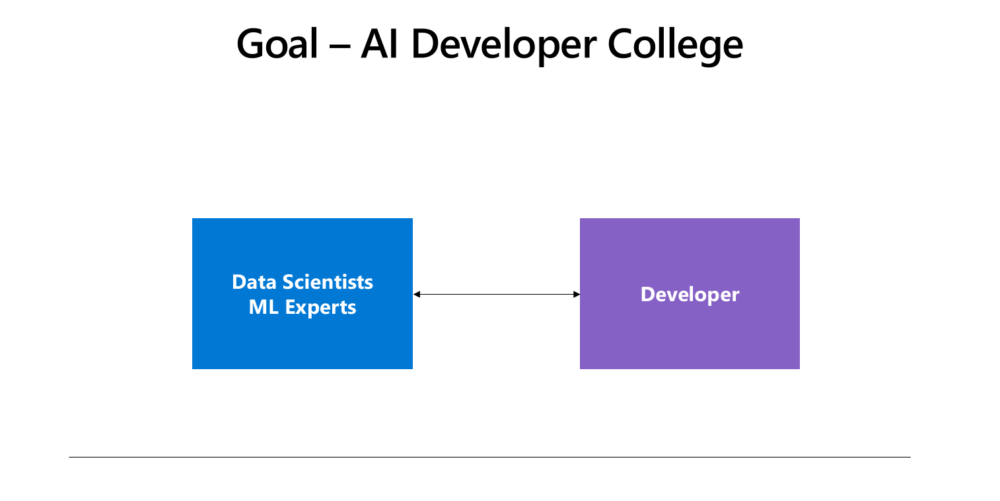
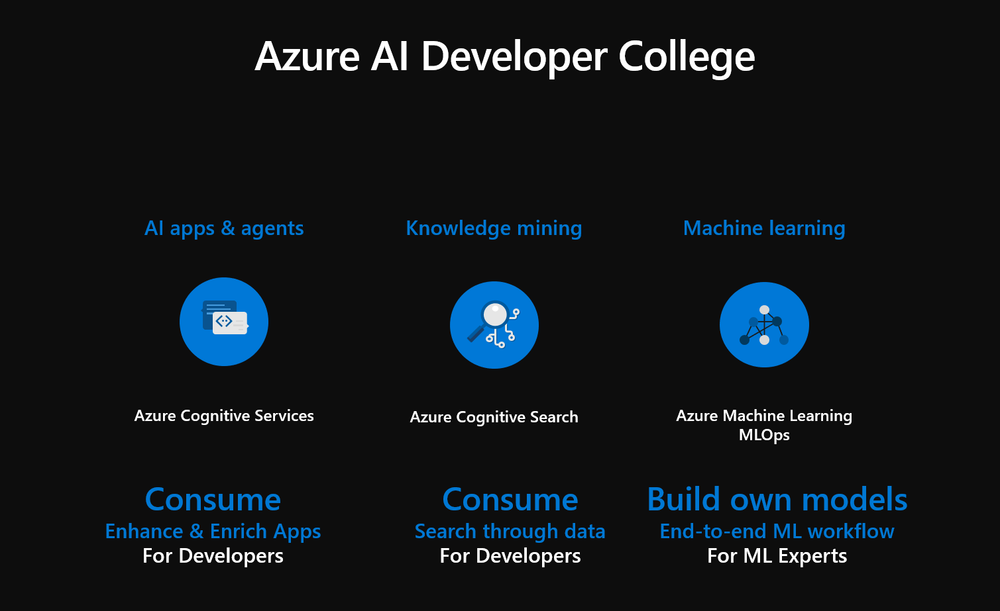

  <h1>Welcome to the AI Developer College!</h1>
  
The AI Developer College is a two-days training for AI developers.

  
   

  

    Built with ❤︎ by the
      <a href="https://github.com/CSA-OCP-GER">Microsoft Cloud Solution Architects from Germany</a>
    
  

## Goal of the AI Developer College

The goal is to show developers the tools of machine learning (ml) experts and vice versa. We want to connect both worlds. Since we noticed that there is a huge gap between both sides. As ml experts deliver pre-trained machine learning models as restful endpoint to the developers (or to the business) and developers use those REST APIs to integrate them in their applications, it is essential that both sides understand both worlds. To close the gap we will start with the ml experts view and switch then to the developer view.

## Goal of the AI Developer College Training Days

On Day 1 we will use Azure Machine Learning Workspace. Here we will start by training our own model, testing and registering it and deploying the model on Azure Container Instance and Azure Kubernetes using Jupyter Notebook a popular tool for prototyping highly used by ml experts. In this case our goal as a ml expert is to provide a REST API with a trained model behind the scenes that can be consumed by an application.

Once we have seen the ml experts view we will switch to the developer or DevOps side of things. For operationalization of the model we need DevOps in this case called Machine Learning Operations (MLOps). For this challenge we have prepared a configuration file which automatically deploys a Workspace, trains and registers a model and deploys it to Azure Container Instance and Azure Kubernetes Service. To sum it up, everything we have done manually will be automated for us later today.

On Day 2 we will stay in the developer view by using existing endpoints with pre-trained machine models behind the scenes. For this we will focus on our managed services like Azure Cognitive Search and Azure Cognitive Services and explore some of our convenient tools to create custom machine learning models like LUIS and Custom Vision. As a developer I can use those REST APIs and enrich my applications without having deep ml expert knowledge.
As final challenge we have prepared a small application which adopts a pre-trained object detection model. This shows the entire lifecycle and brings together best of both worlds.

  
 ML Experts ❤︎ Developers

 

This workshop consists of multiple challenges, you have to complete. Your trainers will guide you through the workshop by giving you introduction talks to each of the topics/challenges you have to complete.

Here's the overview of the training week. Happy hacking!

- [Day 1 - Azure Machine Learning Service & MLOps](day1/AzureMachineLearningService/README.md)
- [Day 2 - Cognitive Search](day2/CognitiveSearch/CognitiveSearch.md)
- [Day 2 - Cognitive Services](day2/CognitiveServices/Challenge/CognitiveServices.md)
- [Day 2 - Form Recognizer](day2/Formrecognizer/Formrecognizer.md)
- [Day 2 - Cognitive Services Kitchen Sink App](https://github.com/azuredevcollege/cognitive-services-kitchen-sink)

## Contributing

This project welcomes contributions and suggestions. Most contributions require you to agree to a
Contributor License Agreement (CLA) declaring that you have the right to, and actually do, grant us
the rights to use your contribution. For details, visit <https://cla.microsoft.com.>

When you submit a pull request, a CLA-bot will automatically determine whether you need to provide
a CLA and decorate the PR appropriately (e.g., label, comment). Simply follow the instructions
provided by the bot. You will only need to do this once across all repos using our CLA.

This project has adopted the [Microsoft Open Source Code of Conduct](https://opensource.microsoft.com/codeofconduct/).
For more information see the [Code of Conduct FAQ](https://opensource.microsoft.com/codeofconduct/faq/) or
contact [opencode@microsoft.com](mailto:opencode@microsoft.com) with any additional questions or comments.
