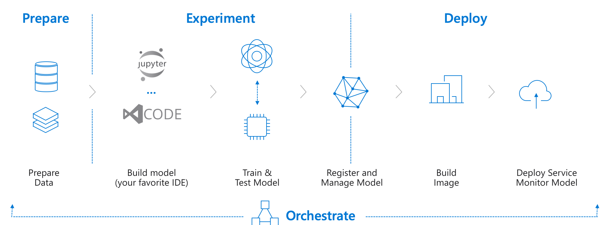

# AI Developer College

Here are the top two resources you'll need today:

1. [Azure Machine Learning Services documentation](https://docs.microsoft.com/en-us/azure/machine-learning/service/)
1. [Azure Machine Learning SDK for Python documentation](https://docs.microsoft.com/en-us/python/api/overview/azure/ml/intro?view=azure-ml-py)

# Challenges

## Challenge 1 - Basic model training on Azure

:zap: Let's go to **[challenge 1](challenges/challenge_01.md)**!

In this first challenge, you'll be training a basic machine learning model on Azure. We'll be using the popular MNIST dataset, as it allows us to focus on getting familiar with the mechanics of Azure Machine Learning. MNIST is a data set containing:

- 60000 hand-written digits as training data
- 10000 hand-written digits as testing data

Here are some examples:

The goal is to build a machine learning model, that

- takes an unseen image as an input (28x28 pixels) and
- outputs if there was a 0, 1, 2, 3, 4, 5, 6, 7, 8 or 9 on the image

Guidance:

- Deploy from Azure Portal: `Machine Learning service workspace`
- Write your code in a Jupyter Notebook in a [Compute VM](https://docs.microsoft.com/en-us/azure/machine-learning/service/quickstart-run-cloud-notebook) and use the [new Azure ML UI](https://ml.azure.com)
- Use `Python 3.6 - AzureML` as the Notebook type in Jupyter (create a new folder before starting)
- We'll be using `scikit-learn` to train a simple `LogisticRegression` classifier
- Target accuracy of our model on the test data set: `>92%`

## Challenge 2 - Advanced model training on Azure

:zap: Let's go to **[challenge 2](challenges/challenge_02.md)**!

In this challenge, you'll be training a more advanced machine learning model on Azure (in fact, you'll be training a Deep Convolution Neural Network). We'll be using the same data set, but this time, we'll use Azure Machine Learning Compute for speeding up and scaling our training.

Guidance:

- Use `Keras` with a TensorFlow backend to train a Convolution Neural Network on Azure Machine Learning Compute
- Target accuracy of our model on the test data set: `>99%`

## Challenge 3 - Model deployment on Azure

:zap: Let's go to **[challenge 3](challenges/challenge_03.md)**!

In this third challenge, you'll be taking the model you've trained in the second challenge and deploy it to Azure Container Instances (ACI). This is perfect for test/dev scenarios and giving our model a quick test drive (we'll get to production deployments in a later challenge).

Guidance:

- Take the model from challenge 2 and containerize it (Azure ML will do most of that for us)
- Deploy it on ACI as a RESTful API

## Challenge 4 - Automated Machine Learning

:zap: Let's got to **[challenge 4](challenges/challenge_04.md)**!

In this challenge, you'll be using Automated Machine Learning to let Azure figure out which Machine Learning algorithm performs best on our dataset. We'll fully leverage the Azure Portal for that, hence no coding needed!

Guidance:

- Create an `Automated Machine Learning` experiment in your Azure Machine Learning Workspace
- Take the [`pima-indians-diabetes.csv`](data/pima-indians-diabetes.csv) dataset as the input
- Let it figure out the best performing model
- **Bonus points**: Deploy the model to ACI as a scoring endpoint (takes just a few clicks)

## Challenge 5 - Production deployment to Azure Kubernetes Service (AKS)

:zap: Let's go to **[challenge 5](challenges/challenge_05.md)**!

In this last challenge, you'll be training a model and deploying the model to showcase how you can use AutoML for a simple classification problem. This model will predict if a credit card transaction is considered a fraudulent charge. But this time we'll deploy the model to Azure Kubernetes Service (AKS). Since this will mimic a production deployment, we want to make sure to enable authentication and telemetry monitoring (using Application Insights) for our model!

Guidance:

- Create an `Automated Machine Learning` experiment, train, register and deploy the model via Python
- Retrieve the scoring script and the environment file from the `Automated Machine Learning` experiment
- Take the [`creditcard.csv`](data/creditcard.csv) dataset as the input
- Create a AKS cluster
- Deploy the model with authentication and [monitoring](https://docs.microsoft.com/en-us/azure/machine-learning/service/how-to-enable-app-insights)

# Recommended Certifications

- [Exam AI-100: Designing and Implementing an Azure AI Solution](https://www.microsoft.com/en-us/learning/exam-ai-100.aspx) - mostly focussed on AI, Machine Learning and in some cases also IoT as an use case
- [Exam DP-100: Designing and Implementing a Data Science Solution on Azure](https://www.microsoft.com/en-us/learning/exam-dp-100.aspx) - very Data Science focussed, requires general Machine Learning knowledge (methologies, algorithms, etc.)
- [Exam DP-200: Implementing an Azure Data Solution](https://www.microsoft.com/en-us/learning/exam-dp-200.aspx) - focussed on the data side for a doing point of view (storing, securing, etc.)
- [Exam DP-201: Designing an Azure Data Solution](https://www.microsoft.com/en-us/learning/exam-dp-201.aspx) - focussed on the data side from an architectural point of view (storing, securing, etc.)

# Further Trainings

- :star: [Microsoft Learn - Machine Learning](https://docs.microsoft.com/en-us/learn/browse/?roles=data-scientist&term=machine%20learning) - great selection of short training units and exercises! :star:
- [AI Business School](https://aischool.microsoft.com) - great for gaining specific, practical knowledge for defining and implementing an AI strategy in your company (more targeted at business users, but also covers the responsible use of AI)
- [Microsoft Professional Program for Artificial Intelligence track](https://academy.microsoft.com/en-us/tracks/artificial-intelligence) - extremely in-depth and very extensive Machine Learning training (includes a lot of mandatory hands-on)

# Further Material

- :star: [Azure Machine Learning Notebook Samples](https://github.com/Azure/MachineLearningNotebooks) - this should solve 99% of your problems :star:
- [Azure Machine Learning Overview](https://azure.microsoft.com/en-us/blog/azure-ai-making-ai-real-for-business/)
- [Azure Machine Learning Overview - What's new](https://azure.microsoft.com/en-us/blog/what-s-new-in-azure-machine-learning-service/)
- [Automated Machine Learning Overview](https://azure.microsoft.com/en-us/blog/announcing-automated-ml-capability-in-azure-machine-learning/)
- [Hyperparameter Tuning](https://docs.microsoft.com/en-us/azure/machine-learning/service/how-to-tune-hyperparameters)
- [Understand automated machine learning results](https://docs.microsoft.com/en-us/azure/machine-learning/service/how-to-understand-automated-ml)
- Distributed Training with [TensorFlow or Keras](https://docs.microsoft.com/en-us/azure/machine-learning/service/how-to-train-tensorflow#distributed-training) and [PyTorch](https://docs.microsoft.com/en-us/azure/machine-learning/service/how-to-train-pytorch#distributed-training)
- [AI Tools for VS Code](https://visualstudio.microsoft.com/downloads/ai-tools-vscode/)
- [PyTorch Support for Azure ML](https://azure.microsoft.com/en-us/blog/world-class-pytorch-support-on-azure/)
- [Azure Machine Learning Pipelines](https://docs.microsoft.com/en-us/azure/machine-learning/service/concept-ml-pipelines)
- [MLOps with Azure ML](https://github.com/microsoft/MLOpsPython) - running a ML Pipeline in Azure DevOps
- [DevOps for AI: Deploying everywhere (Build 2018)](https://www.youtube.com/watch?v=Fo220toRwhM) - might be not fully up to date but gives some good ideas
