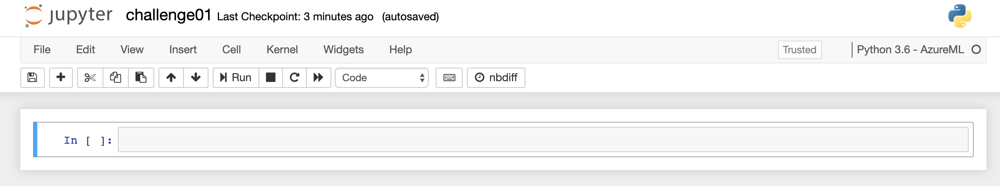

# Challenge 1

## Setup part
Before we learn how a Data Scientist can work with Azure Machine Learning, we first need to create an Azure Machine Learning Workspace. 

In the Azure Portal, first we create a `Resource Group` and name it `aidevcollege`:


Once the Resource Group is created, select **+ Create a resource** in the upper-left corner of Azure portal,

Use the search bar to find **Machine Learning**.

Select **Machine Learning**.

In the Machine Learning pane, select **Create** to begin.


Use the following inputs to create the Azure Machine Learning Workspace:

* Workspace name: `aidevcollege`
* Resource Group: `aidevcollege`
* Location: `West Europe`
* Leave the rest at default and create the service.

It should look like this:


Let's have a look at our Resource Group, which should look like this:


* Application Insights - used for monitoring our models in production (will be used later)
* Storage account - this will store our logs, model outputs, training/testing data, etc.
* Key vault - stores our secrets
* Machine Learning service workspace - the center point for Machine Learning on Azure

Now we can either launch the `Machine Learning service workspace` from the portal or we can open the [Azure Machine Learning Studio](https://ml.azure.com/) directly.


## Creating a Compute Instance

Launch the `Machine Learning service workspace` and navigate to **Compute** so we can create a new `Compute Instance.`
A compute instance can be used as fully configured and managed development environment in the cloud for machine learning.
The Compute Instance actually sits inside this `Machine Learning service workspace`. It is just a **regular Azure Virtual Machine**.
**Azure Machine Learning Service Workspace is the "umbrella" that groups all your machine learning resources**


Hit `Create`, select `STANDARD_D3_V2` and give it a unique name:


It'll take a few minutes until the Compute Instance has been created. This Compute Instance provides us with the same Jupyter environment. In this exercise, we'll use this Compute Instance to train a simple Machine Learning model. In a real-world setup, we might consider using a GPU-enabled instance, in case we need to perform Deep Learning or just rely on Azure Machine Learning Compute (challenge 2).

> Behind the scenes a Azure Virtual Machine will be deployed:

> For more Details check out the following [documentation](https://docs.microsoft.com/en-us/azure/machine-learning/concept-compute-instance)

Once it is running, the UI will already give us links to `Jupyter`, `JupyterLab` and `RStudio`. To keep things simple, we'll use `Jupyter` throughout this ai dev college, but if you feel adventurous, use `JupyerLab` or `RStudio` solving the challenges in R.


## Initial Azure Machine Learning Setup

Inside the newly created Compute Instance, first create a new folder via the `New` button on the top right of Jupyter. *Everything we'll do in this workshop should happen in this folder*. We will call this **folder:** `aidevcollege`. This is because Machine Learning Services will persist the whole contents of the experiment's folder, which exceeds the limit when you run your Jupyter Notebooks in the root folder.


> **Note:** The next block is **not** needed, but you'd need it if you want to connect to your Azure Machine Learning Workspace from e.g., your local machine. Since the `Compute Instance` runs inside the workspace, it automatically connects to the workspace it lives in.

<details>
Next, create a text file called `config.json` (also via the `New` button) and replace the values with your own (you'll find your Subscription ID in the Azure Portal at the top of your Resource Group):

```json
 # Ignore this block, unless you run Jupyer directly on e.g., your laptop
 {
    "subscription_id": "xxxxxxx-xxxx-xxxx-xxxx-xxxxxxxxx",
    "resource_group": "aidevcollege",
    "workspace_name": "aidevcollege"
 }
 ```


</details>

Finally, we can click the `New` button and create a new Notebook of type: `Python 3.8 - AzureML`. A new browser tab should open up and we can click the name `Untitled` and rename it to `challenge01.ipynb`. 

> To quickly create **new cells** you select the **first cell** (make sure it is in *Code mode* and highlighted by the color blue on the left hand side) and type **`b`** it will add another cell *below* the first cell. 



## Run a notebook from your workspace

Azure Machine Learning includes a cloud notebook server in your workspace for an install-free and pre-configured experience. Use [your own environment](how-to-configure-environment-v1.md) if you prefer to have control over your environment, packages, and dependencies.

## Run your notebook

1. On the top bar, select the compute instance you created during the  [Quickstart: Get started with Azure Machine Learning](quickstart-create-resources.md)  to use for running the notebook.

2. Make sure that the kernel, found on the top right, is `Python 3.10 - SDK v2`.  If not, use the dropdown to select this kernel.

:::image type="content" source="media/tutorial-azure-ml-in-a-day/set-kernel.png" alt-text="Screenshot: Set the kernel.":::

Make sure that the kernel, found on the top right, is `Python 3.10 - SDK v2`.  If not, use the dropdown to select this kernel.

:::image type="content" source="media/tutorial-azure-ml-in-a-day/set-kernel.png" alt-text="Screenshot: Set the kernel.":::


> **The rest of this tutorial contains cells of the tutorial notebook.  Copy/paste them into your new notebook, or switch to the notebook now if you cloned it.**
>
> To run a single code cell in a notebook, click the code cell and hit **Shift+Enter**. Or, run the entire notebook by choosing **Run all** from the top toolbar.

## Connect to the workspace

Before you dive in the code, you'll need to connect to your Azure ML workspace. The workspace is the top-level resource for Azure Machine Learning, providing a centralized place to work with all the artifacts you create when you use Azure Machine Learning.

We're using DefaultAzureCredential to get access to workspace. DefaultAzureCredential is used to handle most Azure SDK authentication scenarios.

Reference for more available credentials if it doesn't work for you: [azure-identity reference doc](https://learn.microsoft.com/en-gb/python/api/azure-identity/azure.identity?view=azure-python).

```python
# Handle to the workspace
from azure.ai.ml import MLClient

# Authentication package
from azure.identity import DefaultAzureCredential

credential = DefaultAzureCredential()
```
However, in this If you want to use a browser to login and authenticate, you can use the following code instead. In this example, you'll use the DefaultAzureCredential.

```python
# Handle to the workspace
# from azure.ai.ml import MLClient

# Authentication package
# from azure.identity import InteractiveBrowserCredential
# credential = InteractiveBrowserCredential()
```

In the next cell, enter your Subscription ID, Resource Group name and Workspace name. To find these values:

1. In the upper right Azure Machine Learning studio toolbar, select your workspace name.
1. Copy the value for workspace, resource group and subscription ID into the code.  
1. You'll need to copy one value, close the area and paste, then come back for the next one.

:::image type="content" source="media/tutorial-azure-ml-in-a-day/find-credentials.png" alt-text="Screenshot: find the credentials for your code in the upper right of the toolbar.":::

```python
# Handle to the workspace
from azure.ai.ml import MLClient

# Authentication package
from azure.identity import DefaultAzureCredential

credential = DefaultAzureCredential()
```
The result is a handler to the workspace that you'll use to manage other resources and jobs.

> **Creating MLClient will not connect to the workspace. The client initialization is lazy, it will wait for the first time it needs to make a call (in the notebook below, that will happen during compute creation).**

## Create a compute resource to run your job

You'll need a compute resource for running a job. It can be single or multi-node machines with Linux or Windows OS, or a specific compute fabric like Spark.

You'll provision a Linux compute cluster. See the [full list on VM sizes and prices](https://azure.microsoft.com/pricing/details/machine-learning/) .

For this example, you only need a basic cluster, so you'll use a Standard_DS3_v2 model with 2 vCPU cores, 7-GB RAM and create an Azure ML Compute.

```python
from azure.ai.ml.entities import AmlCompute

# Name assigned to the compute cluster
cpu_compute_target = "cpu-cluster"

try:
    # let's see if the compute target already exists
    cpu_cluster = ml_client.compute.get(cpu_compute_target)
    print(
        f"You already have a cluster named {cpu_compute_target}, we'll reuse it as is."
    )

except Exception:
    print("Creating a new cpu compute target...")

    # Let's create the Azure ML compute object with the intended parameters
    cpu_cluster = AmlCompute(
        name=cpu_compute_target,
        # Azure ML Compute is the on-demand VM service
        type="amlcompute",
        # VM Family
        size="STANDARD_DS3_V2",
        # Minimum running nodes when there is no job running
        min_instances=0,
        # Nodes in cluster
        max_instances=4,
        # How many seconds will the node running after the job termination
        idle_time_before_scale_down=180,
        # Dedicated or LowPriority. The latter is cheaper but there is a chance of job termination
        tier="Dedicated",
    )

    # Now, we pass the object to MLClient's create_or_update method
    cpu_cluster = ml_client.compute.begin_create_or_update(cpu_cluster)

print(
    f"AMLCompute with name {cpu_cluster.name} is created, the compute size is {cpu_cluster.size}"
)
```

## Create a job environment

To run your AzureML job on your compute resource, you'll need an [environment](concept-environments.md). An environment lists the software runtime and libraries that you want installed on the compute where you’ll be training. It's similar to your Python environment on your local machine.

AzureML provides many curated or ready-made environments, which are useful for common training and inference scenarios. You can also create your own custom environments using a docker image, or a conda configuration.

In this example, you'll create a custom conda environment for your jobs, using a conda yaml file.

First, create a directory to store the file in.
```python
# Handle to the workspace
from azure.ai.ml import MLClient

# Authentication package
from azure.identity import DefaultAzureCredential

credential = DefaultAzureCredential()
```

Now, create the file in the dependencies directory. The cell below uses IPython magic to write the file into the directory you just created.
```python
%%writefile {dependencies_dir}/conda.yml
name: model-env
channels:
  - conda-forge
dependencies:
  - python=3.8
  - numpy=1.21.2
  - pip=21.2.4
  - scikit-learn=0.24.2
  - scipy=1.7.1
  - pandas>=1.1,<1.2
  - pip:
    - inference-schema[numpy-support]==1.3.0
    - xlrd==2.0.1
    - mlflow== 1.26.1
    - azureml-mlflow==1.42.0
    - psutil>=5.8,<5.9
    - tqdm>=4.59,<4.60
    - ipykernel~=6.0
    - matplotlib
```

The specification contains some usual packages, that you'll use in your job (numpy, pip).

Reference this *yaml* file to create and register this custom environment in your workspace:
```python
from azure.ai.ml.entities import Environment

custom_env_name = "aml-scikit-learn"

pipeline_job_env = Environment(
    name=custom_env_name,
    description="Custom environment for Credit Card Defaults pipeline",
    tags={"scikit-learn": "0.24.2"},
    conda_file=os.path.join(dependencies_dir, "conda.yml"),
    image="mcr.microsoft.com/azureml/openmpi3.1.2-ubuntu18.04:latest",
)
pipeline_job_env = ml_client.environments.create_or_update(pipeline_job_env)

print(
    f"Environment with name {pipeline_job_env.name} is registered to workspace, the environment version is {pipeline_job_env.version}"
)
```

## What is a command job?

You'll create an Azure ML *command job* to train a model for credit default prediction. The command job is used to run a *training script* in a specified environment on a specified compute resource.  You've already created the environment and the compute resource.  Next you'll create the training script.

The *training script* handles the data preparation, training and registering of the trained model. In this tutorial, you'll create a Python training script.

Command jobs can be run from CLI, Python SDK, or studio interface. In this tutorial, you'll use the Azure ML Python SDK v2 to create and run the command job.

After running the training job, you'll deploy the model, then use it to produce a prediction.


## Create training script

Let's start by creating the training script - the *main.py* Python file.

First create a source folder for the script:
```python
import os

train_src_dir = "./src"
os.makedirs(train_src_dir, exist_ok=True)
```

This script handles the preprocessing of the data, splitting it into test and train data. It then consumes this data to train a tree based model and return the output model. 

[MLFlow](https://mlflow.org/docs/latest/tracking.html) will be used to log the parameters and metrics during our pipeline run.

The cell below uses IPython magic to write the training script into the directory you just created.
```python
%%writefile {train_src_dir}/main.py
import os
import argparse
import pandas as pd
import mlflow
import mlflow.sklearn
from sklearn.ensemble import GradientBoostingClassifier
from sklearn.metrics import classification_report
from sklearn.model_selection import train_test_split

def main():
    """Main function of the script."""

    # input and output arguments
    parser = argparse.ArgumentParser()
    parser.add_argument("--data", type=str, help="path to input data")
    parser.add_argument("--test_train_ratio", type=float, required=False, default=0.25)
    parser.add_argument("--n_estimators", required=False, default=100, type=int)
    parser.add_argument("--learning_rate", required=False, default=0.1, type=float)
    parser.add_argument("--registered_model_name", type=str, help="model name")
    args = parser.parse_args()
   
    # Start Logging
    mlflow.start_run()

    # enable autologging
    mlflow.sklearn.autolog()

    ###################
    #<prepare the data>
    ###################
    print(" ".join(f"{k}={v}" for k, v in vars(args).items()))

    print("input data:", args.data)
    
    credit_df = pd.read_excel(args.data, header=1, index_col=0)

    mlflow.log_metric("num_samples", credit_df.shape[0])
    mlflow.log_metric("num_features", credit_df.shape[1] - 1)

    train_df, test_df = train_test_split(
        credit_df,
        test_size=args.test_train_ratio,
    )
    ####################
    #</prepare the data>
    ####################

    ##################
    #<train the model>
    ##################
    # Extracting the label column
    y_train = train_df.pop("default payment next month")

    # convert the dataframe values to array
    X_train = train_df.values

    # Extracting the label column
    y_test = test_df.pop("default payment next month")

    # convert the dataframe values to array
    X_test = test_df.values

    print(f"Training with data of shape {X_train.shape}")

    clf = GradientBoostingClassifier(
        n_estimators=args.n_estimators, learning_rate=args.learning_rate
    )
    clf.fit(X_train, y_train)

    y_pred = clf.predict(X_test)

    print(classification_report(y_test, y_pred))
    ###################
    #</train the model>
    ###################

    ##########################
    #<save and register model>
    ##########################
    # Registering the model to the workspace
    print("Registering the model via MLFlow")
    mlflow.sklearn.log_model(
        sk_model=clf,
        registered_model_name=args.registered_model_name,
        artifact_path=args.registered_model_name,
    )

    # Saving the model to a file
    mlflow.sklearn.save_model(
        sk_model=clf,
        path=os.path.join(args.registered_model_name, "trained_model"),
    )
    ###########################
    #</save and register model>
    ###########################
    
    # Stop Logging
    mlflow.end_run()

if __name__ == "__main__":
    main()
```

As you can see in this script, once the model is trained, the model file is saved and registered to the workspace. Now you can use the registered model in inferencing endpoints.

## Configure the command

Now that you have a script that can perform the desired tasks, you'll use the general purpose **command** that can run command line actions. This command line action can be directly calling system commands or by running a script. 

Here, you'll create input variables to specify the input data, split ratio, learning rate and registered model name.  The command script will:
* Use the compute created earlier to run this command.
* Use the environment created earlier - you can use the `@latest` notation to indicate the latest version of the environment when the command is run.
* Configure some metadata like display name, experiment name etc. An *experiment* is a container for all the iterations you do on a certain project. All the jobs submitted under the same experiment name would be listed next to each other in Azure ML studio.
* Configure the command line action itself - `python main.py` in this case. The inputs/outputs are accessible in the command via the `${{ ... }}` notation.

```python
from azure.ai.ml import command
from azure.ai.ml import Input

registered_model_name = "credit_defaults_model"

job = command(
    inputs=dict(
        data=Input(
            type="uri_file",
            path="https://archive.ics.uci.edu/ml/machine-learning-databases/00350/default%20of%20credit%20card%20clients.xls",
        ),
        test_train_ratio=0.2,
        learning_rate=0.25,
        registered_model_name=registered_model_name,
    ),
    code="./src/",  # location of source code
    command="python main.py --data ${{inputs.data}} --test_train_ratio ${{inputs.test_train_ratio}} --learning_rate ${{inputs.learning_rate}} --registered_model_name ${{inputs.registered_model_name}}",
    environment="aml-scikit-learn@latest",
    compute="cpu-cluster",
    experiment_name="train_model_credit_default_prediction",
    display_name="credit_default_prediction",
)
```

## Submit the job 

It's now time to submit the job to run in AzureML. This time you'll use `create_or_update`  on `ml_client.jobs`.
```python
ml_client.create_or_update(job)
```

## View job output and wait for job completion

View the job in AzureML studio by selecting the link in the output of the previous cell.

The output of this job will look like this in the AzureML studio. Explore the tabs for various details like metrics, outputs etc. Once completed, the job will register a model in your workspace as a result of training. 


> **Wait until the status of the job is complete before returning to this notebook to continue. The job will take 2 to 3 minutes to run. It could take longer (up to 10 minutes) if the compute cluster has been scaled down to zero nodes and custom environment is still building.**

In the [next challenge](challenge_02.md), we're going to register our model and deploy it as a Managed Endpoint in Azure.
