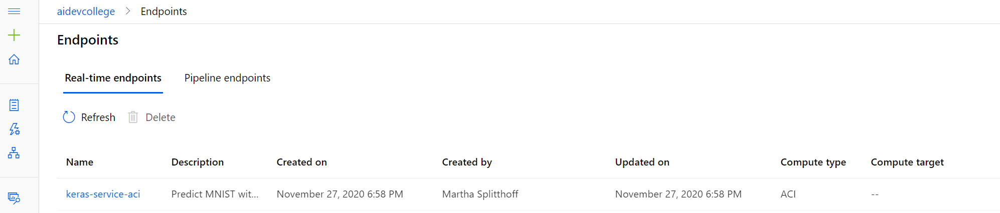
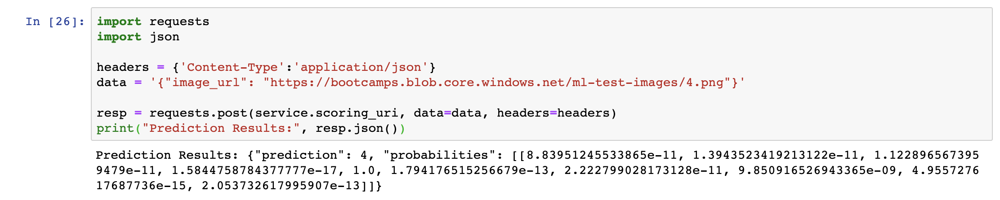

# Challenge 3

After challenge 2, we finally have a model that has an accuracy of more than 99% - time to deploy it as an API!
Hence, we'll be taking the model and we will deploy it to an [Azure Container Instances (ACI)](https://azure.microsoft.com/en-us/services/container-instances/).

**We'll reuse the notebook from challenge 2!**

As before, let's import all necessary libraries and connect to our Workspace (we're probably already connected, but better safe than sorry):

```python
from azureml.core import Workspace, Experiment, Run
import math, random, json

ws = Workspace.from_config()
```

Let's reference our registered model from challenge 2:

```python
from azureml.core.model import Model

model = Model(ws, name="keras-tf-mnist-model")

# Make sure we have the correct model
print(model.name, model.id, model.version, sep = '\t')
```

We need to write a short `score.py` script, which Azure ML understands for loading our model and exposing it as a web service. This file will be packaged as a Docker container so that we can deploy it to ACI.

```python
%%writefile score.py
import json, os, requests
import numpy as np
from io import BytesIO
from PIL import Image
from keras.models import load_model
from azureml.core.model import Model

def init():
    # The init functions load and prepares the model for scoring.
    global model
    # retreive the path to the model file using the model name
    model_path = Model.get_model_path('keras-tf-mnist-model')
    model = load_model(model_path)

def run(raw_data):
    # The run function takes raw data and passes it to the model for evaluation.
    image_url = json.loads(raw_data)['image_url']    
    image = Image.open(BytesIO(requests.get(image_url).content))
    img = 1 - (np.array(image.convert('L'), dtype=np.float32).reshape(1, 28, 28, 1) / 255.0)
    # make prediction
    y = model.predict(img)
    return json.dumps({"prediction": int(np.argmax(y)), "probabilities": y.tolist()})
```

We also need to tell Azure ML which dependencies our packaged model has (similar to when we used Azure Machine Learning Compute):

```python
from azureml.core import Environment
from azureml.core.conda_dependencies import CondaDependencies
from azureml.core.runconfig import RunConfiguration
from azureml.core import Image
from azureml.core.model import InferenceConfig, Model
from azureml.core.webservice import AciWebservice, Webservice
from azureml.core import Image

# Create a Python environment for the experiment
# Let Azure ML manage dependencies by setting user_managed_dependencies to False
# Use docker containers by setting docker.enabled to True
# Our workspace needs to know what environment to use
env = Environment("aidevcollege-env")
env.python.user_managed_dependencies = False # Let Azure ML manage dependencies
env.docker.enabled = True # Use a docker container

# Create a the pip and conda package dependencies
packages = CondaDependencies.create(pip_packages=["tensorflow","keras", "astor", 'azureml-sdk', 
                                                  'pynacl==1.2.1', 'azureml-dataprep', "pillow==5.3.0",
                                                  "azureml-defaults"])

# Add the package dependencies to the Python environment for the experiment
env.python.conda_dependencies = packages

# Combine scoring script & environment in Inference configuration
inference_config = InferenceConfig(entry_script="score.py", environment=env)

```

Finally, we are able to configure our Azure Container Instance and deploy our model as an API:

```python
from azureml.core.webservice import AciWebservice, Webservice
from azureml.core.model import InferenceConfig, Model

# Set deployment configuration
deployment_config = AciWebservice.deploy_configuration(
                                                cpu_cores=1, 
                                                memory_gb=1, 
                                                tags={"data": "MNIST",  "method" : "keras-tf"}, 
                                                description='Predict MNIST with Keras and TensorFlow')


# Define the model, inference, & deployment configuration and web service name and location to deploy
service = Model.deploy(
    workspace = ws,
    name = "keras-service-aci",
    models = [model],
    inference_config = inference_config,
    deployment_config = deployment_config)

service.wait_for_deployment(show_output=True)
```

The first deployment should take around 5-8 minutes.

Shortly after, we see our ACI service coming up under the `Endpoints` tab:



Lastly, we can print out the service URL and the state of the service:

```python
print(service.state)
print(service.scoring_uri)
```

Let's try to make a request:

```python
import requests
import json

headers = {'Content-Type':'application/json'}
data = '{"image_url": "https://bootcamps.blob.core.windows.net/ml-test-images/4.png"}'

resp = requests.post(service.scoring_uri, data=data, headers=headers)
print("Prediction Results:", resp.json())
```

The prediction results contain the probabilities for the image being a 0, 1, 2, ... or 9.



Here are some more hand-drawn test images for you to copy into the `image_url`: <br>

[image_0](https://bootcamps.blob.core.windows.net/ml-test-images/0.png), 
[image_1](https://bootcamps.blob.core.windows.net/ml-test-images/1.png), 
[image_2](https://bootcamps.blob.core.windows.net/ml-test-images/2.png), 
[image_3](https://bootcamps.blob.core.windows.net/ml-test-images/3.png), 
[image_4](https://bootcamps.blob.core.windows.net/ml-test-images/4.png), 
[image_5](https://bootcamps.blob.core.windows.net/ml-test-images/5.png), 
[image_6](https://bootcamps.blob.core.windows.net/ml-test-images/6.png), 
[image_7](https://bootcamps.blob.core.windows.net/ml-test-images/7.png), 
[image_8](https://bootcamps.blob.core.windows.net/ml-test-images/8.png), 
[image_9](https://bootcamps.blob.core.windows.net/ml-test-images/9.png) <br>

At this point:

* We took our high-accuracy model from challenge 2 and deployed it on Azure Container Instances (ACI) as a web service
* We can do simple RESTful API calls to our endpoint for scoring 28x28 pixel sized images
* Please note that deploying models to ACI is currently not suited for production workloads - instead, it is recommended to deploy to Azure Kubernetes Service (AKS) - we'll get to that soon.

Often, we have a simpler data set and want to figure out how we can best classify or predict certain data points - without trying out a lot of Machine Learning algorithms ourselves. Hence, we'll look at Automated Machine Learning in the [fourth challenge](challenge_04.md).
