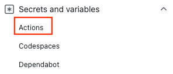

# Challenge 3: Use GitHub Actions with Azure Machine Learning
Get started with [GitHub Actions](https://docs.github.com/en/actions) to train a model on Azure Machine Learning. 

This article will teach you how to create a GitHub Actions workflow that builds and deploys a machine learning model to [Azure Machine Learning](./overview-what-is-azure-machine-learning.md). You'll train a [scikit-learn](https://scikit-learn.org/) linear regression model on the NYC Taxi dataset. 

GitHub Actions uses a workflow YAML (.yml) file in the `/.github/workflows/` path in your repository. This definition contains the various steps and parameters that make up the workflow.


## Prerequisites

**The following prerequisites are required if you want to clone the repository instead of forking it, but it is not a requirement. You can do this challenge entirely in GitHub**

Before following the steps in this article, make sure you have the following prerequisites:

* An Azure subscription. If you don't have an Azure subscription, create a free account before you begin. Try the [free or paid version of Azure Machine Learning](https://azure.microsoft.com/free/).

* An Azure Machine Learning workspace. If you don't have one, use the steps in the [Quickstart: Create workspace resources](../articles/machine-learning/quickstart-create-resources.md) article to create one.

* To install the Python SDK v2, use the following command:

    ```bash
    pip install azure-ai-ml
    ```

    For more information, see [Install the Python SDK v2 for Azure Machine Learning](/python/api/overview/azure/ai-ml-readme).

* A GitHub account. If you don't have one, sign up for [free](https://github.com/join).  

## Step 1. Get the code

Fork the following repo at GitHub:
```
https://github.com/azure/azureml-examples
```

## Step 2. Authenticate with Azure

You'll need to first define how to authenticate with Azure using a [service principal](https://learn.microsoft.com/en-us/azure/active-directory/develop/app-objects-and-service-principals#service-principal-object).

### Generate deployment credentials

Create a [service principal](https://learn.microsoft.com/en-us/azure/active-directory/develop/app-objects-and-service-principals#service-principal-object) with the [az ad sp create-for-rbac](https://learn.microsoft.com/en-us/cli/azure/ad/sp#az-ad-sp-create-for-rbac) command in the [Azure CLI](https://learn.microsoft.com/en-us/cli/azure/). Run this command with [Azure Cloud Shell](https://shell.azure.com/) in the Azure portal.

```bash
az ad sp create-for-rbac --name "myML" --role contributor \
    --scopes /subscriptions/<subscription-id>/resourceGroups/<group-name> \
    --sdk-auth
```
In the example above, replace the placeholders with your subscription ID, resource group name, and app name. The output is a JSON object with the role assignment credentials that provide access to your App Service app similar to below. Copy this JSON object for later.
```
 {
    "clientId": "<GUID>",
    "clientSecret": "<GUID>",
    "subscriptionId": "<GUID>",
    "tenantId": "<GUID>",
    (...)
  }
```


### Create secrets

1. In GitHub, go to your repository.

2. Select Security > Secrets and variables > Actions.



3. Select New repository secret.

4. Paste the entire JSON output from the Azure CLI command into the secret's value field. Give the secret the name AZURE_CREDENTIALS.

5. Select Add secret.

## Step 3. Update `setup.sh` to connect to your Azure Machine Learning workspace

You'll need to update the CLI setup file variables to match your workspace. 

1. In your forked repository, go to `azureml-examples/cli/`. 
1. Edit `setup.sh` and update these variables in the file. 
   
    |Variable  | Description  |
    |---------|---------|
    |GROUP     |      Name of resource group    |
    |LOCATION     |    Location of your workspace (example: `eastus2`)    |
    |WORKSPACE     |     Name of Azure ML workspace     | 

## Step 4. Update `pipeline.yml` with your compute cluster name

You'll use a `pipeline.yml` file to deploy your Azure ML pipeline. This is a machine learning pipeline and not a DevOps pipeline. You only need to make this update if you're using a name other than `cpu-cluster` for your computer cluster name. 

1. In your forked repository, go to `azureml-examples/cli/jobs/pipelines/nyc-taxi/pipeline.yml`. 
1. Each time you see `compute: azureml:cpu-cluster`, update the value of `cpu-cluster` with your compute cluster name. For example, if your cluster is named `my-cluster`, your new value would be `azureml:my-cluster`. There are five updates.

## Step 5: Run your GitHub Actions workflow

Your workflow authenticates with Azure, sets up the Azure Machine Learning CLI, and uses the CLI to train a model in Azure Machine Learning. 

# [Service principal](#tab/userlevel)


Your workflow file is made up of a trigger section and jobs:
- A trigger starts the workflow in the `on` section. The workflow runs by default on a cron schedule and when a pull request is made from matching branches and paths. Learn more about [events that trigger workflows](https://docs.github.com/actions/using-workflows/events-that-trigger-workflows). 
- In the jobs section of the workflow, you checkout code and log into Azure with your service principal secret.
- The jobs section also includes a setup action that installs and sets up the [Machine Learning CLI (v2)](how-to-configure-cli.md). Once the CLI is installed, the run job action runs your Azure Machine Learning `pipeline.yml` file to train a model with NYC taxi data.


### Enable your workflow

1. In your forked repository, open `.github/workflows/cli-jobs-pipelines-nyc-taxi-pipeline.yml` and verify that your workflow looks like this. 

    ```yaml
    name: cli-jobs-pipelines-nyc-taxi-pipeline
    on:
      workflow_dispatch:
      schedule:
        - cron: "0 0/4 * * *"
      pull_request:
        branches:
          - main
          - sdk-preview
        paths:
          - cli/jobs/pipelines/nyc-taxi/**
          - .github/workflows/cli-jobs-pipelines-nyc-taxi-pipeline.yml
          - cli/run-pipeline-jobs.sh
          - cli/setup.sh
    jobs:
      build:
        runs-on: ubuntu-latest
        steps:
        - name: check out repo
          uses: actions/checkout@v2
        - name: azure login
          uses: azure/login@v1
          with:
            creds: ${{secrets.AZ_CREDS}}
        - name: setup
          run: bash setup.sh
          working-directory: cli
          continue-on-error: true
        - name: run job
          run: bash -x ../../../run-job.sh pipeline.yml
          working-directory: cli/jobs/pipelines/nyc-taxi
    ```

1. Select **View runs**. 
1. Enable workflows by selecting **I understand my workflows, go ahead and enable them**.
1. Select the **cli-jobs-pipelines-nyc-taxi-pipeline workflow** and choose to **Enable workflow**. 
     
    :::image type="content" source="media/how-to-github-actions-machine-learning/enable-github-actions-ml-workflow.png" alt-text="Screenshot of enable GitHub Actions workflow.":::
1. Select **Run workflow** and choose the option to **Run workflow** now. 
    
    
    

## Step 6: Verify your workflow run

1. Open your completed workflow run and verify that the build job ran successfully. You'll see a green checkmark next to the job. 
1. Open Azure Machine Learning studio and navigate to the **nyc-taxi-pipeline-example**. Verify that each part of your job (prep, transform, train, predict, score) completed and that you see a green checkmark. 

    

   

## Clean up resources

When your resource group and repository are no longer needed, clean up the resources you deployed by deleting the resource group and your GitHub repository. 

## Next steps
Often, we have a simpler data set and want to figure out how we can best classify or predict certain data points - without trying out a lot of Machine Learning algorithms ourselves. Hence, we'll look at Automated Machine Learning in the [fourth challenge](challenge_04.md).
