# Challenge 4

By now, we have a good understanding how Azure Machine Learning works. In this  challenge, we'll take a data set and use Automated Machine Learning for testing out different regression algorithms automatically. Automated Machine Learning is currently able to perform `classification`, `regression` and also `forecasting`.

**Automated machine learning**, also referred to as automated machine learning (AutoML), is the process of automating the time consuming, iterative tasks of machine learning model development. It allows data scientists, analysts, and developers to build ML models with high scale, efficiency, and productivity all while sustaining model quality. Traditional machine learning model development is resource-intensive, requiring significant domain knowledge and time to produce and compare dozens of models. With automated machine learning, you'll accelerate the time it takes to get production-ready ML models with great ease and efficiency.

**When to use it?**
Apply automated ML when you want Azure Machine Learning to train and tune a model for you using the target metric you specify. Automated ML democratizes the machine learning model development process, and empowers its users, no matter their data science expertise, to identify an end-to-end machine learning pipeline for any problem. You can use the automated ML feature to:

- Implement ML solutions without extensive programming knowledge
- Save time and resources
- Leverage data science best practices
- Provide agile problem-solving

**How automated ML works?**
During training, Azure Machine Learning creates a number of pipelines in parallel that try different algorithms and parameters for you. The service iterates through ML algorithms paired with feature selections, where each iteration produces a model with a training score. The higher the score, the better the model is considered to "fit" your data. It will stop once it hits the exit criteria defined in the experiment.

**Note:** Automated Machine Learning can also [be used directly from the Azure Portal](https://docs.microsoft.com/en-us/azure/machine-learning/service/how-to-create-portal-experiments). In this challenge, we'll use the Portal, in the next challenge, we'll be using code.

## Dataset

> All the mentioned datasets in challenge 4 and challenge 5 can be found in your locally cloned repository **`aidevcollege/day1/AzureMachienLearningService/data`**. 

For this challenge, we'll use the `Pima Indians Diabetes` dataset: The Pima Indians Diabetes Dataset involves predicting the onset of diabetes within 5 years in Pima Indians given medical details. Before getting started, have a look at the data set: [`pima-indians-diabetes.csv`](../data/pima-indians-diabetes.csv). As this dataset is controversially discussed we have added the following two documents: [blog](https://researchblog.duke.edu/2016/10/24/diabetes-and-privacy-meet-big-data/#:~:text=Generations%27%20worth%20of%20data%20on,pregnancies%20of%20Pima%20Native%20Americans.) and [paper](https://www.journals.uchicago.edu/doi/full/10.1086/693853?mobileUi=0&).

> *"This is where “eternal” medical consent enters the equation: no researcher can realistically inform a study participant of what their medical data will be used for 40 years in the future."*
> To make this sensitive topic aware we added this dataset as well as our Microsoft AI principles. 
> **Please be responsible and follow the:** [Microsoft AI principles](https://www.microsoft.com/en-us/ai/responsible-ai?activetab=pivot1%3aprimaryr6)

**Note:**
You can find more datasets for trying out AutoML on [this website](https://machinelearningmastery.com/standard-machine-learning-datasets/) or obviously on [Kaggle](https://www.kaggle.com/) - by the way, the [`Wine Quality Dataset`](../data/winequality-white.csv) also makes a great use case for a nice demo.

**A word of caution:** Always make sure to only use properly formatted `csv` files with Automated Machine Learning. Especially incomplete lines/rows, e.g. missing a few commas, can throw off the service easily.

## Automated Machine Learning

In your Machine Learning workspace, navigate to the `Automated ML` section and select `+ New Automated ML run`.

The process includes creating or selecting `a dataset`, `Configuring the run` and `Task type and settings`


Give our new dataset a name and select the `pima-indians-diabetes.csv` select it from **`aidevcollege/day1/AzureMachienLearningService/data`**, and upload it into the Azure Machine Learning User Interface. For this challenge we will use a cleansed version the data set with headers here:  [`pima-indians-diabetes.csv`](../data/pima-indians-diabetes.csv)

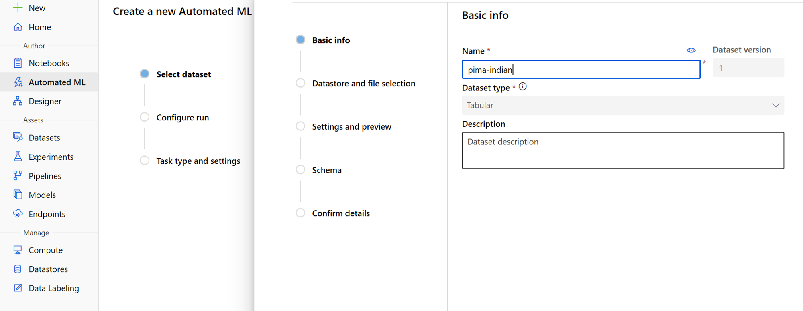

Then we can either re-use our previous storage or create a new one (in this case we can just use our existing one):

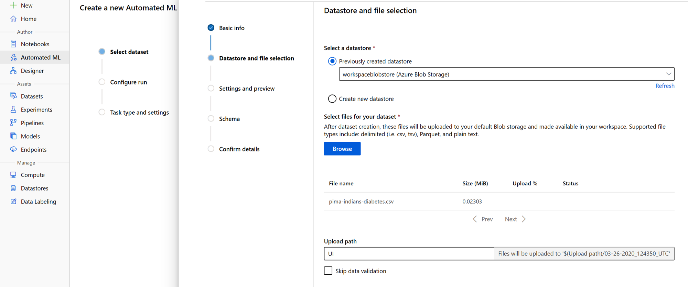

Next we view the settings and preview and select `Use headers from the first file`

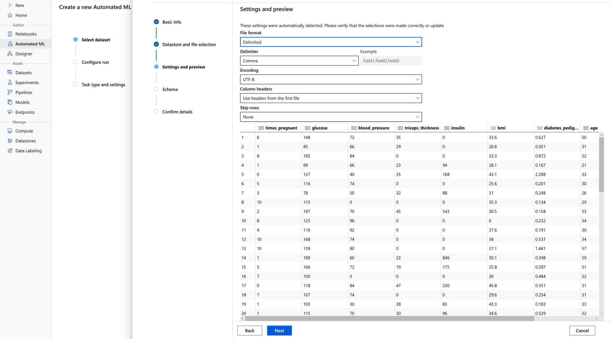

And we will also see a preview of our data, where we can exclude features and also specify which column we want to include. In this challenge we leave the schema as it is:

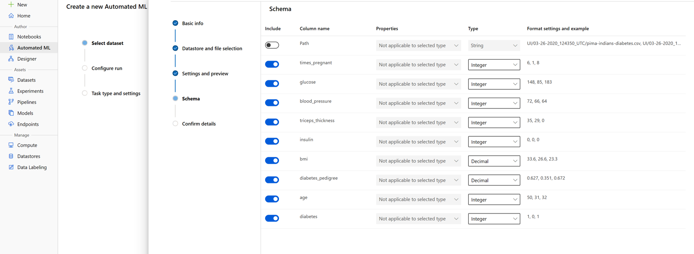

Lastly we confirm the details:

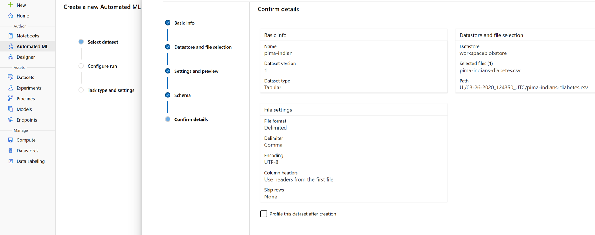

Then we can name our experiment and we can either re-use our Compute Instance, but we could also create a new `Azure Machine Learning compute` cluster or re-use the cluster from challenge 2. The `Create a new compute` window is self-explanatory after the last challenges (set minimum to `0` and maximum number of nodes to `1`)! 

> To avoid charges when no jobs are running, set the minimum nodes to 0. This setting allows Azure Machine Learning to de-allocate the compute nodes when idle. Any higher value will result in charges for the number of nodes allocated.

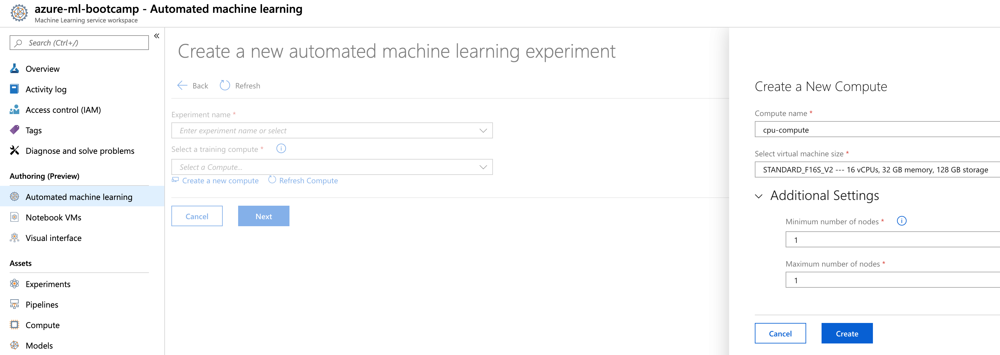

or we use our existing one:

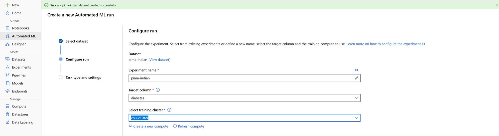

Lastly we can configure the `Task type and settings` tab. 
Here we make sure we set the job to `Classifcation` and define `diabetes` as the target column.

**Classification**
Classification is a common machine learning task. Classification is a type of supervised learning in which models learn using training data, and apply those learnings to new data. Azure Machine Learning offers featurizations specifically for these tasks, such as deep neural network text featurizers for classification. Learn more about featurization options. The main goal of classification models is to predict which categories new data will fall into based on learnings from its training data. Common classification examples include fraud detection, handwriting recognition, and object detection.

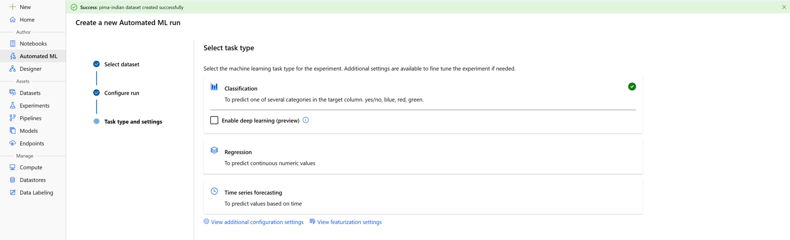

Under **`View additional configuration settings`**, we can further configure our AutoML job and select our optimization metric, concurrency, etc. Let's set **`Training job time (hours)` to `0.25`**. This means our training job will terminate after a maximum of 15 minutes. **The entire AutoML Run can take about 25-30 min**. *Time to grab a coffee or continue to the next challenge and come back later! ☕

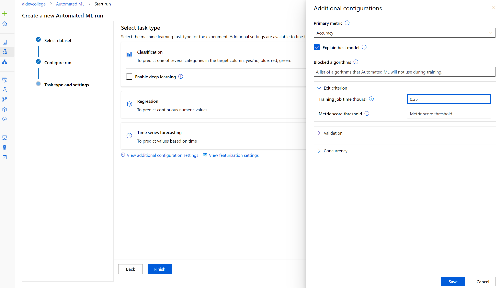

Once we start the training, it'll take ~6 minutes to prepare the experiment. Overall, the default 100 iterations would take quite a while, but since we limited the training time to 15 minutes, it'll terminate earlier. Once the job has finished, we should see something like this:

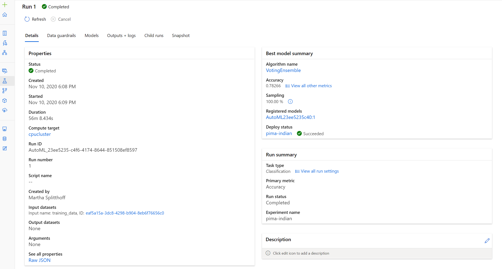

Below, we can see the metrics per iteration:

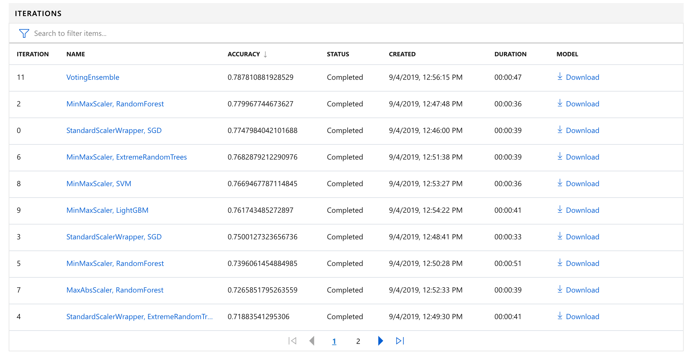

If we click one of the iterations, we'll get plenty of metrics for the evaluated pipeline:

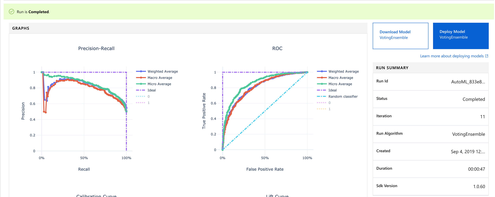

Without doubt, it is important to understand what those metrics actually mean, since this will allow us to judge if the generated model(s) are useful or not. [This link](https://docs.microsoft.com/en-us/azure/machine-learning/service/how-to-understand-automated-ml) will help you understanding the metrics of Automated Machine Learning.

Next, we can deploy one of the iterations to ACI.

## Model Deployment to ACI

On the details screen for each iteration, we can download the Model's `.pkl` file and also directly deploy it to ACI. Let's deploy one of the models:

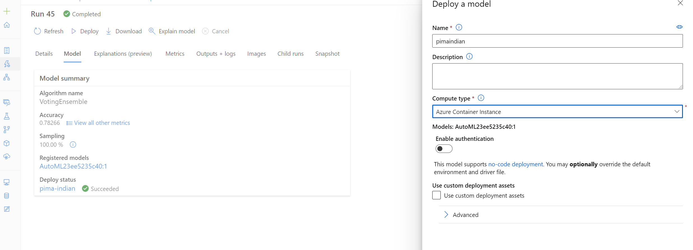

In the same screen, we can also download the `yaml` for the Conda environment used, but more importantly, the `score.py` - this helps us to understand, what data we need to input into our API!

We can see how AutoML is first creating an image, and then starts the deployment to a new Azure Container Instance.

Once the deployment has finished (~7 minutes), we can find the scoring URI in our Workspace under `Endpoints --> pima-indian --> Details`:

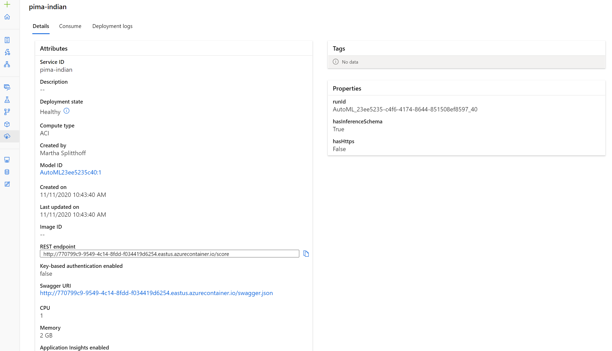

 Finally we can score one or more data samples using the following Python code (just run the code in one of the former notebooks and replace `url`):

```python
import requests
import json

url = 'Replace with your URL'
headers = {'Content-Type':'application/json'}
data = {"data": [{
    "times_pregnant": 6,
    "glucose": 148,
    "blood_pressure": 72,
    "triceps_thickness": 35,
    "insulin": 0,
    "bmi": 33.6,
    "diabetes_pedigree": 0.627,
    "age": 50
},
{
    "times_pregnant": 1,
    "glucose": 85,
    "blood_pressure": 66,
    "triceps_thickness": 29,
    "insulin": 0,
    "bmi": 26.6,
    "diabetes_pedigree": 0.351,
    "age": 31
    
}]}

resp = requests.post(url, data=json.dumps(data), headers=headers)
print("Prediction Results:", resp.json())
```

Pretty easy, right?

More details can be found [here](https://docs.microsoft.com/en-us/azure/machine-learning/service/how-to-create-portal-experiments#deploy-model). We can obviously relatively easily re-use the code from challenge 3, and just swap out the `score.py` and the `conda.yml` for programmatically deploying the model.

At this point:

* We took the `Pima Indians Diabetes Dataset` and ran automated Automated Machine Learning for classification on it
* We evaluated 25 algorithms and achieved an accuracy of ~77.9% (your accuracy might vary, since it is not necessarily deterministic)
* We took the best performing model and deployed it to ACI (similar to challenge 3)
* If we don't like the model yet, we could start further experimentation by taking the best performing pre-processing & algorithm pipeline and use it as a starting point

So far, we have focused on deploying models to Azure Container Instances, which is great for testing scenarios. For production grade deployments, we want to use Azure Kubernetes Service, which we'll do in the [fifth challenge](challenge_05.md).