# Hints for Challenge 5

In this challenge we will be training a model to showcase how you can use AutoML for a simple classification problem. The goal is to predict if a credit card transaction is considered a fraudulent charge. But this time we'll deploy to Azure Kubernetes Service (AKS). We'll also enable the following features:

* Authentication - users of our API will require an authentication key to use the model
* Monitoring - we'll be using Application Insights for monitoring telemetry data of our model

## Dataset

For this challenge, we'll use the `associated credit card dataset` dataset: The credit card dataset is containing both training features and labels. The features are inputs to the model, while the training labels represent the expected output of the model. Before getting started, have a look at the data set: [`creditcard.csv`](../data/creditcard.csv).

Sounds good? Let's get started (we'll be done after this)!

Back to Jupyter now, and let's create a notebook called `challenge05.ipynb`. First, we'll import the necessary packages and connect to our workspace:

## Connect to Workspace

```python
from azureml.core import Workspace
from azureml.core.compute import AksCompute, ComputeTarget
from azureml.core.webservice import Webservice, AksWebservice
from azureml.core.model import Model

import azureml.core

import logging

from matplotlib import pyplot as plt
import pandas as pd
import os

import azureml.core
from azureml.core.experiment import Experiment
from azureml.core.workspace import Workspace
from azureml.core.dataset import Dataset
from azureml.train.automl import AutoMLConfig

ws = Workspace.from_config()

# choose a name for experiment
experiment_name = 'automl-credit-card-fraud'

experiment=Experiment(ws, experiment_name)

```
## Create a Training Cluster

A compute target is required to execute the Automated ML run. 
Next, we can create an `Azure Machine Learning Compute` cluster in Azure and use it as our training compute resource:

```python
from azureml.core.compute import AmlCompute
from azureml.core.compute import ComputeTarget
import os

# Configure our cluster details
compute_name = "cpucluster"
compute_min_nodes = 1
compute_max_nodes = 6
vm_size = "Standard_F16s_v2"

# Check if a cluster with the same name already exists
compute_targets = ws.compute_targets
if compute_name in compute_targets and compute_targets[compute_name].type == 'AmlCompute':
    print("Found compute target, let's just reuse it:", compute_name)
    compute_target = ws.compute_targets[compute_name]

else:
    print('Creating a new compute target, this will take a few minutes...')
    compute_config = AmlCompute.provisioning_configuration(vm_size = vm_size,
                                                           min_nodes = compute_min_nodes,
                                                           max_nodes = compute_max_nodes)

    # Create the cluster
    compute_target = ComputeTarget.create(ws, compute_name, compute_config)
    
    # We can poll for a minimum number of nodes and for a specific timeout. 
    compute_target.wait_for_completion(show_output=True, min_node_count=None, timeout_in_minutes=20)
    
    # For a more detailed view of current AmlCompute status, use the 'status' property    
    print(compute_target.status.serialize())
```
## Load Data and configure Experiment using AutoML

Now let's use the `associated credit card dataset`.
Next, we'll split the data using random_split and extract the training data for the model.
Then we'll load the credit card dataset from a csv file containing both training features and labels.

```python
# Load the data
data = "https://automlsamplenotebookdata.blob.core.windows.net/automl-sample-notebook-data/creditcard.csv"
dataset = Dataset.Tabular.from_delimited_files(data)
# Split the data
training_data, validation_data = dataset.random_split(percentage=0.8, seed=223)
label_column_name = 'Class'

```

Next we'll instantiate a AutoMLConfig object. This defines the settings and data used to run the experiment.

```python
automl_settings = {
    "n_cross_validations": 3, # Number of cross validation splits.
    "primary_metric": 'average_precision_score_weighted', # This is the metric that you want to optimize.
    "enable_early_stopping": True, # Stop the run if the metric score is not showing improvement.
    "max_concurrent_iterations": 2, # This is a limit for testing purpose, please increase it as per cluster size
    "experiment_timeout_hours": 0.25, # This is a time limit for testing purposes, remove it for real use cases, this will drastically limit ablity to find the best model possible
    "verbosity": logging.INFO,
}

automl_config = AutoMLConfig(task = 'classification',
                             debug_log = 'automl_errors.log',
                             compute_target = compute_target,
                             training_data = training_data, # Input dataset, containing both features and label column. 
                             label_column_name = label_column_name, # The name of the label column.
                             **automl_settings
                            )

```
Call the submit method on the experiment object and pass the run configuration. 
Depending on the data and the number of iterations this can run up to ~20 min.

```python
# Call the submit method on the experiment object and pass the run configuration.
remote_run = experiment.submit(automl_config)
remote_run

```

## Showing Training Results

While the training is running, we can also display a nice widget directly in our notebook:

```python
from azureml.widgets import RunDetails
RunDetails(remote_run).show()
```

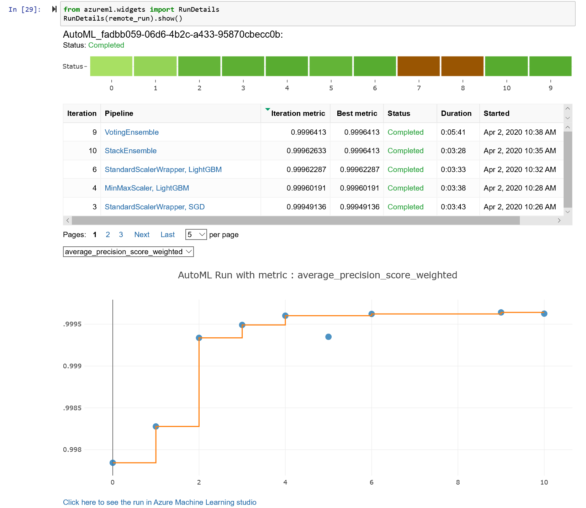

After training we can see the following:
* ITERATION: The iteration being evaluated.
* PIPELINE: A summary description of the pipeline being evaluated.
* DURATION: Time taken for the current iteration.
* METRIC: The result of computing score on the fitted pipeline.
* BEST: The best observed score thus far.

```python
remote_run.wait_for_completion(show_output=True)
```
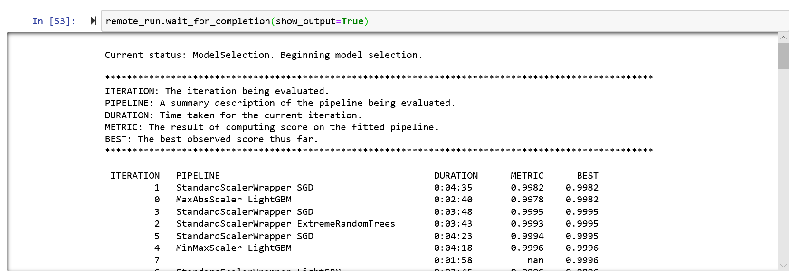

Now we can show the results of our training run:
We'll retrieve the best model by selecting the best pipeline from our iterations. The `get_output` method on automl_classifier returns the `best run` and the `fitted model` for the last invocation. Overloads on `get_output` allow you to retrieve the best run and fitted model for any logged metric or for a particular iteration.

```python
best_run, fitted_model = remote_run.get_output()
fitted_model
```
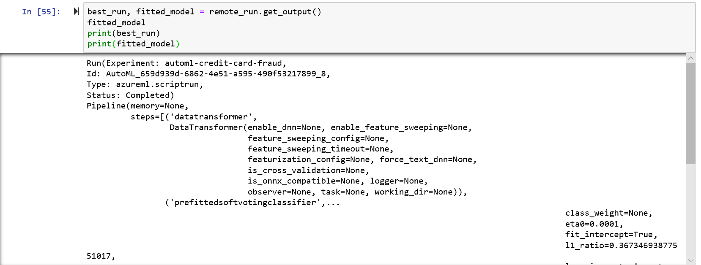

Split the data in the same way the data was split for training and then run the test data through the trained model to get the predicted values.

```python
# convert the test data to dataframe
X_test_df = validation_data.drop_columns(columns=[label_column_name]).to_pandas_dataframe()
y_test_df = validation_data.keep_columns(columns=[label_column_name], validate=True).to_pandas_dataframe()

# call the predict functions on the model
y_pred = fitted_model.predict(X_test_df)
```
Now visualize the data on a scatter plot to show what our truth (actual) values are compared to the predicted values from the trained model that was returned.

```python
from sklearn.metrics import confusion_matrix
import numpy as np
import itertools

cf =confusion_matrix(y_test_df.values,y_pred)
plt.imshow(cf,cmap=plt.cm.Blues,interpolation='nearest')
plt.colorbar()
plt.title('Confusion Matrix')
plt.xlabel('Predicted')
plt.ylabel('Actual')
class_labels = ['False','True']
tick_marks = np.arange(len(class_labels))
plt.xticks(tick_marks,class_labels)
plt.yticks([-0.5,0,1,1.5],['','False','True',''])
# plotting text value inside cells
thresh = cf.max() / 2.
for i,j in itertools.product(range(cf.shape[0]),range(cf.shape[1])):
    plt.text(j,i,format(cf[i,j],'d'),horizontalalignment='center',color='white' if cf[i,j] >thresh else 'black')
plt.show()

```
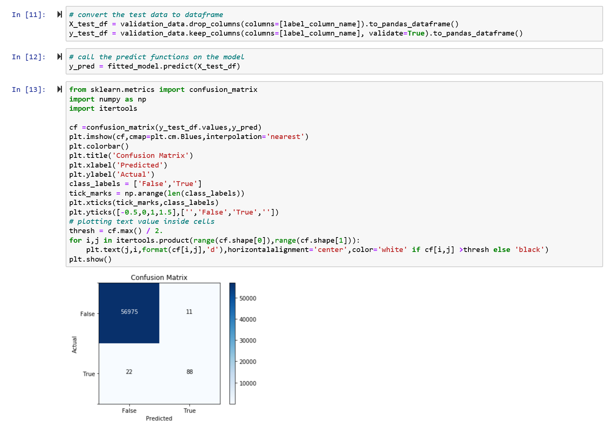

## Retrieve and Download trained AutoML model

Now we retrieve and download the `model_name`, `score.py file`, `env.yml file` and register the model: 

```python
model_name = best_run.properties['model_name']

script_file_name = 'inference/score.py'
conda_env_file_name = 'inference/env.yml'

best_run.download_file('outputs/scoring_file_v_1_0_0.py', 'inference/score.py')
best_run.download_file('outputs/conda_env_v_1_0_0.yml', 'inference/env.yml')

model = remote_run.register_model(model_name = model_name)

print(remote_run.model_id)
```
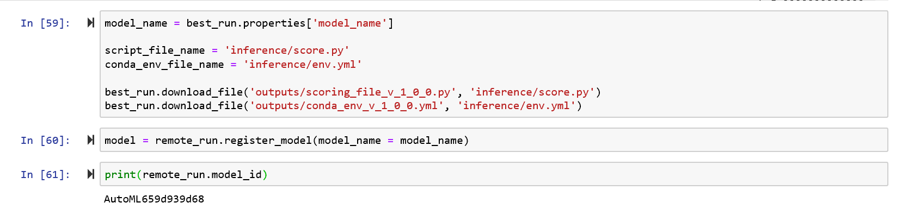

You can also check the files in the [Azure Machine Learning Service UI](https://ml.azure.com) under
`Models` and then you click on the `Run ID`: 

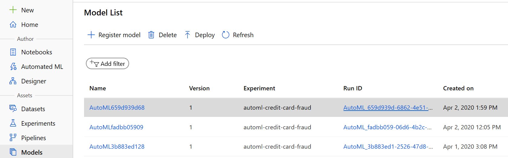

and then you choose `Outputs`: 

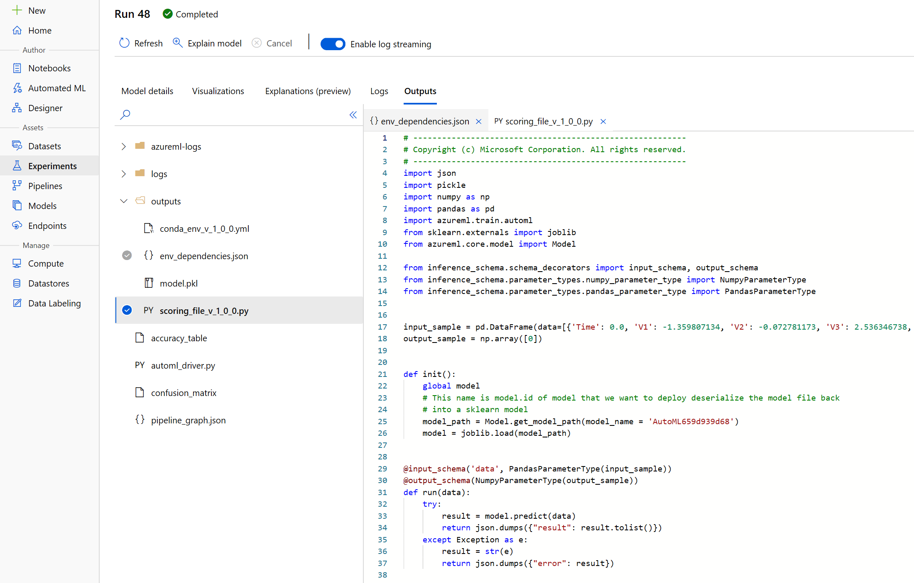

## Deployment to AKS

Let's first create an AKS cluster, which will take around 10-15 minutes. We'll keep it with defaults, even though it needs to be stated that there are [plenty of configuration options](https://docs.microsoft.com/en-us/azure/machine-learning/service/how-to-deploy-azure-kubernetes-service#deploy-to-aks). We can also re-use an existing cluster, but let's keep it simple:

```python
from azureml.core import Workspace
from azureml.core.compute import AksCompute, ComputeTarget
from azureml.core.webservice import Webservice, AksWebservice
from azureml.core.model import Model

from azureml.core.compute import AksCompute, ComputeTarget

aks_name = 'automl-aks' 

cts = ws.compute_targets

if aks_name in cts and cts[aks_name].type == 'AKS':
    print('Found existing AKS cluster, will use it!')
    aks_target = cts[aks_name]
else:
    print('Creating a new AKS cluster...')
    prov_config = AksCompute.provisioning_configuration()
    aks_target = ComputeTarget.create(workspace = ws, 
                                  name = aks_name, 
                                  provisioning_configuration = prov_config)
    print('Waiting for cluster creation completion...')
    aks_target.wait_for_completion(show_output = True)

print('Cluster state:', aks_target.provisioning_state)
print('Cluster is ready!', aks_target)
```
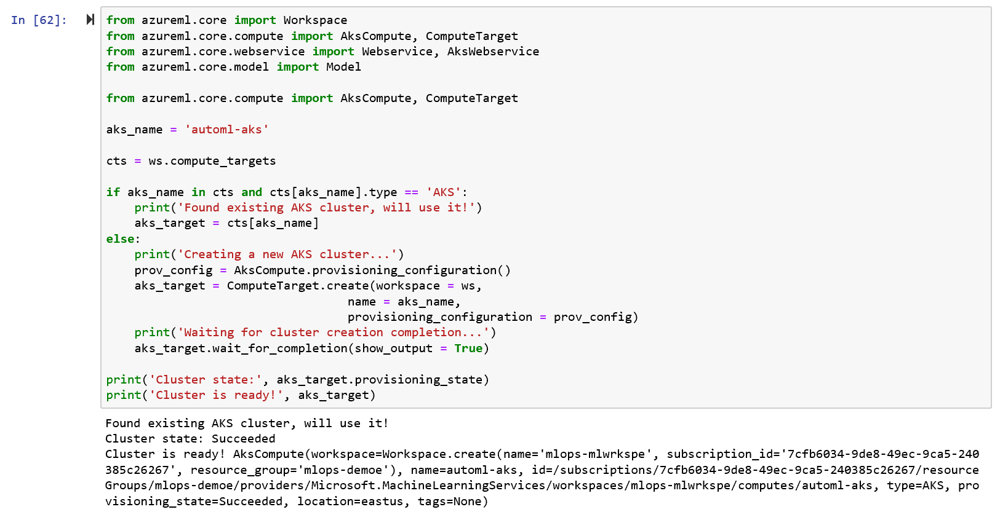

Lastly, we can deploy our model to the Kubernetes Cluster (should take 1-2 minutes):

```python
from azureml.core.model import InferenceConfig
from azureml.core.webservice import AciWebservice
from azureml.core.webservice import Webservice
from azureml.core.model import Model
from azureml.core.environment import Environment
from azureml.core.webservice import Webservice, AksWebservice

myenv = Environment.from_conda_specification(name="myenv", file_path=conda_env_file_name)
inference_config = InferenceConfig(entry_script=script_file_name, environment=myenv)

aks_config = AksWebservice.deploy_configuration(collect_model_data=True,
                                                enable_app_insights=True)

aks_service_name = 'creditcard-fraud'
aks_service = Model.deploy(workspace=ws,
                           name=aks_service_name,
                           models=[model],
                           inference_config=inference_config,
                           deployment_config=aks_config,
                           deployment_target=aks_target,
                          overwrite=True)

aks_service.wait_for_deployment(show_output = True)
print('Service state:', aks_service.state)
print('Service details:', aks_service)
print(aks_service.scoring_uri)

```
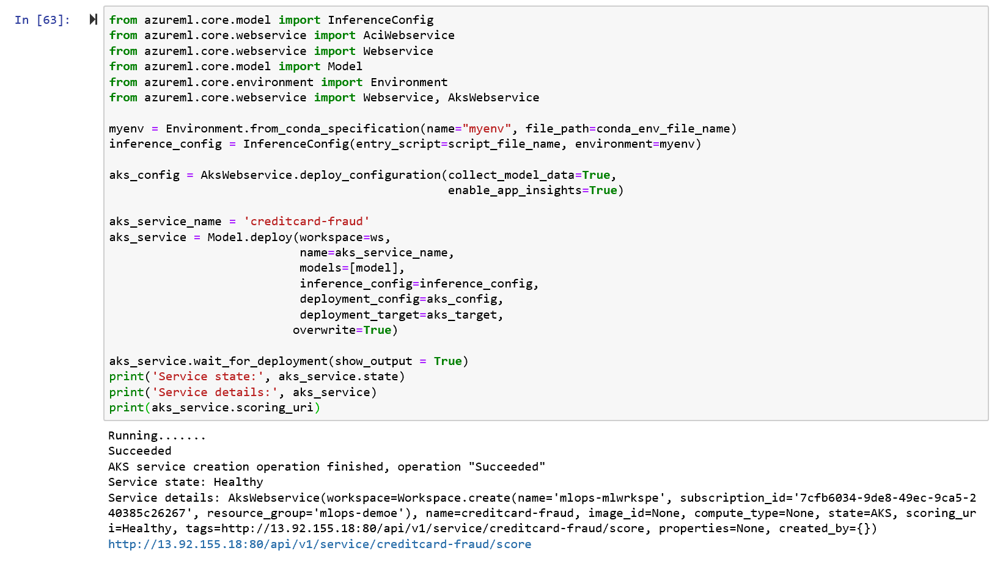

And finally, we can score some data after having retrieved the `keys` for accessing the service:

```python
import requests
import json

key1, key2 = aks_service.get_keys()

headers = {'Content-Type':'application/json',
           'Authorization': 'Bearer ' + key1}

data = { "data": [{
    'Time': 0.0, 
    'V1': -1.359807134, 
    'V2': -0.072781173, 
    'V3': 2.536346738, 
    'V4': 1.378155224, 
    'V5': -0.33832077, 
    'V6': 0.462387778, 
    'V7': 0.239598554, 
    'V8': 0.098697901, 
    'V9': 0.36378697, 
    'V10': 0.090794172, 
    'V11': -0.551599533, 
    'V12': -0.617800856, 
    'V13': -0.991389847, 
    'V14': -0.311169354, 
    'V15': 1.468176972, 
    'V16': -0.470400525, 
    'V17': 0.207971242, 
    'V18': 0.02579058, 
    'V19': 0.40399296, 
    'V20': 0.251412098, 
    'V21': -0.018306778, 
    'V22': 0.277837576, 
    'V23': -0.11047391, 
    'V24': 0.066928075, 
    'V25': 0.128539358, 
    'V26': -0.189114844, 
    'V27': 0.133558377, 
    'V28': -0.021053053, 
    'Amount': 149.62}]
  }

resp = requests.post(aks_service.scoring_uri, json=data, headers=headers)
print("Prediction Results:", resp.json())
```
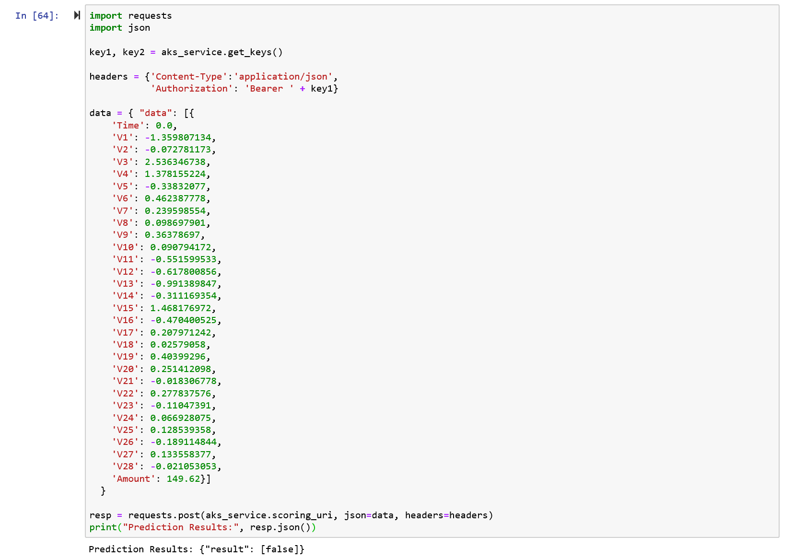

So let's start looking at Application Insights first.

### Monitoring with Application Insights

Navigate to your original resource group and select your Application Insights instance:

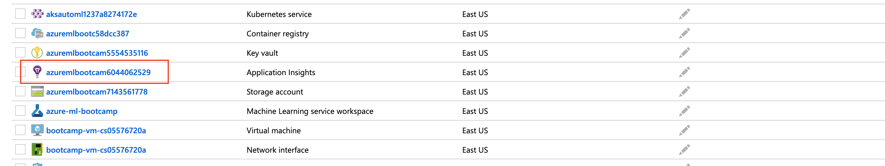

We'll be greeted with some telemetry metrics of our model:

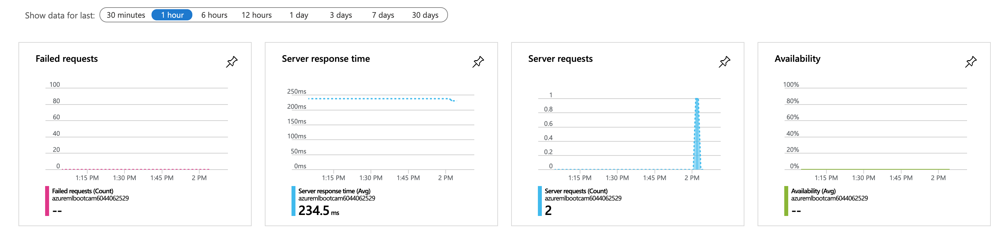

Next, let's navigate to `Logs (Analytics)`:

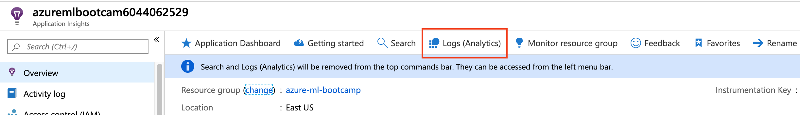

Enter `traces` in the query text field and hit run:

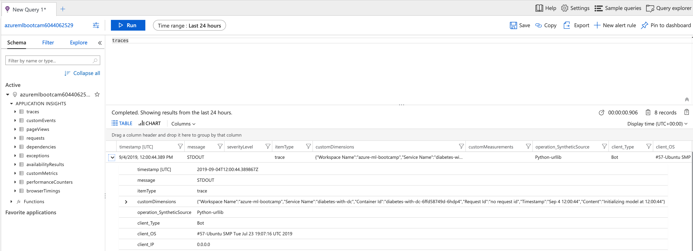

From here, we can start building more complex queries, set alarms or start exploring what is happening with our models.

Lastly, we can delete our API service and also the AKS cluster:

```python
aks_service.delete()
aks_target.delete()
```

At this point:

* We've deployed our model from AutoML to Azure Kubernetes Service
* We've enabled authentication to protect our API endpoint (we can also enable [token-based authentication](https://docs.microsoft.com/en-us/azure/machine-learning/service/how-to-deploy-azure-kubernetes-service#authentication-with-tokens))
* We've used Application Insights to monitor model telemetry - this will allow us to set alarms if the model is down or getting slow

That's it for today - Well done! :clap:

Acknowledgements:

* This Credit Card fraud Detection dataset is made available under the Open Database License: http://opendatacommons.org/licenses/odbl/1.0/. Any rights in individual contents of the database are licensed under the Database Contents License: http://opendatacommons.org/licenses/dbcl/1.0/ and is available at: https://www.kaggle.com/mlg-ulb/creditcardfraud

* The dataset has been collected and analysed during a research collaboration of Worldline and the Machine Learning Group (http://mlg.ulb.ac.be) of ULB (Université Libre de Bruxelles) on big data mining and fraud detection. More details on current and past projects on related topics are available on https://www.researchgate.net/project/Fraud-detection-5 and the page of the DefeatFraud project Please cite the following works: • Andrea Dal Pozzolo, Olivier Caelen, Reid A. Johnson and Gianluca Bontempi. Calibrating Probability with Undersampling for Unbalanced Classification. In Symposium on Computational Intelligence and Data Mining (CIDM), IEEE, 2015 • Dal Pozzolo, Andrea; Caelen, Olivier; Le Borgne, Yann-Ael; Waterschoot, Serge; Bontempi, Gianluca. Learned lessons in credit card fraud detection from a practitioner perspective, Expert systems with applications,41,10,4915-4928,2014, Pergamon • Dal Pozzolo, Andrea; Boracchi, Giacomo; Caelen, Olivier; Alippi, Cesare; Bontempi, Gianluca. Credit card fraud detection: a realistic modeling and a novel learning strategy, IEEE transactions on neural networks and learning systems,29,8,3784-3797,2018,IEEE o Dal Pozzolo, Andrea Adaptive Machine learning for credit card fraud detection ULB MLG PhD thesis (supervised by G. Bontempi) • Carcillo, Fabrizio; Dal Pozzolo, Andrea; Le Borgne, Yann-Aël; Caelen, Olivier; Mazzer, Yannis; Bontempi, Gianluca. Scarff: a scalable framework for streaming credit card fraud detection with Spark, Information fusion,41, 182-194,2018,Elsevier • Carcillo, Fabrizio; Le Borgne, Yann-Aël; Caelen, Olivier; Bontempi, Gianluca. Streaming active learning strategies for real-life credit card fraud detection: assessment and visualization, International Journal of Data Science and Analytics, 5,4,285-300,2018,Springer International Publishing


Copyright (c) Microsoft Corporation. All rights reserved.
Licensed under the MIT License.