# AI Developer College Day 1 - MLOps

In the last challenges we have trained our own model and used `Jupyter Notebook` to deploy the trained model on an Azure Container Instance and Azure Kubernetes. As we have seen the data scientist/ml experts view we will switch to the developer or DevOps side of things. For operationalization of the model we need DevOps in this case called Machine Learning Operations (MLOps). As we consider this a topic which should be considered by both parties ml experts as well as developers.

## Focus of Today:


For example to switch from Jupyter Notebook to a plain Python file you can simply copy the code cells into a `.py` file. (see for example the train_diabetes.py). In this challenge we have prepared a [`.yaml`](https://docs.microsoft.com/en-us/azure/devops/pipelines/yaml-schema?view=azure-devops&tabs=schema%2Cparameter-schema) file which automatically deploys a Azure Machine Learning Workspace, deploys a Compute Cluster, trains and register a model and deploys it to Azure Container Instance and Azure Kubernetes Service like we did before in the Jupyter Notebook manually. To sum it up everything we have done manually will be automated now.

> YAML - “YAML Ain’t Markup Language,” is a human-readable data serialization standard that can be used in conjunction with all programming languages and is often used to write configuration files.

### Here is what you will learn

Today will be only a very brief and high level overview of MLOps, as you will learn:

- Create an Azure DevOps account for your organization
- Create a Team Project with an Agile Process Template
- Import the Repository to Azure DevOps
- Create a Service Connection
- Work with Build and Release Pipelines

But as our goal is to bring both worlds from the data scientists/ml experts and the developers together, that is why we consider the operationalization part as important to be (also briefly) emphasized.

Today we will cover the following topics in several sections:

|Topic|Section|
|---|---|
|What is MLOps? |[What is MLOps?](#what-is-mlops)|
|Azure DevOps|[Azure DevOps](#azure-devops)|
|Create an Azure DevOps organization|[Create an Azure DevOps organization](#create-an-azure-devops-organization)|
|Create a new project|[Create a new project](#create-a-new-project)|
|Work with Azure Repos|[Work with Azure Repos](#work-with-azure-repos)|
|Add Service Connections to your DevOps project|[Add Service Connections to your DevOps project](#add-service-connections-to-your-devops-project)|
|Work with Azure Pipelines|[Work with Azure Pipelines](#work-with-azure-pipelines)|

# MLOps on Azure

This repository contains examples of how to implement [MLOps](https://en.wikipedia.org/wiki/MLOps) using [Azure ML Services](https://azure.microsoft.com/en-us/services/machine-learning-service/) and [Azure DevOps](https://azure.microsoft.com/en-us/services/devops/).

## What is MLOps?

**MLOps** (a compound of "[machine learning](https://en.wikipedia.org/wiki/Machine_learning)" and "operations") is a practice for collaboration and communication between [data scientists](https://en.wikipedia.org/wiki/Data_scientists) and operations professionals to help manage production ML lifecycle.
Similar to the [DevOps](https://en.wikipedia.org/wiki/DevOps) or [DataOps](https://en.wikipedia.org/wiki/DataOps) approaches, MLOps looks to increase automation and improve the quality of production ML while also focusing on business and regulatory requirements.

### How does Azure ML help with MLOps?

Azure ML contains a number of asset management and orchestration services to help you manage the lifecycle of your model training & deployment workflows.

With Azure ML + Azure DevOps you can effectively and cohesively manage your datasets, experiments, models, and ML-infused applications.


## Azure DevOps

Azure DevOps provides developer services to support teams to plan work, collaborate on code development, and build and deploy applications.
Developers can work in the cloud using Azure DevOps Services or on-premises using Azure DevOps Server. Azure DevOps Server was formerly named Visual Studio Team Foundation Server (TFS).


Azure DevOps provides integrated features that you can access through your web browser or IDE client. You can use one or more of the following services based on your business needs:

- **Azure Repos** provides Git repositories or Team Foundation Version Control (TFVC) for source control of your code
- **Azure Pipelines** provides build and release services to support continuous integration and delivery of your apps
- **Azure Boards** delivers a suite of Agile tools to support planning and tracking work, code defects, and issues using Kanban and Scrum methods
- **Azure Test Plans** provides several tools to test your apps, including manual/exploratory testing and continuous testing
- **Azure Artifacts** allows teams to share Maven, npm, and NuGet packages from public and private sources and integrate package sharing into your CI/CD pipelines

To get started with Azure DevOps navigate to the [Azure DevOps overview page](https://app.vssps.visualstudio.com/). Here you will find further links to the documentation, support, pricing and Blogs.

> [!IMPORTANT]
> Before we can create an Azure DevOps account we need to understand which Identity Providers are supported by Azure DevOps.
> Azure AD, MSA (Microsoft account) and a GitHub account is supported if you want to use cloud authentication. 
> It is recommended to use Azure AD when a large group of users must be managed or if you want to integrate Azure DevOps to your organisation's Azure AD, otherwise use your Microsoft account or a GitHub account.
> For on-premises deployments Active Directory is recommended. <br>
> **Note:** If you want to integrate Azure DevOps into your organization's Azure AD make sure that you have the needed permission to create a ServicePrincipal in your Azure AD. We will create a ServicePrincipal in further challenges to authorize Azure DevOps to access your Azure Subscription in order to deploy Azure resources.

## Create an Azure DevOps organization

1. Navigate to [Azure DevOps](https://azure.microsoft.com/services/devops/)
2. Click "Start for free >", if you don't see a login page, please open a private browser window to make sure that you use the right account (either an Azure AD, MSA or GitHub account).
3. Give your new project a name and select a country/region.
4. Create an organization. Instructions can be found [here](https://docs.microsoft.com/en-us/azure/devops/organizations/accounts/create-organization?toc=%2Fazure%2Fdevops%2Fget-started%2Ftoc.json&bc=%2Fazure%2Fdevops%2Fget-started%2Fbreadcrumb%2Ftoc.json&view=azure-devops)

## Create a new project

Create a new project, name it "AIDevCollege" and use the "Agile" process template and leave the version control selection to **Git**.
Instructions can be found [here](https://docs.microsoft.com/en-us/azure/devops/organizations/projects/create-project?view=azure-devops).

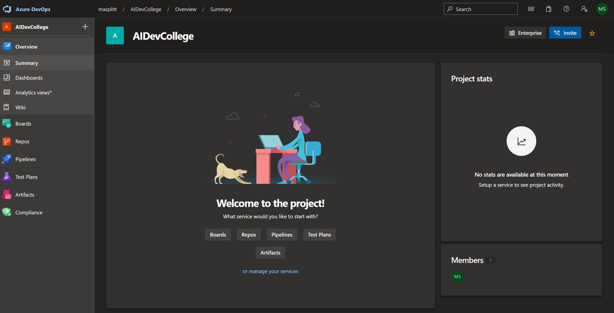

## Work with Azure Repos


### Import the AI Developer College GitHub repository to your Azure Repo

Open your browser and navigate to the [AI Developer College Training Days on GitHub](https://github.com/aidevcollege/aidevcollege.git). Click the green "Code" button and copy the https url. Make sure to **use GIT** in the Azure Repos as **Repository Type**, it should be the current default.

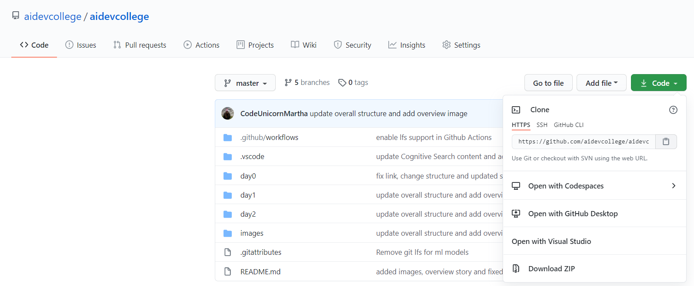

Go to your Azure DevOps project import the repository and name it __aidevcollege__:

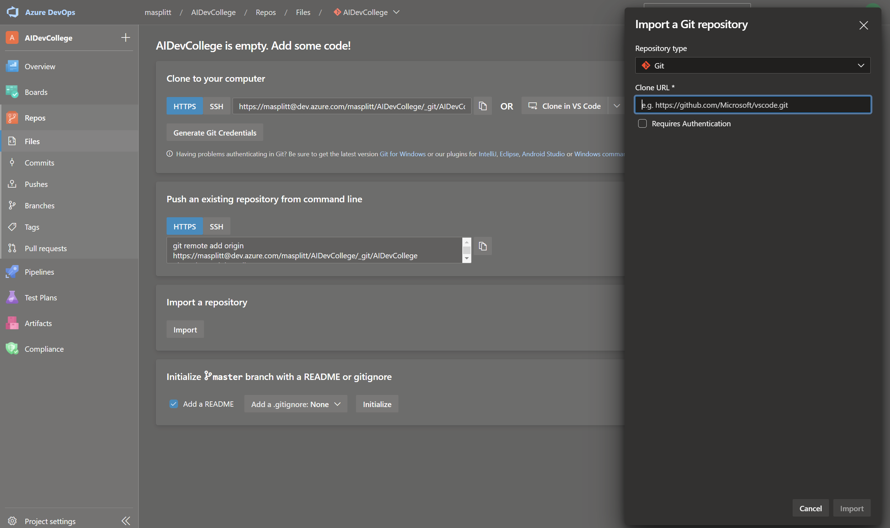

## Add Service Connections to your DevOps project

Next, we configure the project such that the release pipeline has access to the code in github repo, to your AzureML Workspace, and to the Azure Container Registry (for Docker images).

Go to the settings of your project, `Service Connections` and click on `New Service Connection`.

- Create one Service Connection of type `Azure Resource Manager`.
- Create a service principle of the type `Service Principle (automatic)`.
- Select your `Subscription` and name it **`MyAzureSubscription`** in the _Service connection name_.

<p align="left"></p>

First you select `Azure Resource Manager` in the first screen:

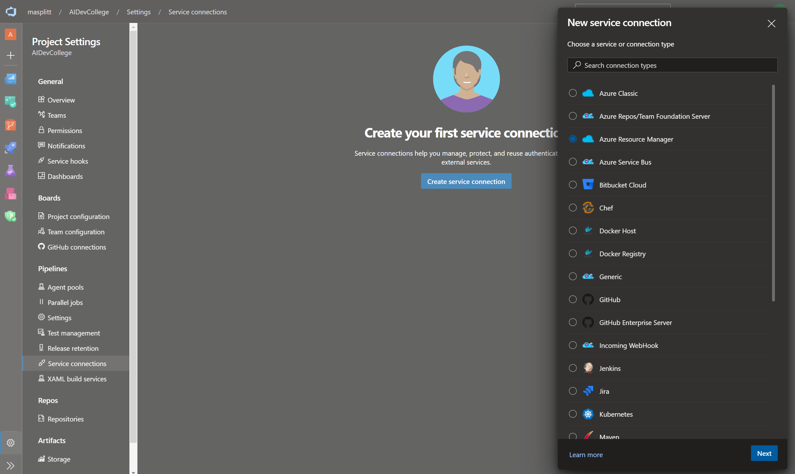

In the next screen you select `service principal (automatic)`


> **Important:**
> In the next screen you select your _Subscription_ and fill in **`MyAzureSubscription`** in the _Service connection name_.

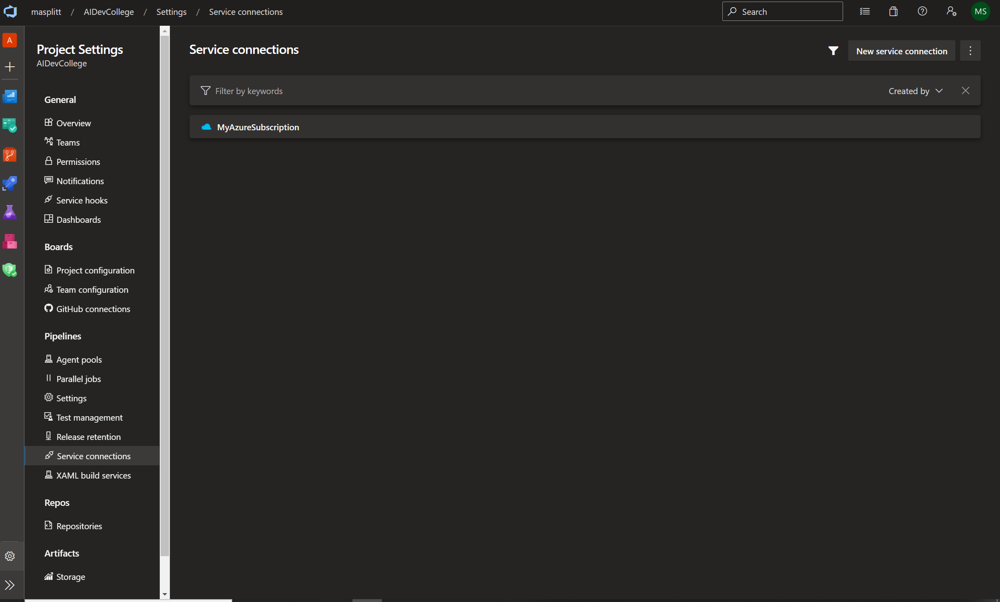

## Work with Azure Pipelines

### Azure Pipelines for continuous integration (CI) and continuous delivery (CD)

**What are Azure Pipelines?**
Azure Pipelines is a cloud service that you can use to automatically build and test your code project and make it available to other users. It works with just about any language or project type. Azure Pipelines combines continuous integration (CI) and continuous delivery (CD) to constantly and consistently test and build your code and ship it to any target.

In the following we will explain the terms continuous integration (CI) and continuous delivery (CD), Azure Pipelines, as well as the key concepts of pipelines which are included also in the `.yaml` file which you will use in this challenge. **If you have no or little knowledge about DevOps go ahead and read this introduction in the `Details` section otherwise you can jump to the challenge right away.**

<details>

**Continuous delivery** <br>
Continuous delivery (CD) is a process by which code is built, tested, and deployed to one or more test and production stages. Deploying and testing in multiple stages helps drive quality. Continuous integration systems produce deployable artifacts, which includes infrastructure and apps. Automated release pipelines consume these artifacts to release new versions and fixes to existing systems. Monitoring and alerting systems run constantly to drive visibility into the entire CD process. This process ensures that errors are caught often and early.

**Continuous integration** <br>
Continuous integration (CI) is the practice used by development teams to simplify the testing and building of code. CI helps to catch bugs or problems early in the development cycle, which makes them easier and faster to fix. Automated tests and builds are run as part of the CI process. The process can run on a set schedule, whenever code is pushed, or both. Items known as artifacts are produced from CI systems. They're used by the continuous delivery release pipelines to drive automatic deployments.

Implementing CI and CD pipelines helps to ensure consistent and quality code that's readily available to users. And, Azure Pipelines provides a quick, easy, and safe way to automate building your projects and making them available to users.

**Use Azure Pipelines because it supports the following scenarios:** <br>
- Works with any language or platform
- Deploys to different types of targets at the same time
- Integrates with Azure deployments
- Builds on Windows, Linux, or Mac machines
- Integrates with GitHub
- Works with open-source projects.

**Key concepts for new Azure Pipelines** <br>

- A trigger tells a Pipeline to run.
- A pipeline is made up of one or more stages. A pipeline can deploy to one or more environments.
- A stage is a way of organizing jobs in a pipeline and each stage can have one or more jobs.
- Each job runs on one agent. A job can also be agentless.
- Each agent runs a job that contains one or more steps.
- A step can be a task or script and is the smallest building block of a pipeline.
- A task is a pre-packaged script that performs an action, such as invoking a REST API or publishing a build artifact.
- An artifact is a collection of files or packages published by a run.


**Agent** <br>
When your build or deployment runs, the system begins one or more jobs. An agent is computing infrastructure with installed agent software that runs one job at a time. For more in-depth information about the different types of agents and how to use them, see [Build and release agents](https://github.com/MicrosoftDocs/azure-devops-docs/blob/master/docs/pipelines/agents/agents.md).

**Artifact** <br>
An artifact is a collection of files or packages published by a run. Artifacts are made available to subsequent tasks, such as distribution or deployment. For more information, see Artifacts in Azure Pipelines. In our case this is usually the trained machine learning model

**Environment** <br>
An environment is a collection of resources, where you deploy your application. It can contain one or more virtual machines, containers, web apps, or any service that's used to host the application being developed. A pipeline might deploy the app to one or more environments after build is completed and tests are run.

**Job** <br>
A stage contains one or more jobs. Each job runs on an agent. A job represents an execution boundary of a set of steps. All of the steps run together on the same agent. For example, you might build two configurations - x86 and x64. In this case, you have one build stage and two jobs.

**Run** <br>
A run represents one execution of a pipeline. It collects the logs associated with running the steps and the results of running tests. During a run, Azure Pipelines will first process the pipeline and then hand off the run to one or more agents. Each agent will run jobs. Learn more about the [pipeline run sequence](./images/run-overview.svg).

**Script** <br>
A script runs code as a step in your pipeline using command line, PowerShell, or Bash. You can write [cross-platform scripts](https://github.com/MicrosoftDocs/azure-devops-docs/blob/master/docs/pipelines/scripts/cross-platform-scripting.md) for macOS, Linux, and Windows. Unlike a [task](https://github.com/MicrosoftDocs/azure-devops-docs/blob/master/docs/pipelines/process/tasks.md), a script is custom code that is specific to your pipeline.

**Stage** <br>
A stage is a logical boundary in the pipeline. It can be used to mark separation of concerns (e.g., Build, QA, and production). Each stage contains one or more jobs.

**Step** <br>
A step is the smallest building block of a pipeline. For example, a pipeline might consist of build and test steps. A step can either be a script or a task. A task is simply a pre-created script offered as a convenience to you. To view the available tasks, see the [Build and release tasks](https://github.com/MicrosoftDocs/azure-devops-docs/blob/master/docs/pipelines/tasks/index.md) reference. For information on creating custom tasks, see [Create a custom task](https://github.com/MicrosoftDocs/azure-devops-docs/blob/master/docs/extend/develop/add-build-task.md).

**Task** <br>
A [task](https://github.com/MicrosoftDocs/azure-devops-docs/blob/master/docs/pipelines/process/tasks.md) is the building block for defining automation in a pipeline. A task is packaged script or procedure that has been abstracted with a set of inputs.

**Trigger** <br>
A trigger is something that's set up to tell the pipeline when to run. You can configure a pipeline to run upon a push to a repository, at scheduled times, or upon the completion of another build. All of these actions are known as triggers. For more information, see [build triggers](https://github.com/MicrosoftDocs/azure-devops-docs/blob/master/docs/pipelines/build/triggers.md) and [release triggers](https://github.com/MicrosoftDocs/azure-devops-docs/blob/master/docs/pipelines/release/triggers.md).

</details>

### Run your first MLOps Pipeline

0. Let's move to the Pipelines tile on the left hand side and **hit** _create a new pipeline_ and **select** _Azure Repos Git_. Then select your previously created/cloned repository **aidevcollege**.

<p align="left"></p>

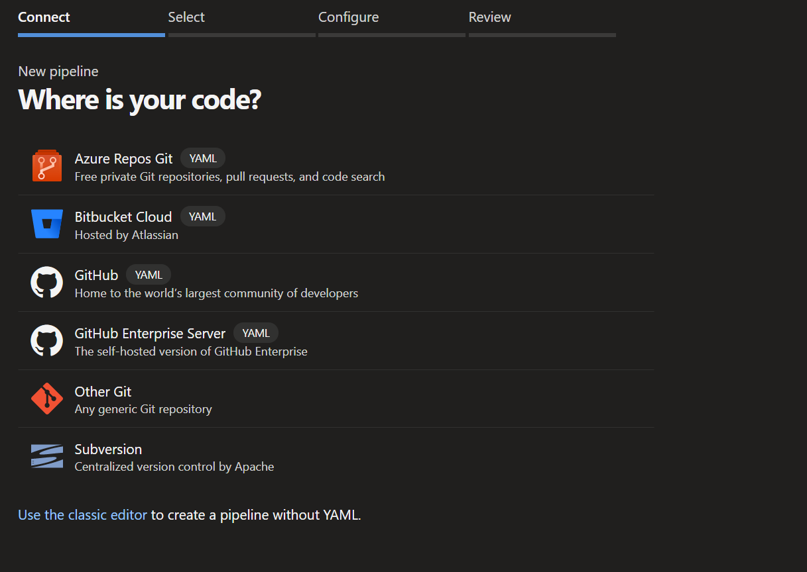

1. So now let's create/configure a pipeline under **Pipelines.** For this Build and Release pipeline go ahead by selecting the **Existing Azure Pipelines YAML file**. Copy the path `day1/MLOps/MLOps/azure-pipelines.yml` into the text field and thus select the **azure-pipelines.yml** as shown here:

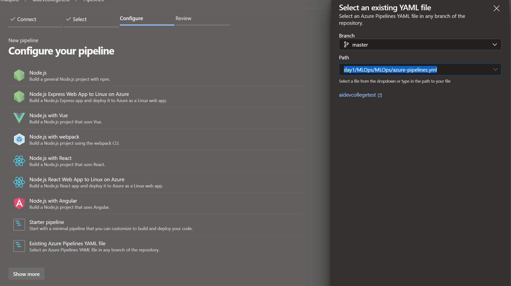

And then _select_ **Run**.

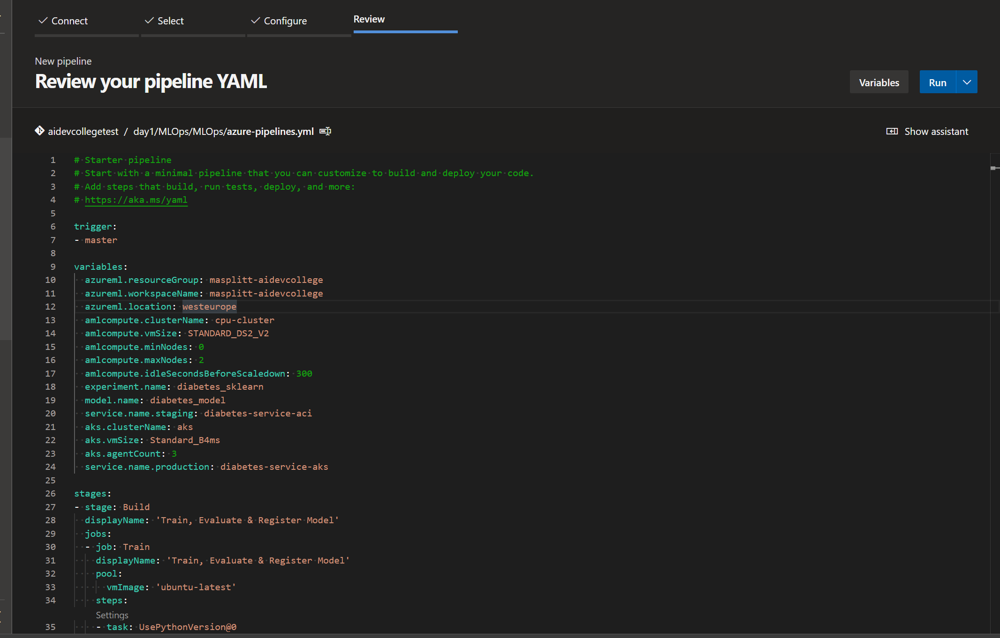

2. Now let's look at the Pipeline it consists out of a:
   - `Train, Evaluate and Register` _Dev_ Stage,
   - `Deploy to Staging` _Test_ Stage and a
   - `Deploy to Production` _Production_ Stage.

**Summarizing the Steps:**
A Machine Learning model will be trained, evaluated and registered. Afterwards it will be deployed to a Azure Container Instance and finally it will be deployed to the Azure Kubernetes Service.

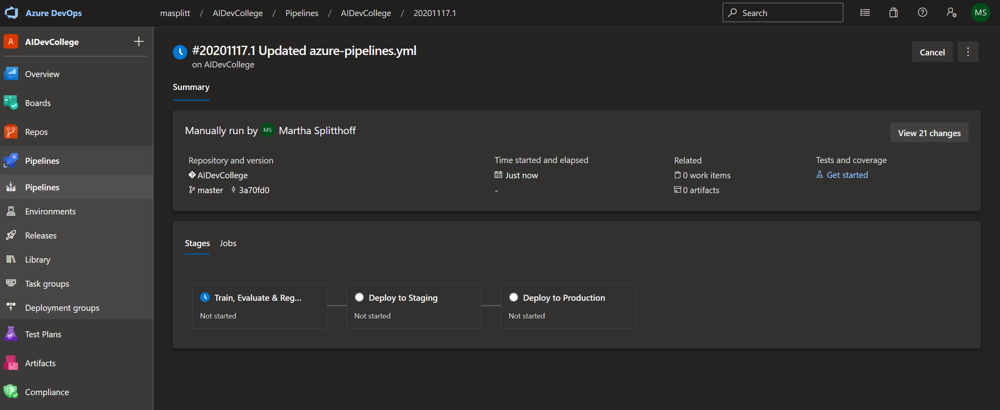

Let's look at the pipeline:

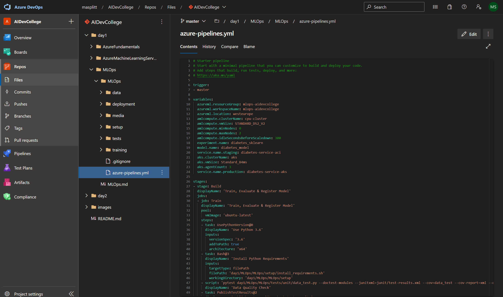

> **Important:** To run the pipeline we will have to change something in the **master** branch of our Repository as it **triggers** the build process of the pipeline. So go ahead and change the value for the variable _azureml.resourceGroup_ to `<yourname>-aidevcollege`.

```
    variables:
        azureml.resourceGroup: <yourname>-aidevcollege
        azureml.workspaceName: mlops-aidevcollege
        azureml.location: westeurope
        amlcompute.clusterName: cpu-cluster
        amlcompute.vmSize: STANDARD_DS2_V2
```

This should be the result when the pipeline was executed successfully.

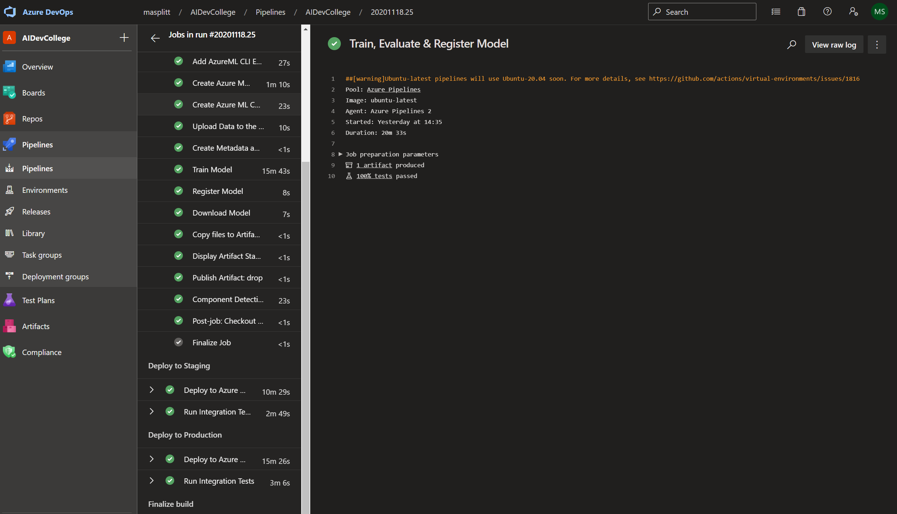

Here you can see when the pipeline ran through all three stages successfully.

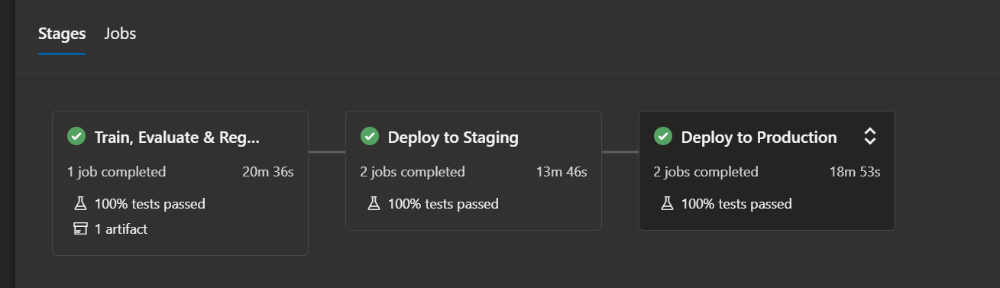

In the `Train, Evaluate and Register` _Dev_ Stage:

- the dependencies are installed
- the Azure Machine Learning Workspace is deployed
- the Azure Machine Learning CPU-Cluster is deployed
- the Data is uploaded
- the Machine Learning model is trained, registered and downloaded
- the trained model is published as an artifact

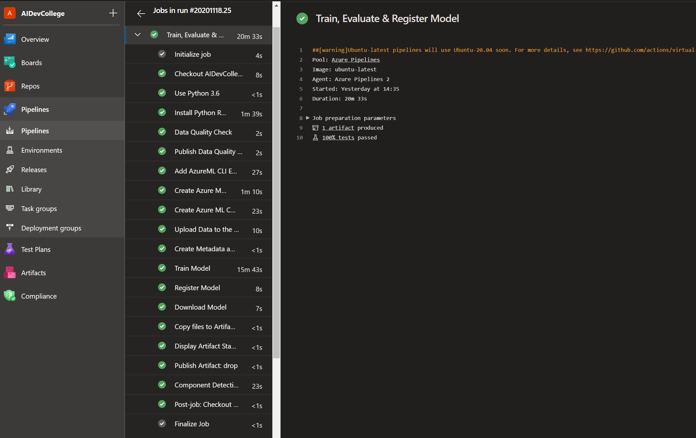

You can see the steps in `jobs`, `steps` and `tasks` in the **azure-pipelines.yml** file (see explanation above):

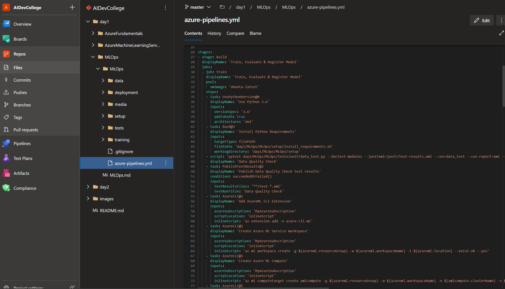

In the `Deploy to Staging` _Test_ Stage:

- the Artifact is downloaded
- Dependencies are installed
- Deployment to the Azure Container Instance Service is executed.
- Integration Tests are run

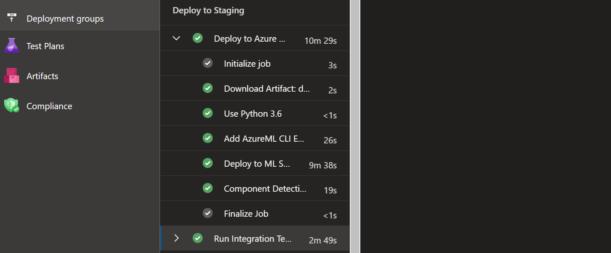

You can see the steps in `jobs`, `steps` and `tasks` in the **azure-pipelines.yml** file:

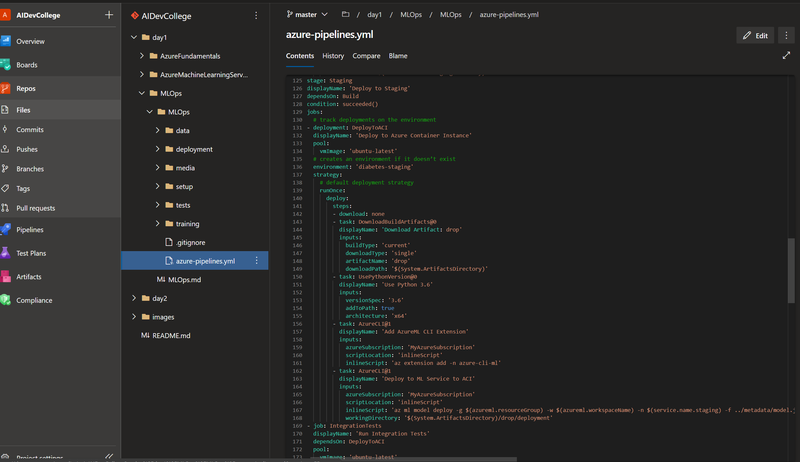

In the `Deploy to Production` _Production_ Stage:

- the Artifact is downloaded
- Dependencies are installed
- Deployment to the Azure Kubernetes Service is executed.
- Integration Tests are run

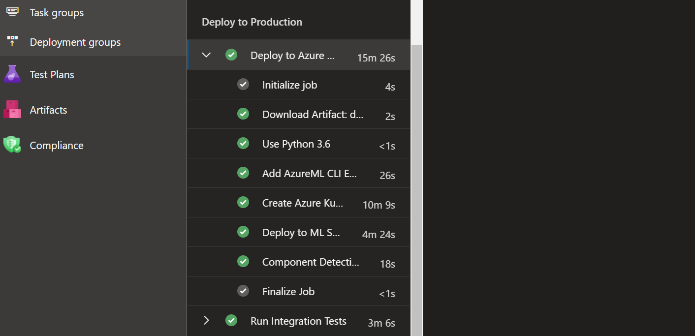

You can see `jobs`, `steps` and `tasks` in the **azure-pipelines.yml** file:

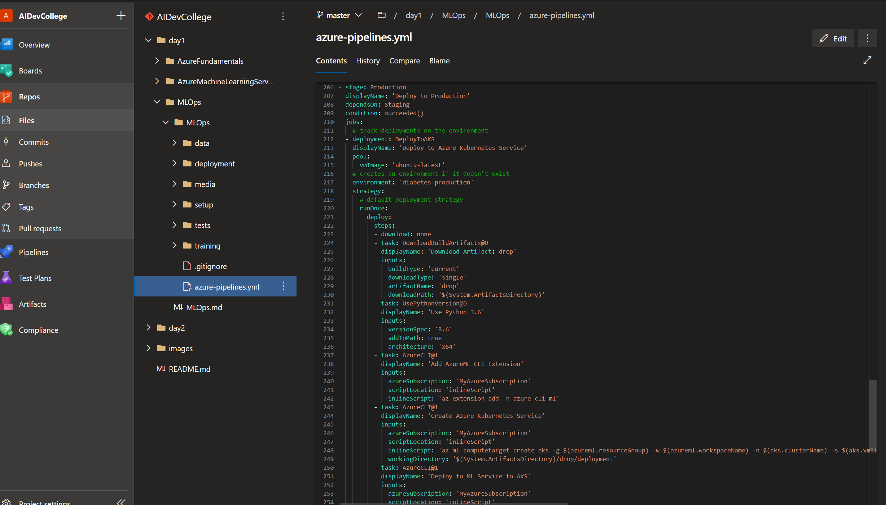

Finally, check your Resource Group within the **Azure Portal**, if everything has been deployed and check your **Machine Learning Workspace** to see the **trained model** and the **endpoints**.

Here you can see the final results within the **Azure Portal**:

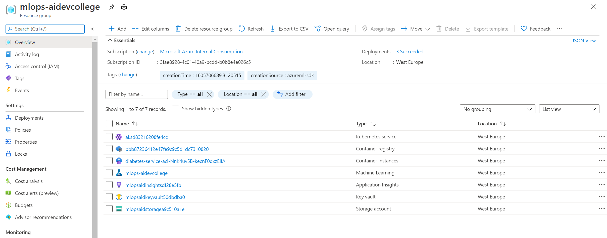

Here you can see the final results within the **Azure Machine Learning Workspace**:
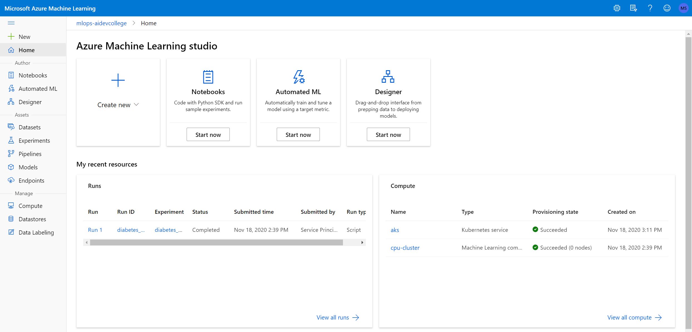

### What happened behind the scenes:
Overall we have 3 Stages called `Build`, called `Staging` and called `Production`.
Underneath we have several `jobs` e.g. to `train, evaluate and register` the `linear regression model` using [`Ridge Regression`](https://towardsdatascience.com/ridge-and-lasso-regression-a-complete-guide-with-python-scikit-learn-e20e34bcbf0b). Underneath the `jobs` we have several `tasks` to load the dependencies e.g. Azure CLI or Python dependencies and to publish the trained model as an Artifact. In the `Staging` Stage and `Production` Stage the trained model is downloaded and deployed to Azure Container Instance and Azure Kubernetes to provision the model later on in an Application.

Here you can see the overall `variables`, `stages`, `jobs`, `steps` and `tasks` sections in the **azure-pipelines.yml** file:

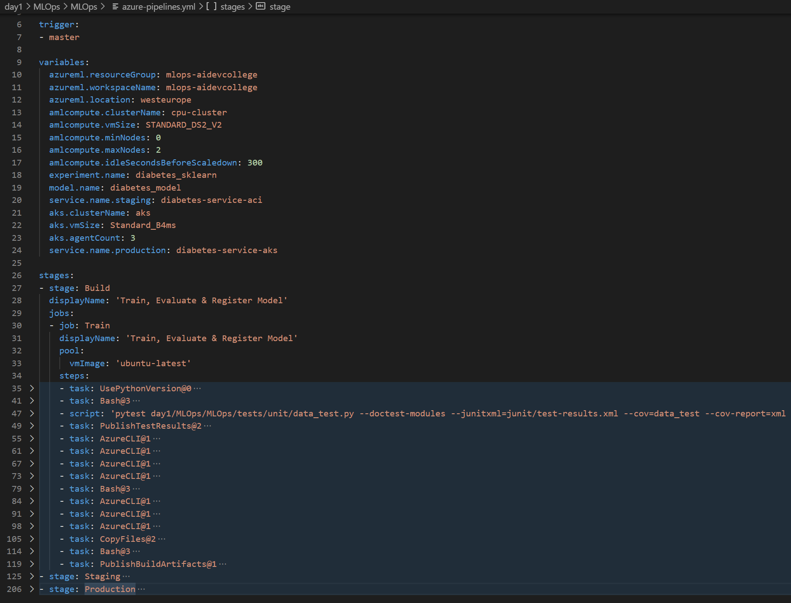.

>> [!IMPORTANT]
> Now as we are still in the ml expert view combined with the developer view, we still want to retrain our model and register a new version of the model. But as we did everything manually using Jupyter Notebooks earlier today we still want to use this convenient automatic MLOps approach.

Thus we will change our trainings script and trigger a new run of our pipeline. In the end we will have a new registered model as an outcome. 

### Trigger a new Pipeline Run to register a new version of the machine learning model

- Let's go into the folder `day1/MLOps/MLOps/training` in **Azure Repos** and open the `train_diabetes.py` and modify the **`test_size`** to a reasonable size like **`0.33`**. The `test_size` splits the data into training and testing set. The training dataset will be used to fit the model and the testing dataset will be used to evaluate the quality of the model. We chose 33% of test data and 67% of training data as the respective split.

- Now we **automatically trigger** the pipeline again. We do _not need to manually_ run the pipeline. This is supposed to show that once you change your training script the model is retrained.

```python

X_train, X_test, y_train, y_test = train_test_split(diabetes, y, test_size=0.33, random_state=0)

```

**Final Result:** Now we see our second model registered in our `Machine Learning Workspace:`

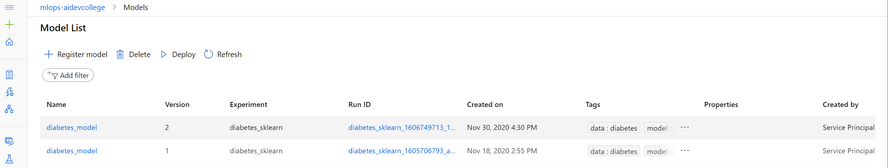

## What we have done so far:

- Create an Azure DevOps account, project, service connection and imported the Repository 
- Work with Build and Release Pipelines
- Automatically created a ML Workspace, Train and registered the ML model
- Automatically deployed the ML model to a Container Instance and Azure Kubernetes
- Triggered a second Pipeline run and registered a new ML model in the Machine Learning Workspace

>> [!IMPORTANT]
> If you want to know more about Azure DevOps there is another **[Azure Developer College](https://github.com/azuredevcollege/trainingdays)** going into the details of **[Azure DevOps](https://github.com/azuredevcollege/trainingdays/tree/master/day4)**

That's it for today - Well done! :clap:

[Back to AI Developer College Overview](../../README.md)

