# AI Developer College Day 2 - Cognitive Search

Today we will stay in the developer view by using existing endpoints with pre-trained machine models behind the scenes. For this we will focus on our managed services like Azure Cognitive Search and later on Azure Cognitive Services and explore some of our convenient tools to create custom machine learning models like LUIS and Custom Vision. As a developer I can use those REST APIs and enrich my applications without having deep data scientist knowledge.
As final task we have prepared a small application which adopts a pre-trained object detection model. This shows the entire lifecycle and brings together best of both worlds.

## Focus of Today:

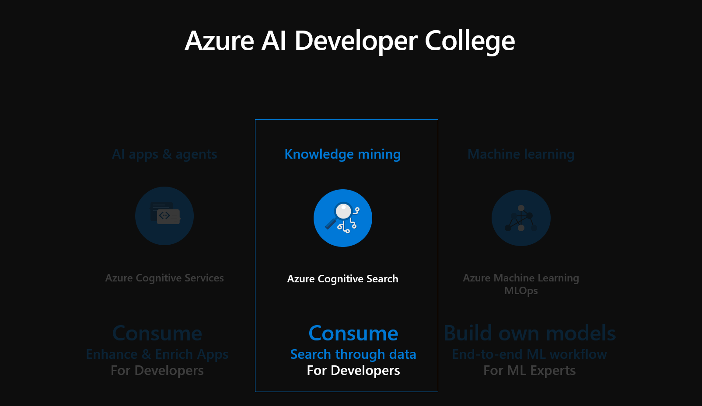

As Azure Cognitive Search can be enriched by the Azure Cognitive Services with pre-trained machine learning models behind the scenes and it makes data searchable in an intelligent manner this service is included in our AI Developer College as well as in the Azure AI Stack.

## Here is what you will learn

Today will be an overview of Azure Cognitive Search, as you will learn:

- Create an Azure Search Service in the Portal
- Add Cognitive Skills to Azure Search
- Deploy an Azure Search instance and index a PDF-based data set
- Use Azure Search & Cognitive Services to index unstructured content
- Integrate Azure Search in an Node JS application

Today we will cover the following topics in several sections:

|Topic|Section|
|---|---|
|Getting familiar with Cognitive Search|[What is Azure Cognitive Search?](#what-is-azure-cognitive-search)|
|Create Azure Cognitive Search in the Portal|[Create an Azure Search Service in the Portal](#create-an-azure-search-service-in-the-portal)|
|Connect to Azure Cognitive Search|[Connect to Azure Cognitive Search](#connect-to-azure-cognitive-search)|
|Deploy an Azure Search instance and index a PDF-based data set|[Azure Search & Cognitive Search - Deploy an Azure Search instance and index a PDF-based data set](#azure-search--cognitive-search---deploy-an-azure-search-instance-and-index-a-pdf-based-data-set)|
|Azure Search & Cognitive Search Indexing unstructured content|[Azure Search & Cognitive Search Indexing unstructured content (e.g. images, audio, etc.)](#azure-search--cognitive-search-indexing-unstructured-content-eg-images-audio-etc)|
|Integrate Azure Search in an Node JS Application|[Integrate Azure Search in an Node JS Application](#integrate-azure-search-in-an-node-js-application)|

## Azure Cognitive Search

### What is Azure Cognitive Search?

Azure Cognitive Search is a search-as-a-service cloud solution that gives developers APIs and tools for adding a rich search experience over private, heterogeneous content in web, mobile and enterprise applications. Your code or a tool invokes data ingestion (indexing) to create and load an index. Optionally, you can add cognitive skills to apply Artificial Intelligence processes during indexing. Doing so, you can add new information and structures useful for search and other scenarios.

Regarding your application, your code issues query requests and handles responses from Azure Search. The search experience is defined in your client using functionality from Azure Cognitive Search, with query execution over a persisted index that you create, own, and store in your service.


If you are interested in getting to know features of Azure Search and the query syntax we have listed some examples for you in the **`Details`** section below. Otherwise you can go ahead and start with the challenge. <br>

<details>

### What are the Features of Azure Cognitive Search?

| Core Search  | Features |
| --- | --- |
|Free-form text search | [**Full-text search**](https://docs.microsoft.com/en-us/azure/search/search-lucene-query-architecture) is a primary use case for most search-based apps. Queries can be formulated using a supported syntax. <br/><br/>[**Simple query syntax**](https://docs.microsoft.com/en-us/rest/api/searchservice/simple-query-syntax-in-azure-search) provides logical operators, phrase search operators, suffix operators, precedence operators.<br/><br/>[**Lucene query syntax**](https://docs.microsoft.com/en-us/rest/api/searchservice/lucene-query-syntax-in-azure-search) includes all operations in simple syntax, with extensions for fuzzy search, proximity search, term boosting, and regular expressions.|
| Filters and facets | [**Faceted navigation**](https://docs.microsoft.com/en-us/azure/search/search-faceted-navigation) is enabled through a single query parameter. Azure Cognitive Search returns a faceted navigation structure you can use as the code behind a categories list, for self-directed filtering (for example, to filter catalog items by price-range or brand). <br/><br/> [**Filters**](https://docs.microsoft.com/en-us/azure/search/search-filters-facets) can be used to incorporate faceted navigation into your application's UI, enhance query formulation, and filter based on user- or developer-specified criteria. Create filters using the OData syntax. 

### Facet Filters in a Search App

Faceted navigation is used for self-directed filtering on query results in a search app, where your application offers UI controls for scoping search to groups of documents (for example, categories or brands), and Azure Cognitive Search provides the data structure to back the experience. 

In code, a query that specifies all parts of a valid query, including search expressions, facets, filters, scoring profiles– anything used to formulate a request, can look like the following example: 

```csharp
var sp = new SearchParameters()
{
    ...
    // Add facets
    Facets = new[] { "businessTitle" }.ToList()
};
```

This example builds a request that creates facet navigation based on the business title information.


Facets are dynamic and returned on a query. Search responses bring with them the facet categories used to navigate the results.

You can find more details here: [Search-Filters-Facets](https://docs.microsoft.com/en-us/azure/search/search-filters-facets)

In the SCM Application, we are using the Lucene query syntax ([Lucene Query Syntax Examples](https://docs.microsoft.com/en-us/azure/search/search-query-lucene-examples)).

View the full Azure Cognitive Search Feature list here:
[Azure Cognitive Search Feature list](https://docs.microsoft.com/en-us/azure/search/search-what-is-azure-search#feature-descriptions)

Now let's deploy an [Azure Search](https://docs.microsoft.com/en-us/azure/search/search-create-service-portal) instance as in the following.

</details>

## Create an Azure Search Service in the Portal

1. Create a new resource group, e.g. **adc-azsearch-db-rg** and add a service of type **Azure Cognitive Search**

1. First, create a `Azure Search` instance in the Azure Portal

1. For our purposes, the `Standard Tier` is sufficient


View the Details of Creating an Azure Search Service in the Portal:

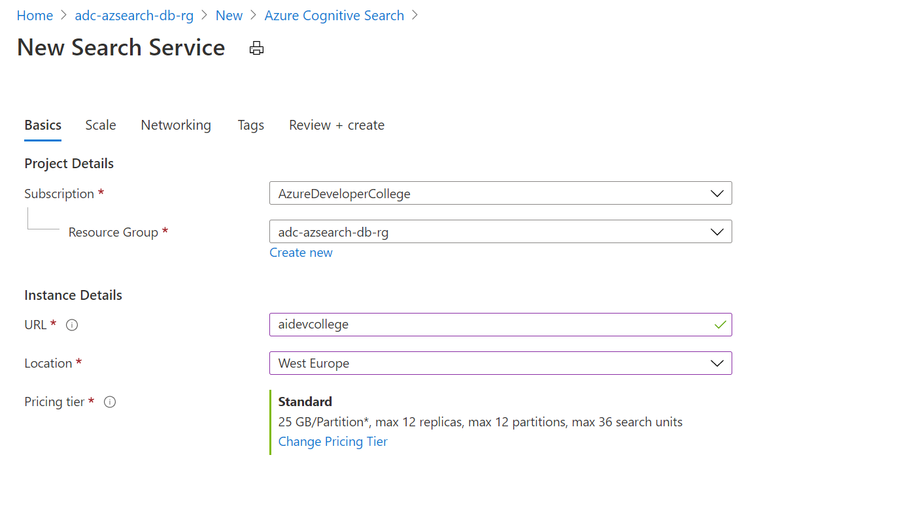

Once provisioned, our service will be reachable via `https://xxxxxxx.search.windows.net`

Azure Search [can index](https://docs.microsoft.com/en-us/azure/search/search-indexer-overview) data from a variety of sources:

- Azure SQL Database or SQL Server on an Azure virtual machine
- Azure Cosmos DB
- Azure Blob Storage
- Azure Table Storage
- Indexing CSV blobs using the Azure Search Blob indexer
- Indexing JSON blobs with Azure Search Blob indexer

### Connect to an Azure Cognitive Search index in Python using Jupyter notebooks ##

### Get a key and URL ##

REST calls require the service URL and an access key on every request. A search service is created with both, so if you added Azure Cognitive Search to your subscription, follow these steps to get the necessary information:

1. [Sign in to the Azure portal](https://portal.azure.com/), and in your search service **Overview** page, get the URL (example endpoint `https://xxxxxxx.search.windows.net`).

2. In **Settings** > **Keys**, get an admin key for full rights on the service. There are two interchangeable admin keys, provided for business continuity in case you need to roll one over. You can use either the primary or secondary key on requests for adding, modifying, and deleting objects.

All requests require an api-key on every request sent to your service. Having a valid key establishes trust, on a per request basis, between the application sending the request and the service that handles it.

## Connect to Azure Cognitive Search

In this task, start a Jupyter notebook and verify that you can connect to Azure Cognitive Search. You'll do this by requesting a list of indexes from your service.

1. We reuse the `Compute Instance (VM)` from the Azure Machine Learning Service and create a new Notebook. We can click the `New` button and create a new Notebook of type: `Python 3.6 - AzureML`. A new browser tab should open up and we can click the name `Untitled` and rename it to `CognitiveSearch.ipynb`.

2. In the first cell, load the libraries used for working with JSON and formulating HTTP requests.

   ```python
   import json
   import requests
   from pprint import pprint
   ```

3. In the second cell, input the request elements that will be constants on every request. Replace the search service name (YOUR-SEARCH-SERVICE-NAME) and admin API key (YOUR-ADMIN-API-KEY) with valid values. 

   ```python
   endpoint = 'https://<YOUR-SEARCH-SERVICE-NAME>.search.windows.net/'
   api_version = '?api-version=2020-06-30'
   headers = {'Content-Type': 'application/json',
           'api-key': '<YOUR-ADMIN-API-KEY>' }
   ```

4. In the third cell, formulate the request. This GET request targets the indexes collection of your search service and selects the name property of existing indexes.

   ```python
   url = endpoint + "indexes" + api_version + "&$select=name"
   response  = requests.get(url, headers=headers)
   index_list = response.json()
   pprint(index_list)
   ```
 If you get ConnectionError `"Failed to establish a new connection"`, verify that the api-key is a primary or secondary admin key, and that all leading and trailing characters (`?` and `/`) are in place.

5. Run each step. If indexes exist, the response contains a list of index names. In contrast, an empty index collection returns this response: 

```json
{
  "@odata.context": "https://mydemo.search.windows.net/$metadata#indexes(name)", "value": []
}
```
Once we have completed the next **Create an Index Task** it will look like this:

```json
{
  "@odata.context": "https://devcollege.search.windows.net/$metadata#indexes(name)",
  "value": [{"name": "hotels-quickstart"}]
}
```

### 1 - Create an index

Unless you are using the portal, an index must exist on the service before you can load data. This step uses the [Create Index REST API](https://docs.microsoft.com/rest/api/searchservice/create-index) to push an index schema to the service.

Required elements of an index include a name, a fields collection, and a key. The fields collection defines the structure of a *document*. Each field has a name, type, and attributes that determine how the field is used (for example, whether it is full-text searchable, filterable, or retrievable in search results). Within an index, one of the fields of type `Edm.String` must be designated as the *key* for document identity.

This index is named "hotels-quickstart" and has the field definitions you see below. It's a subset of a larger [Hotels index](https://github.com/Azure-Samples/azure-search-sample-data/blob/master/hotels/Hotels_IndexDefinition.JSON) used in other walkthroughs. We trimmed it in this quickstart for brevity.

1. In the next cell, paste the following example into a cell to provide the schema. 

    ```python
    index_schema = {
       "name": "hotels-quickstart",  
       "fields": [
         {"name": "HotelId", "type": "Edm.String", "key": "true", "filterable": "true"},
         {"name": "HotelName", "type": "Edm.String", "searchable": "true", "filterable": "false", "sortable": "true", "facetable": "false"},
         {"name": "Description", "type": "Edm.String", "searchable": "true", "filterable": "false", "sortable": "false", "facetable": "false", "analyzer": "en.lucene"},
         {"name": "Description_fr", "type": "Edm.String", "searchable": "true", "filterable": "false", "sortable": "false", "facetable": "false", "analyzer": "fr.lucene"},
         {"name": "Category", "type": "Edm.String", "searchable": "true", "filterable": "true", "sortable": "true", "facetable": "true"},
         {"name": "Tags", "type": "Collection(Edm.String)", "searchable": "true", "filterable": "true", "sortable": "false", "facetable": "true"},
         {"name": "ParkingIncluded", "type": "Edm.Boolean", "filterable": "true", "sortable": "true", "facetable": "true"},
         {"name": "LastRenovationDate", "type": "Edm.DateTimeOffset", "filterable": "true", "sortable": "true", "facetable": "true"},
         {"name": "Rating", "type": "Edm.Double", "filterable": "true", "sortable": "true", "facetable": "true"},
         {"name": "Address", "type": "Edm.ComplexType", 
         "fields": [
         {"name": "StreetAddress", "type": "Edm.String", "filterable": "false", "sortable": "false", "facetable": "false", "searchable": "true"},
         {"name": "City", "type": "Edm.String", "searchable": "true", "filterable": "true", "sortable": "true", "facetable": "true"},
         {"name": "StateProvince", "type": "Edm.String", "searchable": "true", "filterable": "true", "sortable": "true", "facetable": "true"},
         {"name": "PostalCode", "type": "Edm.String", "searchable": "true", "filterable": "true", "sortable": "true", "facetable": "true"},
         {"name": "Country", "type": "Edm.String", "searchable": "true", "filterable": "true", "sortable": "true", "facetable": "true"}
        ]
       }
      ]
    }
    ```

2. In another cell, formulate the request. This PUT request targets the indexes collection of your search service and creates an index based on the index schema you provided in the previous cell. Check that the indentation is correct as shown below.

   ```python
   url = endpoint + "indexes" + api_version
   response  = requests.post(url, headers=headers, json=index_schema)
   index = response.json()
   pprint(index)
   ```

3. Run each step.

   The response includes the JSON representation of the schema. 

- Another way to verify index creation is to check the Indexes list in the portal.

<a name="load-documents"></a>

### 2 - Load documents

To push documents, use an HTTP POST request to your index's URL endpoint. The REST API is [Add, Update, or Delete Documents](https://docs.microsoft.com/rest/api/searchservice/addupdate-or-delete-documents). Documents originate from [HotelsData](https://github.com/Azure-Samples/azure-search-sample-data/blob/master/hotels/HotelsData_toAzureSearch.JSON) on GitHub.

1. In a new cell, provide four documents that conform to the index schema. Specify an upload action for each document.

    ```python
    documents = {
        "value": [
        {
        "@search.action": "upload",
        "HotelId": "1",
        "HotelName": "Secret Point Motel",
        "Description": "The hotel is ideally located on the main commercial artery of the city in the heart of New York. A few minutes away is Time's Square and the historic centre of the city, as well as other places of interest that make New York one of America's most attractive and cosmopolitan cities.",
        "Description_fr": "L'hôtel est idéalement situé sur la principale artère commerciale de la ville en plein cœur de New York. A quelques minutes se trouve la place du temps et le centre historique de la ville, ainsi que d'autres lieux d'intérêt qui font de New York l'une des villes les plus attractives et cosmopolites de l'Amérique.",
        "Category": "Boutique",
        "Tags": [ "pool", "air conditioning", "concierge" ],
        "ParkingIncluded": "false",
        "LastRenovationDate": "1970-01-18T00:00:00Z",
        "Rating": 3.60,
        "Address": {
            "StreetAddress": "677 5th Ave",
            "City": "New York",
            "StateProvince": "NY",
            "PostalCode": "10022",
            "Country": "USA"
            }
        },
        {
        "@search.action": "upload",
        "HotelId": "2",
        "HotelName": "Twin Dome Motel",
        "Description": "The hotel is situated in a  nineteenth century plaza, which has been expanded and renovated to the highest architectural standards to create a modern, functional and first-class hotel in which art and unique historical elements coexist with the most modern comforts.",
        "Description_fr": "L'hôtel est situé dans une place du XIXe siècle, qui a été agrandie et rénovée aux plus hautes normes architecturales pour créer un hôtel moderne, fonctionnel et de première classe dans lequel l'art et les éléments historiques uniques coexistent avec le confort le plus moderne.",
        "Category": "Boutique",
        "Tags": [ "pool", "free wifi", "concierge" ],
        "ParkingIncluded": "false",
        "LastRenovationDate": "1979-02-18T00:00:00Z",
        "Rating": 3.60,
        "Address": {
            "StreetAddress": "140 University Town Center Dr",
            "City": "Sarasota",
            "StateProvince": "FL",
            "PostalCode": "34243",
            "Country": "USA"
            }
        },
        {
        "@search.action": "upload",
        "HotelId": "3",
        "HotelName": "Triple Landscape Hotel",
        "Description": "The Hotel stands out for its gastronomic excellence under the management of William Dough, who advises on and oversees all of the Hotel’s restaurant services.",
        "Description_fr": "L'hôtel est situé dans une place du XIXe siècle, qui a été agrandie et rénovée aux plus hautes normes architecturales pour créer un hôtel moderne, fonctionnel et de première classe dans lequel l'art et les éléments historiques uniques coexistent avec le confort le plus moderne.",
        "Category": "Resort and Spa",
        "Tags": [ "air conditioning", "bar", "continental breakfast" ],
        "ParkingIncluded": "true",
        "LastRenovationDate": "2015-09-20T00:00:00Z",
        "Rating": 4.80,
        "Address": {
            "StreetAddress": "3393 Peachtree Rd",
            "City": "Atlanta",
            "StateProvince": "GA",
            "PostalCode": "30326",
            "Country": "USA"
            }
        },
        {
        "@search.action": "upload",
        "HotelId": "4",
        "HotelName": "Sublime Cliff Hotel",
        "Description": "Sublime Cliff Hotel is located in the heart of the historic center of Sublime in an extremely vibrant and lively area within short walking distance to the sites and landmarks of the city and is surrounded by the extraordinary beauty of churches, buildings, shops and monuments. Sublime Cliff is part of a lovingly restored 1800 palace.",
        "Description_fr": "Le sublime Cliff Hotel est situé au coeur du centre historique de sublime dans un quartier extrêmement animé et vivant, à courte distance de marche des sites et monuments de la ville et est entouré par l'extraordinaire beauté des églises, des bâtiments, des commerces et Monuments. Sublime Cliff fait partie d'un Palace 1800 restauré avec amour.",
        "Category": "Boutique",
        "Tags": [ "concierge", "view", "24-hour front desk service" ],
        "ParkingIncluded": "true",
        "LastRenovationDate": "1960-02-06T00:00:00Z",
        "Rating": 4.60,
        "Address": {
            "StreetAddress": "7400 San Pedro Ave",
            "City": "San Antonio",
            "StateProvince": "TX",
            "PostalCode": "78216",
            "Country": "USA"
            }
        }
    ]
    }
    ```   

2. In another cell, formulate the request. This POST request targets the docs collection of the hotels-quickstart index and pushes the documents provided in the previous step.

   ```python
   url = endpoint + "indexes/hotels-quickstart/docs/index" + api_version
   response  = requests.post(url, headers=headers, json=documents)
   index_content = response.json()
   pprint(index_content)
   ```

3. Run each step to push the documents to an index in your search service. Results should look similar to the following example. 

    

### 3 - Search an index

This step shows you how to query an index using the [Search Documents REST API](https://docs.microsoft.com/rest/api/searchservice/search-documents).

1. **Option 1:** In a cell, provide a query expression that executes an empty search (search=*), returning an unranked list (search score  = 1.0) of arbitrary documents. By default, Azure Cognitive Search returns 50 matches at a time. As structured, this query returns an entire document structure and values. Add $count=true to get a count of all documents in the results.

   ```python
   search_string_option1 = '&search=*&$count=true'
   ```

2. **Option 2:** In a new cell, provide the following example to search on the terms "hotels" and "wifi". Add $select to specify which fields to include in the search results.

   ```python
   search_string_option2 = '&search=hotels wifi&$count=true&$select=HotelId,HotelName'
   ```

3. In another cell, formulate a request. This GET request targets the docs collection of the hotels-quickstart index, and attaches the query you specified in the previous step, please  choose the first Option and afterwards the second Option to execute the different queries: `search_string_option<fill In: 1 or 2>`

   ```python
   url = endpoint + "indexes/hotels-quickstart/docs" + api_version + search_string_option1
   response  = requests.get(url, headers=headers, json=search_string_option1)
   query = response.json()
   pprint(query)
   ```

4. Run each step. Results should look similar to the following output. 

    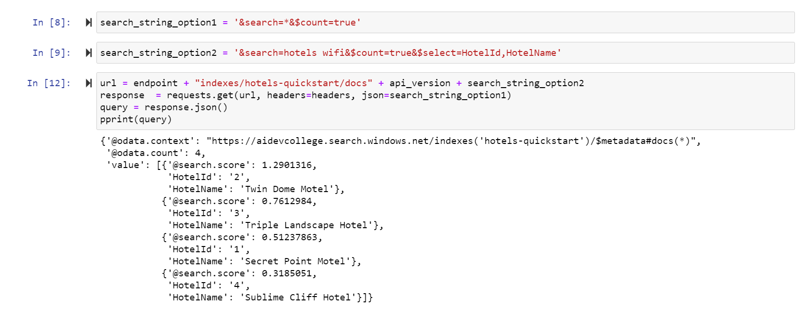

If you are interested in querying with different `searchstrings` we have listed some samples in the **`Details`** section for you:

<details>

5. Try a few other query examples to get a feel for the syntax. You can replace the `searchstring` with the following examples and then rerun the search request. 

   Apply a filter: 

   ```python
   search_string_option3 = '&search=*&$filter=Rating gt 4&$select=HotelId,HotelName,Description,Rating'
   ```

   Take the top two results:

   ```python
   search_string_option4 = '&search=boutique&$top=2&$select=HotelId,HotelName,Description,Category'
   ```

    Order by a specific field:

   ```python
   search_string_option5 = '&search=pool&$orderby=Address/City&$select=HotelId, HotelName, Address/City, Address/StateProvince, Tags'
   ```
</details>

## Azure Search & Cognitive Search - Reuse the Azure Search instance and index a PDF-based data set

:triangular_flag_on_post: **Goal:** Reuse the Azure Search instance and index a PDF-based data set 

We want to index the unstructured PDF data set from [here](https://github.com/aidevcollege/aidevcollege/raw/master/day2/CognitiveSearch/data/search-dataset-pdf.zip).

### Indexing PDF data

Please reuse the Azure Search instance which you initially created.

Here we'll upload our data to Blob Storage and let Azure Search index it from there. Hence, we need to create an new `Storage Account` and create a new `Blob container`, where we'll upload our [dataset](https://github.com/aidevcollege/aidevcollege/raw/master/day2/CognitiveSearch/data/search-dataset-pdf.zip) to. We can do this completely through the Azure Portal (**as described below**), use [Storage Explorer](https://azure.microsoft.com/en-us/features/storage-explorer/) or use the API/CLI.

**See the upload to the Storage Account below:**

Let's create a **Storage Account** in the **Azure Portal**:

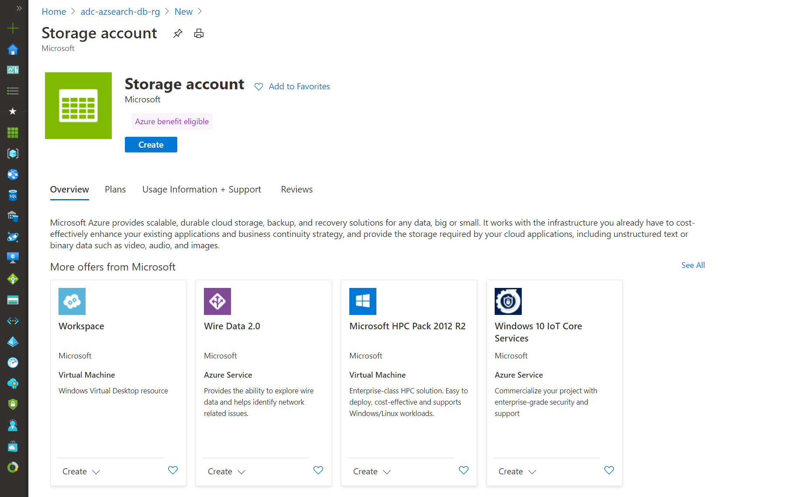

Fill in a *unique name* and choose the region *west europe*:

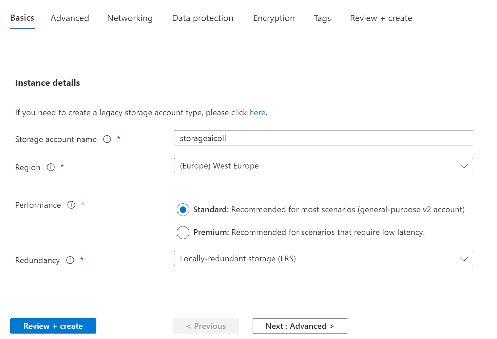

Then create a Container with the **Public Access Level *Private** (See Screenshot below):
The Public Access Level specifies whether data in the container may be accessed publicly. By default, container data is private to the account owner. Use 'Blob' to allow public read access for blobs. Use 'Container' to allow public read and list access to the entire container.

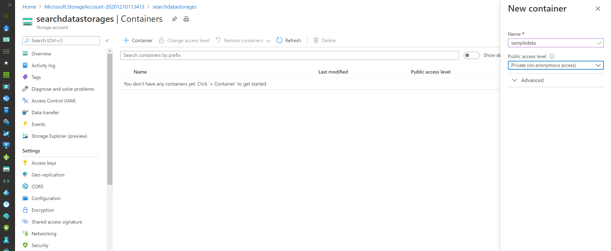

Now we can upload the **unzipped** data to the created Storage Account:

> ⚠ Caution:
> Please be aware to first **unzip** the folder and upload the **unzipped** content of the folder.

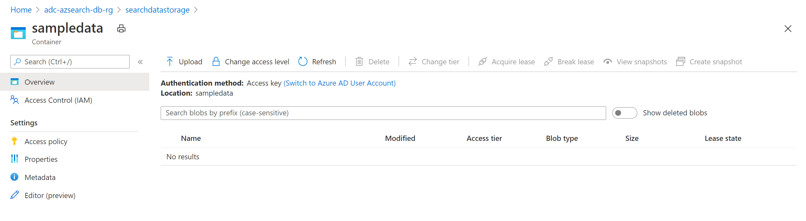

You can conveniently **select and upload all files at once**:

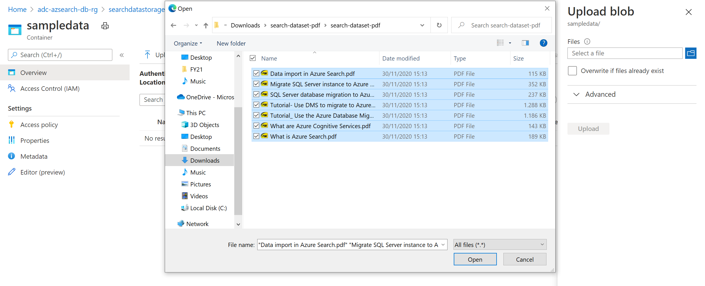

Once we have uploaded the PDF files, we can go into our Azure Search instance and go to `Import Data`:

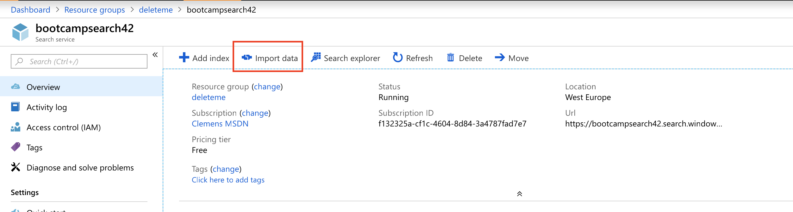

Next, we need to define the `Data Source`:

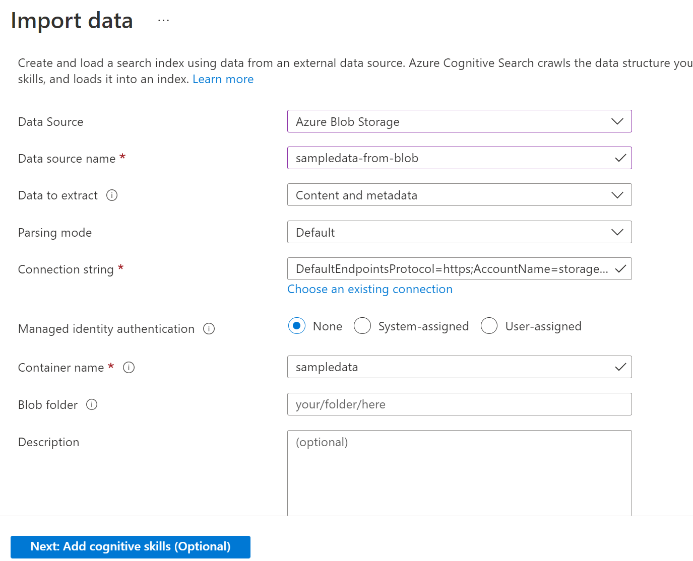

We'll skip `Cognitive Search` for this example (we'll get back to it soon). Azure Search automatically looks at the Blob container and will now extract the content and the metadata from all the PDFs. Let's give our Index a better name:

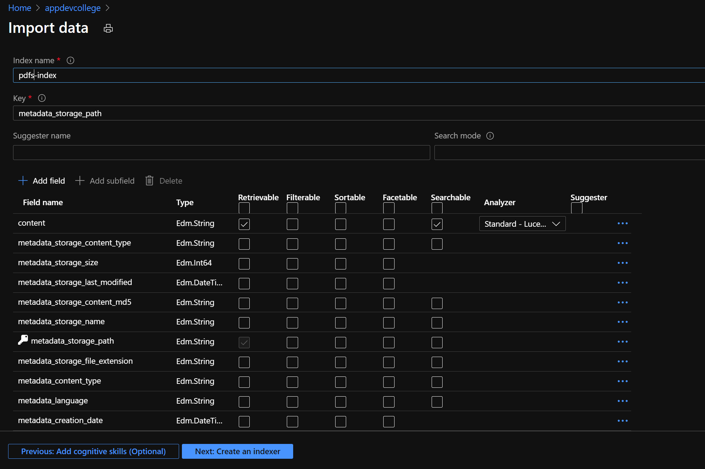

Lastly, we need to give our Indexer a name and also set the schedule. In our case, we'll only run it once, but in a real world scenario, we might want to keep it running to index new, incoming data:

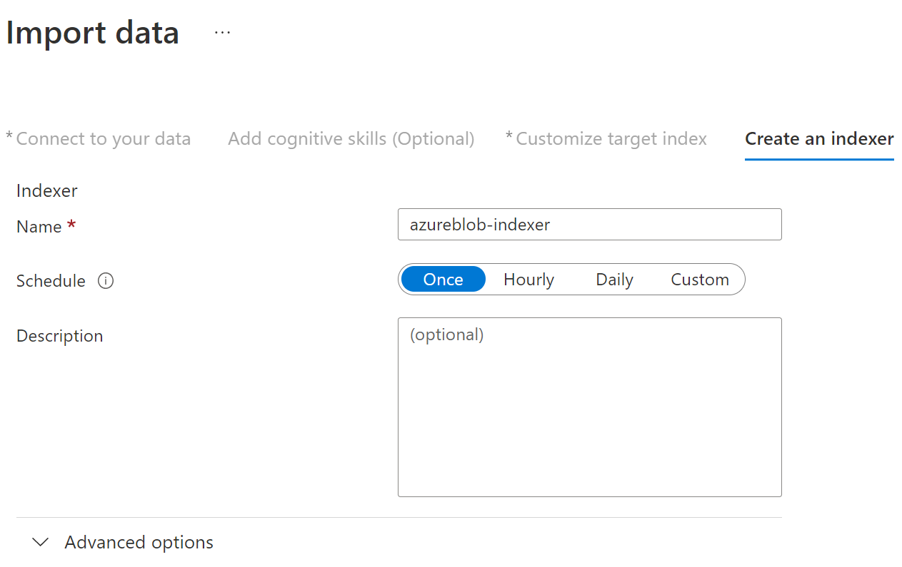

After a minute or two, our Indexer will have indexed all the PDFs and we should be able to query them.

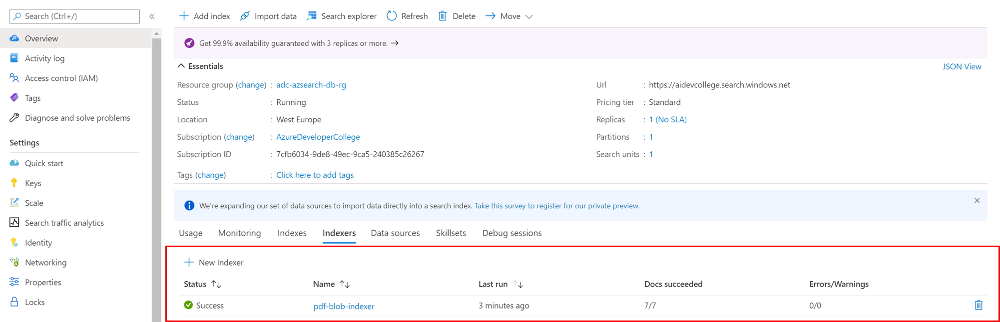

### Querying Content

Azure Search now indexed all our PDFs via the `pdf-blob-indexer` into the `pdf-index` index. Ideally, we would use the REST API of Azure Search to perform sophisticated queries, but in our case, we can use the `Azure Search Explorer`:

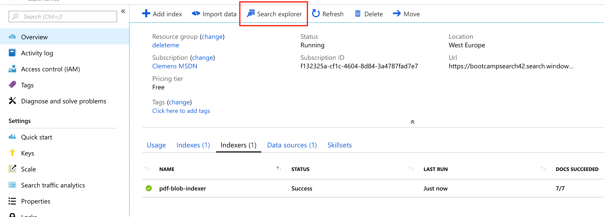

[Querying data](https://docs.microsoft.com/en-us/azure/search/search-query-overview) in Azure Search can get quite sophisticated, but for our example here, we can just put in a simple query:

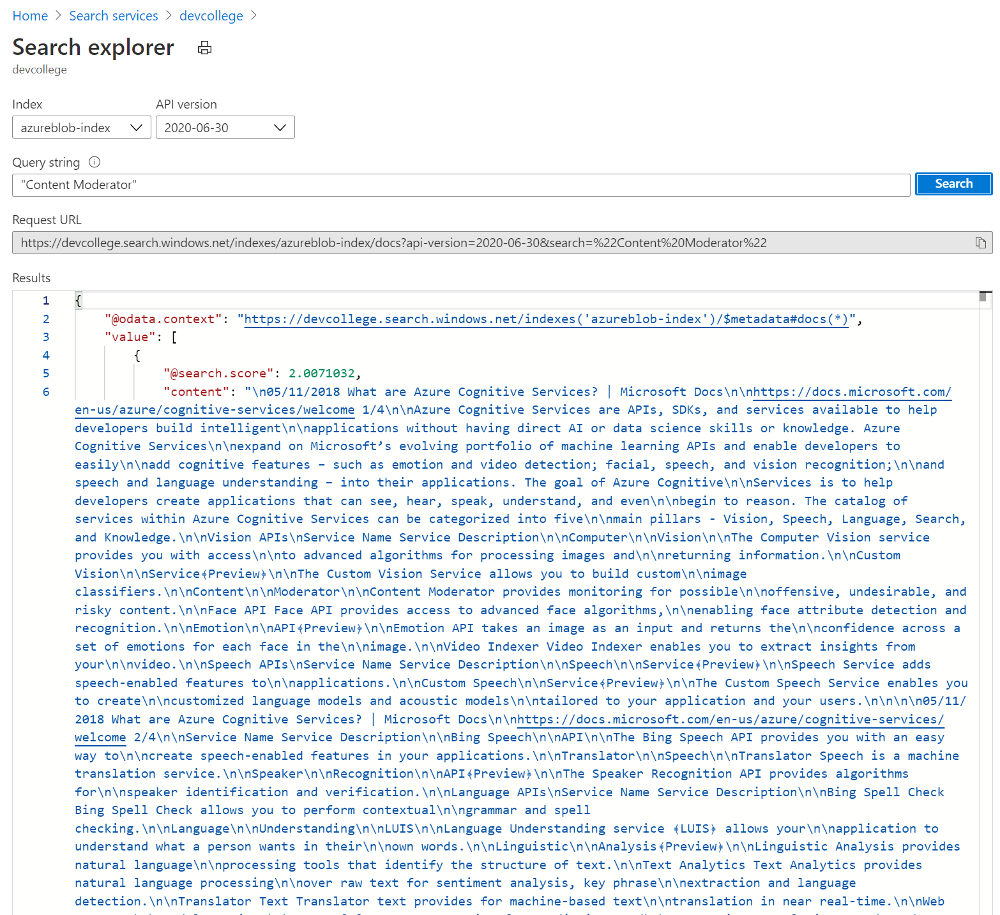

Using double-quotes `"..."` will search for the whole string, rather than each substring. If we want to make a search term mandatory, we need to prefix a `+`. There is a billion more things we can do, but for now, we'll see that we get one document back, as one only one PDF contained the term `Content Moderator`:

```json
{
    "@odata.context": "https://devcollege.search.windows.net/indexes('azureblob-index')/$metadata#docs(*)",
    "value": [
        {
            "@search.score": 2.0071032,
            "content": "\n05/11/2018 What are Azure Cognitive Services? | Microsoft Docs\n\nhttps://docs.microsoft.com/en-us/azure/cognitive-services/welcome 1/4\n\nAzure Cognitive Services are APIs, SDKs, and services available to help developers build intelligent\n\napplications ...",
            "metadata_storage_path": "aHR0cHM6Ly9tYXNwbGl0dHN0cjEuYmxvYi5jb3JlLndpbmRvd3MubmV0L2RhdGFzZXRzL3NlYXJjaC1kYXRhc2V0LXBkZi9zZWFyY2gtZGF0YXNldC1wZGYvV2hhdCUyMGFyZSUyMEF6dXJlJTIwQ29nbml0aXZlJTIwU2VydmljZXMucGRm0"
        }
    ]
}

```

If we want to figure out the original file, we can look at: `metadata_storage_path`. Since it is **base64-encoded**, we need to decode it, either via command line or by using e.g., [www.base64decode.org](https://www.base64decode.org/):

Perfect, now we know which [document](https://bootcamps.blob.core.windows.net/datasets/What%20are%20Azure%20Cognitive%20Services.pdf) contained the term `Content Moderator`.

## Azure Search & Cognitive Search Indexing unstructured content (e.g. images, audio, etc.)

:triangular_flag_on_post: **Goal:** Index an unstructured data set with Cognitive Search

1. Add another index to the Azure Search instance, but this time enable Cognitive Search
1. Index an existing data set coming from `Azure Blob` (data set can be downloaded [here](https://github.com/aidevcollege/aidevcollege/raw/master/day2/CognitiveSearch/data/search-dataset-cognitive.zip))

In the first part, we've seen that Azure Search can index data like PDFs, PowerPoints, etc., as long as the documents are easily machine readable (=text). [Azure Cognitive Search](https://docs.microsoft.com/en-us/azure/search/cognitive-search-concept-intro) allows us to also index unstructured data. More precisely, it add capabilities for data extraction, natural language processing (NLP), and image processing to Azure Search indexing pipeline (for more see [here](https://docs.microsoft.com/en-us/azure/search/cognitive-search-concept-intro#key-features-and-concepts)). In Azure Cognitive Search, a skillset responsible for the pipeline of the data and consists of multiple skills. Some skills have been pre-included, but it is also possible for us to write our own skills.

[Azure Cognitive Search](https://docs.microsoft.com/en-us/azure/search/cognitive-search-quickstart-blob)

As before, let's **unzip and upload the unzipped data** to Blob Storage and let Azure Search index it from there - in a separate index obviously. In our existing Storage Account, we'll create a new `Blob container`, where we'll upload our [dataset](https://github.com/aidevcollege/aidevcollege/raw/master/day2/CognitiveSearch/data/search-dataset-cognitive.zip) to.

Once we're done, we'll repeat the steps from before, `Import Dataset`, walk through the wizard, but this time, we'll configure the `Cognitive Search` part in the second tab.

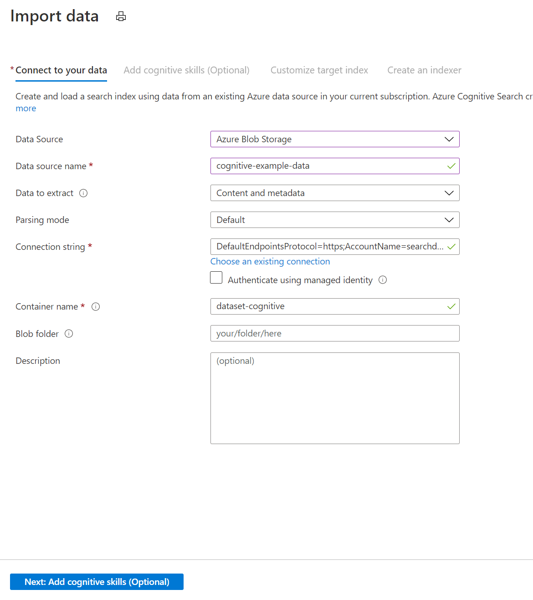

Next, we need to define the skillset. In our case, we'll enable all features:


We might not want to make our `content` field retrievable, as it does not necessarily provide a lot of value - however, we want to keep it `searchable`, so that Azure Search can do its job. Since we have the original files in Blob and the location stored in `metadata_storage_path`, we can always just retrieve the original file.

Once we finished the next two tabs, Azure Cognitive Search will start indexing our data (this will take a bit longer, as it needs to run image recognition, Object Character Recognition Cognitive Services, etc. on the files).

Let's try some search queries:

* `"Pin to Dashboard"` --> returns `create-search-service.png` (text was recognized via OCR)
* `"Los Angeles"` --> returns `MSFT_cloud_architecture_contoso.pdf` (location was recognized via OCR in image)

Good, so looks like our skillset worked. Please note that ideally we'd query through the API an directly specify the relevant fields, e.g., `location:Los Angeles` in the second example:

* [Simple Query Syntax](https://docs.microsoft.com/en-us/rest/api/searchservice/simple-query-syntax-in-azure-search)
* [Lucene Query Syntax](https://docs.microsoft.com/en-us/rest/api/searchservice/lucene-query-syntax-in-azure-search)


As we have now seen how to use the Azure Cognitive Search service we still want to combine the ml expert view with the developer view. Thus we will show a quick example how to integrate Azure Cognitive Search in a simple Node.js application.

## Integrate Azure Search in an Node JS Application

Now let's jump into code. We will create a Node.js application that that creates, loads, and queries an Azure Cognitive Search index. This article demonstrates how to create the application step-by-step. 

### Set up your environment

Begin by opening the **Cloud Shell** (next to the search field) in the Browser, a Bash console, Powershell console or other environment in which you've installed Node.js:


1. Create a development directory, giving it the name `adv-search` :

    ```bash
    cd adv-search
    git clone https://github.com/Azure-Samples/azure-search-javascript-samples.git
    cd azure-search-javascript-samples/quickstart/REST
    code .
    ```   

1. Insert your search service data in the file **azure_search_config.json**:
    ```json
    {
        "serviceName" : "[SEARCH_SERVICE_NAME]",
        "adminKey" : "[SEARCH_SERVICE_ADMIN_KEY]",
        "queryKey" : "[SEARCH_SERVICE_QUERY_KEY]",
        "indexName" : "hotels-quickstart"
    }
    ```
    Replace the `[SEARCH_SERVICE_NAME]` value with the name of your search service. Replace `[SEARCH_SERVICE_ADMIN_KEY]` and `[SEARCH_SERVICE_QUERY_KEY]` with the key values you recorded earlier.  
    If your endpoint URL were https://mydemo.search.windows.net, your service name would be **mydemo**. 
    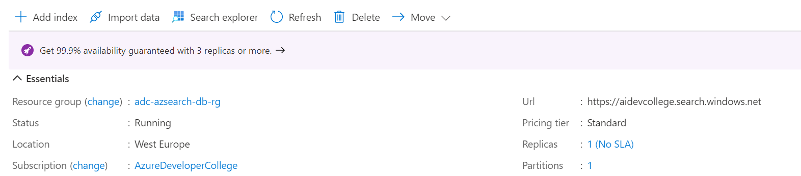
    In **Settings > Keys**, get the primary admin key for full rights on the service. 
    
    > There are two interchangeable admin keys, provided for business continuity in case you need to roll one over. You can use either the primary or secondary key on requests for adding, modifying, and deleting objects.
    
    

    ⚠ Get the query key as well. It's a best practice to issue query requests with read-only access. Use the **key** underneath the *Manage query keys* (e.g. *C4DD...*)

### Important Parts of the simple Node.js Application

Find the file **hotels_quickstart_index.json**. This file defines how Azure Cognitive Search works with the documents you'll be loading in the next step. Each field will be identified by a `name` and has a specified `type`. Each field also has a series of index attributes that specify whether Azure Cognitive Search can *search*, *filter*, *sort*, and *facet* upon the field. 

> Most of the fields are simple data types, but some, like `AddressType` are complex types that allow you to create rich data structures in your index. You can read more about [supported data types](https://docs.microsoft.com/rest/api/searchservice/supported-data-types) and [index attributes](https://docs.microsoft.com/azure/search/search-what-is-an-index#index-attributes). 

Have a look at the **hotels_quickstart_index.json** and get familiar with its setup/content. 

```json
{
    "name": "hotels-quickstart",
    "fields": [
        {
            "name": "HotelId",
            "type": "Edm.String",
            "key": true,
            "filterable": true
        },
        {
            "name": "HotelName",
            "type": "Edm.String",
            "searchable": true,
            "filterable": false,
            "sortable": true,
            "facetable": false
        },
        {
            "name": "Description",
            "type": "Edm.String",
            "searchable": true,
            "filterable": false,
            "sortable": false,
            "facetable": false,
            "analyzer": "en.lucene"
        },
        {
            "name": "Description_fr",
            "type": "Edm.String",
            "searchable": true,
            "filterable": false,
            "sortable": false,
            "facetable": false,
            "analyzer": "fr.lucene"
        },
        {
            "name": "Category",
            "type": "Edm.String",
            "searchable": true,
            "filterable": true,
            "sortable": true,
            "facetable": true
        },
        {
            "name": "Tags",
            "type": "Collection(Edm.String)",
            "searchable": true,
            "filterable": true,
            "sortable": false,
            "facetable": true
        },
        {
            "name": "ParkingIncluded",
            "type": "Edm.Boolean",
            "filterable": true,
            "sortable": true,
            "facetable": true
        },
        {
            "name": "LastRenovationDate",
            "type": "Edm.DateTimeOffset",
            "filterable": true,
            "sortable": true,
            "facetable": true
        },
        {
            "name": "Rating",
            "type": "Edm.Double",
            "filterable": true,
            "sortable": true,
            "facetable": true
        },
        {
            "name": "Address",
            "type": "Edm.ComplexType",
            "fields": [
                {
                    "name": "StreetAddress",
                    "type": "Edm.String",
                    "filterable": false,
                    "sortable": false,
                    "facetable": false,
                    "searchable": true
                },
                {
                    "name": "City",
                    "type": "Edm.String",
                    "searchable": true,
                    "filterable": true,
                    "sortable": true,
                    "facetable": true
                },
                {
                    "name": "StateProvince",
                    "type": "Edm.String",
                    "searchable": true,
                    "filterable": true,
                    "sortable": true,
                    "facetable": true
                },
                {
                    "name": "PostalCode",
                    "type": "Edm.String",
                    "searchable": true,
                    "filterable": true,
                    "sortable": true,
                    "facetable": true
                },
                {
                    "name": "Country",
                    "type": "Edm.String",
                    "searchable": true,
                    "filterable": true,
                    "sortable": true,
                    "facetable": true
                }
            ]
        }
    ],
    "suggesters": [
        {
            "name": "sg",
            "searchMode": "analyzingInfixMatching",
            "sourceFields": [
                "HotelName"
            ]
        }
    ]
}
```

Now, have a look at the file **AzureSearchClient.js** and take your time to understand what happens here. You will find methods to check, if an index exists, to create and delete an index as well as methods to add data to the index (```postDataAsync```) and - of course - query data (```queryAsync```).

### Prepare and run the sample

Use the **Cloud Shell** in the **Azure Portal** window for the following commands.

1. Navigate `cd` to the source code folder `adv-search/azure-search-javascript-samples/quickstart/REST`.
1. Install the packages for the sample with `npm install`.  This command will download the packages upon which the code depends.
1. Run `node index.js` and examine the results

You should see a series of messages describing the actions being taken by the program. Have a look at OData response from Azure Search.

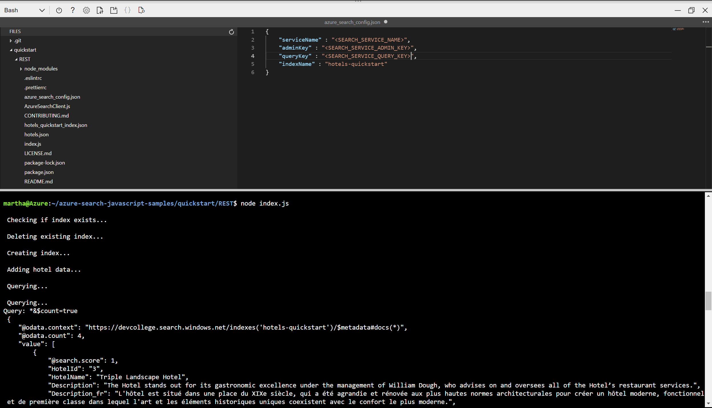

If you are interested in how you can use everything via the REST API and use some fun demos we have added a section with some necessary links in the **`Details`** section below.

<details>

## Using the API

As we've have been lazy and did some parts through the portal - obviously not the way we want to work in the real world. Especially data ingestion and search should (and most likely needs) to be performed through the API. Luckily, the API is pretty easy to use (even using `curl` for it is easy):

* [Create an index](https://docs.microsoft.com/en-us/azure/search/search-create-index-rest-api)
* [Import Data](https://docs.microsoft.com/en-us/azure/search/search-import-data-rest-api)
* [Search](https://docs.microsoft.com/en-us/azure/search/search-query-rest-api)

For sake of time today we won't be able to go into more detail here, but feel free to have a look at it.

## Optional: Play around a bit with Azure Search 

- https://azjobsdemo.azurewebsites.net/
- https://docs.microsoft.com/en-us/samples/azure-samples/search-dotnet-asp-net-mvc-jobs/search-dotnet-asp-net-mvc-jobs/

</details>

## What we have done so far:

- We created an Azure Search Service in the Portal
- Added Cognitive Skills to Azure Search
- Used an Azure Search instance to index a PDF-based data set
- Used Azure Search & Cognitive Services to index unstructured content
- Integrated Azure Search in an Node JS application

As we used **Cognitive Services** behind the scenes of Azure Cognitive Search and as we now want to continue the path of combining the ml expert view and the developer view we will jump into our Cognitive Services challenge next:

:zap: Let's go to **[AI Developer College Day2 - Cognitive Services](../CognitiveServices/Challenge/CognitiveServices.md)**!


## House Keeping: Lab Cleanup

Remove the sample resource group.

```shell
$ az group delete -n adc-azsearch-db-rg
```

