# Cognitive Services #

In this repository you will find the materials and challenges for the Azure Cognitive Services.

# What are Azure Cognitive Services?

Azure Cognitive Services: 
- are APIs, SDKs and services available to help developers build intelligent applications without having direct Artificial Intelligence (AI), data science skills or knowledge. 
- enable developers to easily add cognitive features into their applications. 
- The goal of Azure Cognitive Services is to help developers create applications that can see, hear, speak, understand and even begin to reason. 
- The catalog of services within Azure Cognitive Services can be categorized into five main pillars - *Vision*, *Speech*, *Language*, *Web Search*, and *Decision*.


We'll touch on the following services:

|Service|Where?|
|---|---|
|Text Analytics|[Text Analytics API](https://azure.microsoft.com/en-us/services/cognitive-services/text-analytics/)|
|Translate Text|[Translate Text](https://docs.microsoft.com/en-us/azure/cognitive-services/Translator/translator-info-overview)|
|Face Recognition|[Face API](https://docs.microsoft.com/en-us/azure/cognitive-services/Face/overview)|
|Computer Vision|[Computer Vision API](https://azure.microsoft.com/en-us/services/cognitive-services/computer-vision/)|
|Custom Vision|[Custom Vision API](https://docs.microsoft.com/en-us/azure/cognitive-services/Custom-Vision-Service/overview)|
|Speech|[Speech Services](https://azure.microsoft.com/en-us/services/cognitive-services/speech-services/)|
|Language Understanding|[Language Understanding](https://azure.microsoft.com/en-us/services/cognitive-services/language-understanding-intelligent-service/)|
|Bing Search API|[Bing Search API](https://docs.microsoft.com/en-us/bing/search-apis/bing-web-search/create-bing-search-service-resource)|

# Challenges

You can solve these tasks in a programming language of your choice. For sake of convenience, we are providing hints in `Python`, which you can easily run on the `Compute Instance (VM) from the Azure Machine Learning Service` or in `Visual Studio Code`. SDK Support for `C#`, `Node.js` or `.NET Core` is available for most challenges. Especially Azure Search features an easy-to-use `.NET SDK`. You can find code examples in the Azure documentation for the associated services.

Today we will cover the following topics in several sections:

|Topic|Section|
|---|---|
|Text Analytics |[Azure Cognitive Services - Text Analytics](#azure-cognitive-services---text-analytics)|
|Translate Text|[Azure Cognitive Services - Translate Text](#azure-cognitive-services---translate-text)|
|Face|[Azure Cognitive Services - Face](#azure-cognitive-services---face)|
|Computer Vision|[Azure Cognitive Services - Computer Vision Service](#azure-cognitive-services---computer-vision-service)|
|Custom Vision|[Azure Cognitive Services - Custom Vision Service for Detecting Objects in Images](#azure-cognitive-services---custom-vision-service-for-detecting-objects-in-images)|
|Speech|[Azure Cognitive Services - Speech](#azure-cognitive-services---speech)|
|Language|[Azure Cognitive Services - Language - Reveal the intention of the text](#azure-cognitive-services---language---reveal-the-intention-of-the-text)|
|Search|[Azure Cognitive Services - Search](#azure-cognitive-services---search)|

Now let's start with the **Text Analytics Cognitive Service**. The Text Analytics API (Application Programming Interface) is a cloud-based service that provides Natural Language Processing (NLP) features for text mining and text analysis, including: sentiment analysis, opinion mining, key phrase extraction, language detection, and named entity recognition.

## Azure Cognitive Services - Text Analytics

|Azure Cognitive Services|Information|
|---|---|
|[Text Analytics API](https://azure.microsoft.com/en-us/services/cognitive-services/text-analytics/)|https://docs.microsoft.com/en-us/azure/cognitive-services/text-analytics/quickstarts/python|

:triangular_flag_on_post: **Goal:** Leverage Text Analytics API for extracting language, sentiment, key phrases, and entities from text

1. In the following tasks we will reuse the `Compute Instance (VM)` from the __Azure Machine Learning Service__ and create a new Notebook. We can click the `New` button and create a new Notebook of type: `Python 3.6 - AzureML`. A new browser tab should open up and we can click the name `Untitled` and rename it to `CognitiveServices.ipynb`.

First we deploy the **Azure Text Analytics** Service in the **Azure Portal**:

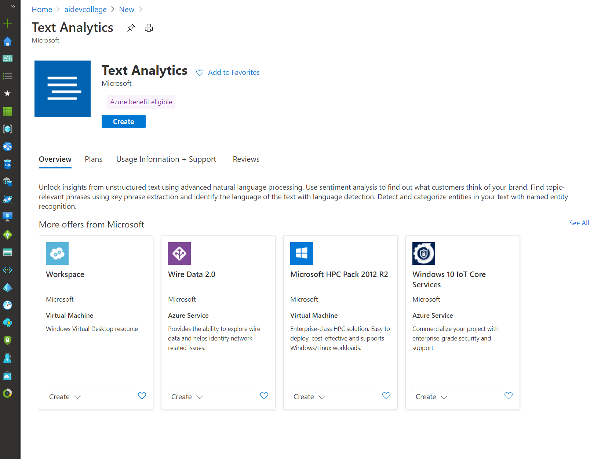

Fill in the *name* and hit *create*:

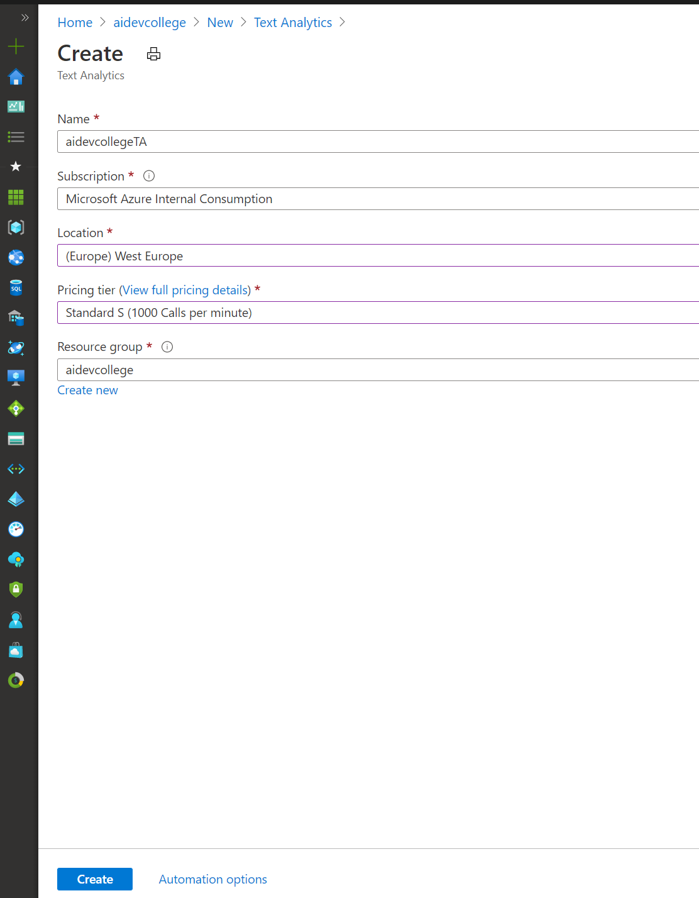

Get the Key and the URL under the section *keys* from the Azure portal:

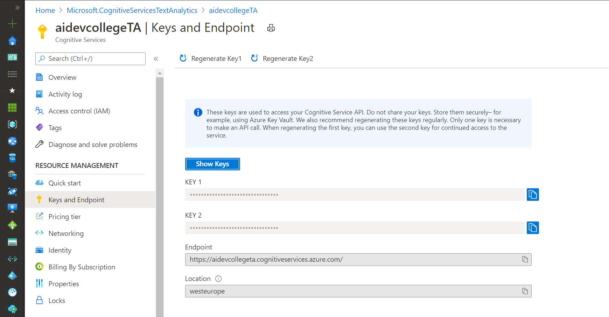

Let's start with connecting to your Text Analytics Service by copying the Code with the **filled in key and endpoint** as shown above into a new Cell in your `CognitiveServices.ipynb` notebook:

```python
import requests
from pprint import pprint

subscription_key = "xxx" # Paste your API key here
text_analytics_base_url = "xxx" # Paste your URL in here
headers = {"Ocp-Apim-Subscription-Key": subscription_key}
```

In the following copy the code into new Cells in your Jupyter Notebook.
In general we will conduct a [REST](https://restfulapi.net/) Call to the Cognitive Services, by sending some data to the Service and let the **pre-trained Machine Learning Model** behind the scences give a response in [JSON format](https://www.w3schools.com/whatis/whatis_json.asp) regarding the data.

### Detect Language

Firstly, we can extract the language from text. Run this in a new Cell in your `CognitiveServices.ipynb` notebook:

```python
language_api_url = text_analytics_base_url + "/text/analytics/v2.1/languages"

documents = { "documents": [
    { "id": "1", "text": "This is a document written in English." },
    { "id": "2", "text": "Este es un document escrito en Español." },
    { "id": "3", "text": "这是一个用中文写的文件" }
]}

response  = requests.post(language_api_url, headers=headers, json=documents)
languages = response.json()
pprint(languages)
```

Your result should look like this: 


### Detect Sentiment

Secondly, we can detect the sentiment of a given phrase, go ahead and copy the Code into your `CognitiveServices.ipynb` notebook:

```python
sentiment_url = text_analytics_base_url + "/text/analytics/v2.1/sentiment"

documents = {"documents" : [
  {"id": "1", "language": "en", "text": "I had a wonderful experience! The rooms were wonderful and the staff was helpful."},
  {"id": "2", "language": "en", "text": "I had a terrible time at the hotel. The staff was rude and the food was awful."},  
  {"id": "3", "language": "es", "text": "Los caminos que llevan hasta Monte Rainier son espectaculares y hermosos."},  
  {"id": "4", "language": "es", "text": "La carretera estaba atascada. Había mucho tráfico el día de ayer."}
]}

response  = requests.post(sentiment_url, headers=headers, json=documents)
sentiments = response.json()
pprint(sentiments)
```
Example Result: 


### Detect Key Phrases

Thirdly, we can easily detect key phrases from text, copy the Code into your `CognitiveServices.ipynb` notebook:

```python
keyphrase_url = text_analytics_base_url + "/text/analytics/v2.1/keyphrases"

documents = {"documents" : [
  {"id": "1", "language": "en", "text": "I had a wonderful experience! The rooms were wonderful and the staff was helpful."},
  {"id": "2", "language": "en", "text": "I had a terrible time at the hotel. The staff was rude and the food was awful."},  
  {"id": "3", "language": "es", "text": "Los caminos que llevan hasta Monte Rainier son espectaculares y hermosos."},  
  {"id": "4", "language": "es", "text": "La carretera estaba atascada. Había mucho tráfico el día de ayer."}
]}

response  = requests.post(keyphrase_url, headers=headers, json=documents)
key_phrases = response.json()
pprint(key_phrases)
```
Example Result: 


### Detect Entities

And last but not least, we can detect the entities in text, copy the Code into your `CognitiveServices.ipynb` notebook:

```python
entities_url = text_analytics_base_url + "/text/analytics/v2.1/entities"

documents = {"documents" : [
  {"id": "1", "text": "Microsoft was founded by Bill Gates and Paul Allen on April 4, 1975, to develop and sell BASIC interpreters for the Altair 8800."}
]}

response  = requests.post(entities_url, headers=headers, json=documents)
entities = response.json()
pprint(entities)
```
Example Result: 


If you want to directly create a dashboard within Power BI from the derived results, have a look at [this tutorial](https://docs.microsoft.com/en-us/azure/cognitive-services/text-analytics/tutorials/tutorial-power-bi-key-phrases).

As the world gets more and more connected we'd like to translate some languages in the following. **Translator Cognitive Service** is a cloud-based machine translation service and is part of the Azure Cognitive Services family of cognitive APIs used to build intelligent apps. Translator is easy to integrate in your applications, websites, tools, and solutions. It allows you to add multi-language user experiences in more than [70 languages](https://docs.microsoft.com/en-us/azure/cognitive-services/Translator/language-support), and can be used on any hardware platform with any operating system for text translation.

## Azure Cognitive Services - Translate Text

:triangular_flag_on_post: **Goal:** Translation of multiple sentences, detection of one or more input languages to one or several output languages concurrently.

First, create a `Translator Text` API Key in the Azure Portal:


The Translator API  allows to directly access the service by specifying the API key:


Use the same `CognitiveServices.ipynb` Notebook as before and copy the following code in a cell below the earlier code in the Notebook. Again we conduct a REST Call by sending data to the *Translate Cognitive Service* and receiving a response from the pre-trained Machine Learning model behind the scenes.

```python
import requests, json

api_key = "xxx" # Paste your API key here
region = "<paste-your-text-translator-service-region here>" # Paste your region here
url = "https://api.cognitive.microsofttranslator.com/translate?api-version=3.0"
headers = {'Ocp-Apim-Subscription-Key': api_key, 'Ocp-Apim-Subscription-Region': region, 'Content-type': 'application/json'}

params = {'to': 'de'}

body = [{'text' : 'I want to order 4 pizza Magarita and 8 beer!'},
        {'text' : 'Please add 42 salads to the order!'}]

response = requests.post(url, headers=headers, params=params, json=body)
print(json.dumps(response.json(), indent=2))
```
Example Result: 

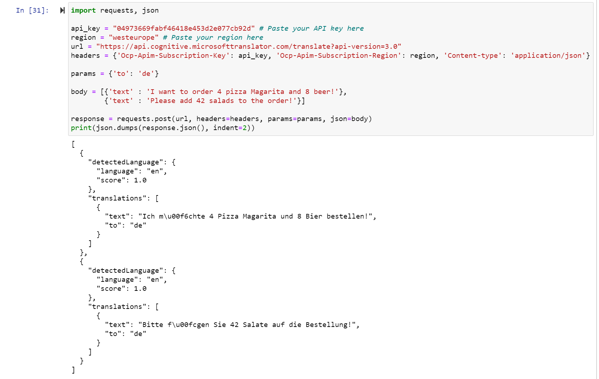

As we can see, we can translate multiple sentences within one API call. The service also automatically detects the input language. If desired, we can even directly translate the input to several output languages concurrently.

As we focused on text now, we want to jump to images. As more and more apps recognize faces there is also a **Face Cognitive Service** for that.

The Azure Face service provides AI algorithms that detect, recognize, and analyze human faces in images. Facial recognition software is important in many different scenarios, such as security, natural user interface, image content analysis and management, mobile apps, and robotics.

## Azure Cognitive Services - Face

:triangular_flag_on_post: **Goal:** Detect, identify, and analyze faces in images.

Again we conduct a REST Call and send an image of a face to the *Face Cognitive Service* and get a JSON response in return which explains the found characteristics of a face e.g. `faceAttributes`

0. Deploy a Face Api Service in the Portal


1. Copy the following code into a new Cell into the `CognitiveServices.ipynb` Notebook.
2. Make the following changes in code where needed:
    1. Replace the value of `subscription_key` with your subscription key.
    2. Edit the value of `face_api_url` to include the endpoint URL for your Face API resource.
    3. Optionally, replace the value of `image_url` with the URL of a different image that you want to analyze.
3. Run the Cell and examine the response.


```python
import requests
import json

# set to your own subscription key value
subscription_key = "xxx" # Paste your API key here
assert subscription_key

# replace <My Endpoint String> with the string from your endpoint URL
face_api_url = 'https://<My Endpoint String>.com/face/v1.0/detect'

image_url = 'https://upload.wikimedia.org/wikipedia/commons/3/37/Dagestani_man_and_woman.jpg'

headers = {'Ocp-Apim-Subscription-Key': subscription_key}

params = {
    'returnFaceId': 'true',
    'returnFaceLandmarks': 'false',
    'returnFaceAttributes': 'age,gender,headPose,smile,facialHair,glasses,emotion,hair,makeup,occlusion,accessories,blur,exposure,noise',
}

response = requests.post(face_api_url, params=params,
                         headers=headers, json={"url": image_url})
print(json.dumps(response.json(), indent = 2))
```

### Examine the response

A successful response is returned in JSON.

```json
[
  {
    "faceId": "e93e0db1-036e-4819-b5b6-4f39e0f73509",
    "faceRectangle": {
      "top": 621,
      "left": 616,
      "width": 195,
      "height": 195
    },
    "faceAttributes": {
      "smile": 0,
      "headPose": {
        "pitch": 0,
        "roll": 6.8,
        "yaw": 3.7
      },
      "gender": "male",
      "age": 37,
      "facialHair": {
        "moustache": 0.4,
        "beard": 0.4,
        "sideburns": 0.1
      },
      "glasses": "NoGlasses",
      "emotion": {
        "anger": 0,
        "contempt": 0,
        "disgust": 0,
        "fear": 0,
        "happiness": 0,
        "neutral": 0.999,
        "sadness": 0.001,
        "surprise": 0
      },
      "blur": {
        "blurLevel": "high",
        "value": 0.89
      },
      "exposure": {
        "exposureLevel": "goodExposure",
        "value": 0.51
      },
      "noise": {
        "noiseLevel": "medium",
        "value": 0.59
      },
      "makeup": {
        "eyeMakeup": true,
        "lipMakeup": false
      },
      "accessories": [],
      "occlusion": {
        "foreheadOccluded": false,
        "eyeOccluded": false,
        "mouthOccluded": false
      },
      "hair": {
        "bald": 0.04,
        "invisible": false,
        "hairColor": [
          {
            "color": "black",
            "confidence": 0.98
          },
          {
            "color": "brown",
            "confidence": 0.87
          },
          {
            "color": "gray",
            "confidence": 0.85
          },
          {
            "color": "other",
            "confidence": 0.25
          },
          {
            "color": "blond",
            "confidence": 0.07
          },
          {
            "color": "red",
            "confidence": 0.02
          }
        ]
      }
    }
  },
  {
    "faceId": "37c7c4bc-fda3-4d8d-94e8-b85b8deaf878",
    "faceRectangle": {
      "top": 693,
      "left": 1503,
      "width": 180,
      "height": 180
    },
    "faceAttributes": {
      "smile": 0.003,
      "headPose": {
        "pitch": 0,
        "roll": 2,
        "yaw": -2.2
      },
      "gender": "female",
      "age": 56,
      "facialHair": {
        "moustache": 0,
        "beard": 0,
        "sideburns": 0
      },
      "glasses": "NoGlasses",
      "emotion": {
        "anger": 0,
        "contempt": 0.001,
        "disgust": 0,
        "fear": 0,
        "happiness": 0.003,
        "neutral": 0.984,
        "sadness": 0.011,
        "surprise": 0
      },
      "blur": {
        "blurLevel": "high",
        "value": 0.83
      },
      "exposure": {
        "exposureLevel": "goodExposure",
        "value": 0.41
      },
      "noise": {
        "noiseLevel": "high",
        "value": 0.76
      },
      "makeup": {
        "eyeMakeup": false,
        "lipMakeup": false
      },
      "accessories": [],
      "occlusion": {
        "foreheadOccluded": false,
        "eyeOccluded": false,
        "mouthOccluded": false
      },
      "hair": {
        "bald": 0.06,
        "invisible": false,
        "hairColor": [
          {
            "color": "black",
            "confidence": 0.99
          },
          {
            "color": "gray",
            "confidence": 0.89
          },
          {
            "color": "other",
            "confidence": 0.64
          },
          {
            "color": "brown",
            "confidence": 0.34
          },
          {
            "color": "blond",
            "confidence": 0.07
          },
          {
            "color": "red",
            "confidence": 0.03
          }
        ]
      }
    }
  }
]
```
As we already started to investigate images we will now look at a different service the **Computer Vision Cognitive Service** to analyze text on an image.

Azure's Computer Vision API includes Optical Character Recognition (OCR) capabilities that extract printed or handwritten text from images. You can extract text from images, such as photos of license plates or containers with serial numbers, as well as from documents - invoices, bills, financial reports, articles, and more.

## Azure Cognitive Services - Computer Vision Service

|Azure Cognitive Services|Information|
|---|---|
|[Computer Vision API](https://azure.microsoft.com/en-us/services/cognitive-services/computer-vision)|https://docs.microsoft.com/en-us/azure/cognitive-services/computer-vision/home
|[Custom Vision Service](https://azure.microsoft.com/en-us/services/cognitive-services/custom-vision-service/)|https://docs.microsoft.com/en-us/azure/cognitive-services/custom-vision-service/home

In the language of your choice (Python solution is provided), write two small scripts that

1. Convert hand-written text from an image into text - Test data: [1](https://bootcamps.blob.core.windows.net/ml-test-images/ocr_handwritten_1.jpg), [2](https://bootcamps.blob.core.windows.net/ml-test-images/ocr_handwritten_2.jpg)
1. Convert printed text from an image into text - Test data: [1](https://bootcamps.blob.core.windows.net/ml-test-images/ocr_printed_1.jpg), [2](https://bootcamps.blob.core.windows.net/ml-test-images/ocr_printed_2.jpg)

Again we conduct REST Calls to the Computer Vision Cognitive Service and get a JSON in response.

The Computer Vision Read API is Azure's latest OCR technology that extracts printed text (in several languages), handwritten text (English only), digits, and currency symbols from images and multi-page PDF documents. It's optimized to extract text from text-heavy images and multi-page PDF documents with mixed languages. It supports detecting both printed and handwritten text in the same image or document. You can get more details [here](https://docs.microsoft.com/en-us/azure/cognitive-services/computer-vision/concept-recognizing-text#:~:text=%20Optical%20Character%20Recognition%20%28OCR%29%20%201%20Read,PDF%20document%20as%20the%20input%20and...%20More%20).

### Optical Character Recognition - Images to Text - Handwritten content

:triangular_flag_on_post: **Goal:** Leverage OCR to make a hand-written text document in images machine-readable

First, create a `Computer Vision` API Key in the Azure Portal

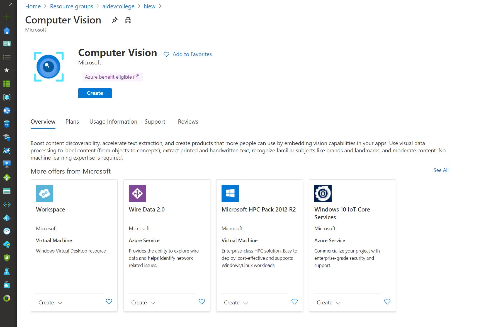

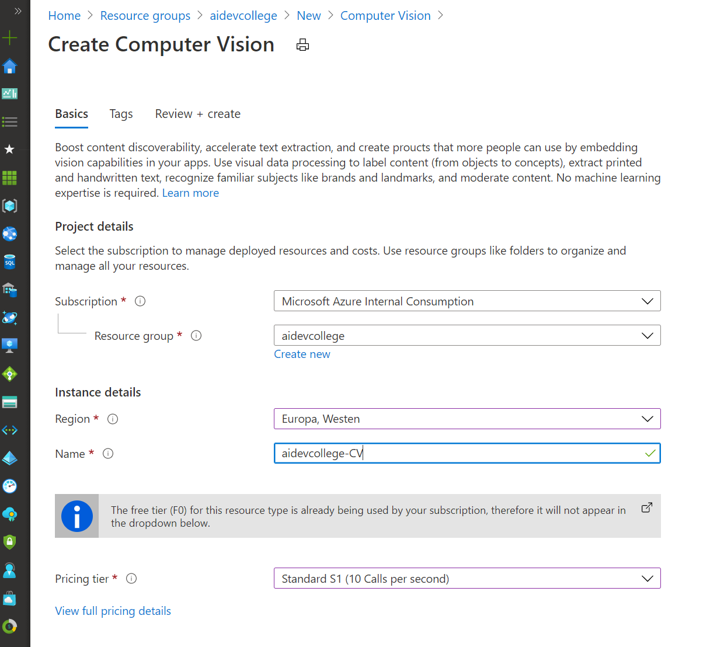

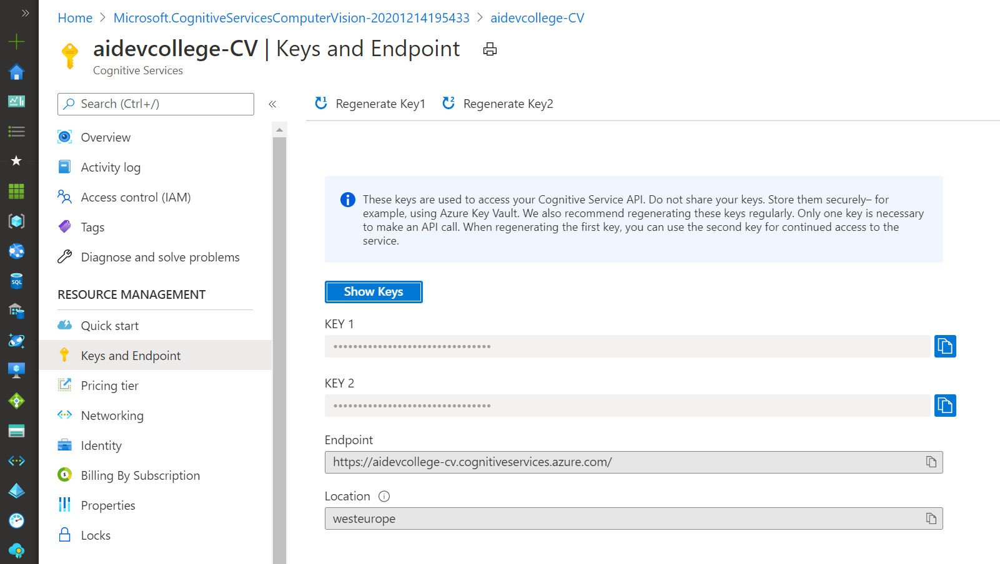

As we're dealing with images, we need a few Python packages to help with this. Go ahead and copy the code into a new Cell in your `CognitiveServices.ipynb` Notebook.

```python
import requests, json, time
import matplotlib.pyplot as plt
from matplotlib.patches import Rectangle
from matplotlib.patches import Polygon
from PIL import Image
from io import BytesIO
```

Ok, now we can start recognizing some text. With the Computer Vision API, this is a two-step process:

1. Submit the image
1. Query if the image has been processed

```python
key = "xxxx" # Paste your API Key here!

url = "https://westeurope.api.cognitive.microsoft.com/vision/v2.0/recognizeText"
image_url = "https://upload.wikimedia.org/wikipedia/commons/thumb/d/dd/Cursive_Writing_on_Notebook_paper.jpg/800px-Cursive_Writing_on_Notebook_paper.jpg"

headers = {'Ocp-Apim-Subscription-Key': key}
params  = {'mode': 'Handwritten'}
data    = {'url': image_url}

# Post image URL to the API
response = requests.post(url, headers=headers, params=params, json=data)

# Return query URL for getting the status
operation_url = response.headers["Operation-Location"]

# Poll until we get a result (...or something failed)
recognition = {}
poll = True
while (poll):
    response_final = requests.get(operation_url, headers=headers)
    recognition = response_final.json()
    time.sleep(1)
    if ("recognitionResult" in recognition):
        poll= False 
    if ("status" in recognition and recognition['status'] == 'Failed'):
        poll= False

print(json.dumps(recognition, indent=2))
```

**Example Notebook and Result:**


Ok, looks like it recognized something. Let's visualize it:

```python
polygons = []

# Get bounding boxes of the text 
if ("recognitionResult" in recognition):
    polygons = [(line["boundingBox"], line["text"])
        for line in recognition["recognitionResult"]["lines"]]

# Display image and overlay text
plt.figure(figsize=(15, 15))
image = Image.open(BytesIO(requests.get(image_url).content))
ax = plt.imshow(image)
for polygon in polygons:
    vertices = [(polygon[0][i], polygon[0][i+1])
        for i in range(0, len(polygon[0]), 2)]
    text = polygon[1]
    patch = Polygon(vertices, closed=True, fill=False, linewidth=2, color='y')
    ax.axes.add_patch(patch)
    plt.text(vertices[0][0], vertices[0][1], text, fontsize=20, va="top")
_ = plt.axis("off")
```

**Visualization:**


**Here are two more images we can test with:**


> [Shopping List Test Image](https://bootcamps.blob.core.windows.net/ml-test-images/ocr_handwritten_1.jpg) <br>
> [Calender Motto Test Image](https://bootcamps.blob.core.windows.net/ml-test-images/ocr_handwritten_2.jpg)


Now we use the same service by just extracting text from printed text in images. 

### Optical Character Recognition - Images to Text - Printed content

:triangular_flag_on_post: **Goal:** Leverage OCR to make a printed text document in images machine-readable

It is very similar as the previous example- except that is a synchronous call, hence we directly get back the recognition result. Go ahead and copy the Code into a new Cell into your `CognitiveServices.ipynb` Notebook:

```python
key = "xxxx" # Paste your API Key here or comment this line to use the key from above

url = "https://westeurope.api.cognitive.microsoft.com/vision/v2.0/ocr"
image_url = "https://bootcamps.blob.core.windows.net/ml-test-images/ocr_printed_1.jpg"

headers = {'Ocp-Apim-Subscription-Key': key}
params  = {'language': 'unk', 'detectOrientation': 'true'}
data    = {'url': image_url}

response = requests.post(url, headers=headers, params=params, json=data)
recognition_result = response.json()

# Extract the word bounding boxes and text
line_infos = [region["lines"] for region in recognition_result["regions"]]
word_infos = []
for line in line_infos:
    for word_metadata in line:
        for word_info in word_metadata["words"]:
            word_infos.append(word_info)
word_infos
```

**Example Notebook:**


**Visualization:**

```python
# Display the image and overlay it with the extracted text
plt.figure(figsize=(15, 15))
image = Image.open(BytesIO(requests.get(image_url).content))
ax = plt.imshow(image, alpha=0.5)
for word in word_infos:
    bbox = [int(num) for num in word["boundingBox"].split(",")]
    text = word["text"]
    origin = (bbox[0], bbox[1])
    patch  = Rectangle(origin, bbox[2], bbox[3], fill=False, linewidth=2, color='y')
    ax.axes.add_patch(patch)
    plt.text(origin[0], origin[1], text, fontsize=12, weight="bold", va="top")
plt.axis("off")
```

**Example Result:**

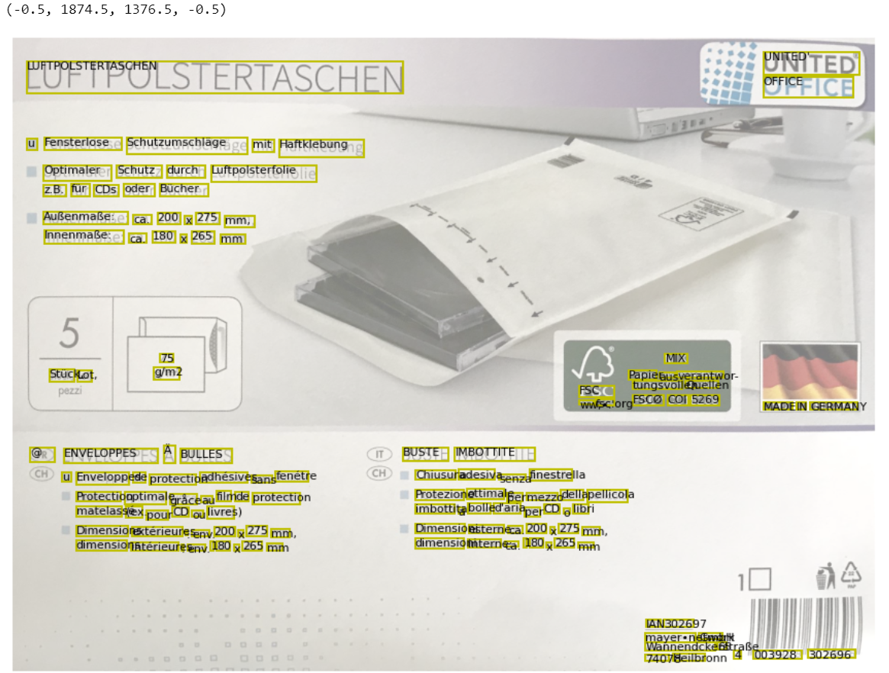

**Here is one more [image](https://bootcamps.blob.core.windows.net/ml-test-images/ocr_printed_2.jpg) we can test with!**

From recognizing text on images we will now detect objects on images for this we will introduce the **Custom Vision Cognitive Service.**

**Azure Custom Vision** is an image recognition service that lets you build, deploy, and improve your own image identifiers. An image identifier applies labels (which represent classes or objects) to images, according to their visual characteristics. Unlike the Computer Vision service, Custom Vision allows you to specify the labels and train custom models to detect them.

**What it does?**
The Custom Vision service uses a machine learning algorithm to analyze images. You, the developer, submit groups of images that feature and lack the characteristics in question. You label the images yourself at the time of submission. Then, the algorithm trains to this data and calculates its own accuracy by testing itself on those same images. Once the algorithm is trained, you can test, retrain, and eventually use it in your image recognition app to classify new images. You can also export the model itself for offline use.

Now let's create our own Custom Vision Service.

## Azure Cognitive Services - Custom Vision Service for Detecting Objects in Images

:triangular_flag_on_post: **Goal:** Detect beer glasses in images

1. Use [Custom Vision](https://customvision.ai) to detect beer glasses in images - [Image Dataset for training and testing](https://bootcamps.blob.core.windows.net/ml-test-images/beer_glasses.zip)

First, log in to [Custom Vision](https://www.customvision.ai/) with your Azure credentials.

Create a new project of type `Object detection`:


Next, add all the **training images** from the **unzipped** [dataset](https://bootcamps.blob.core.windows.net/ml-test-images/beer_glasses.zip) within the **beer_glasses_train**. Once added, we need to tag all the beer glasses in the images. If there are multiple glasses in one image, tag each one individually:

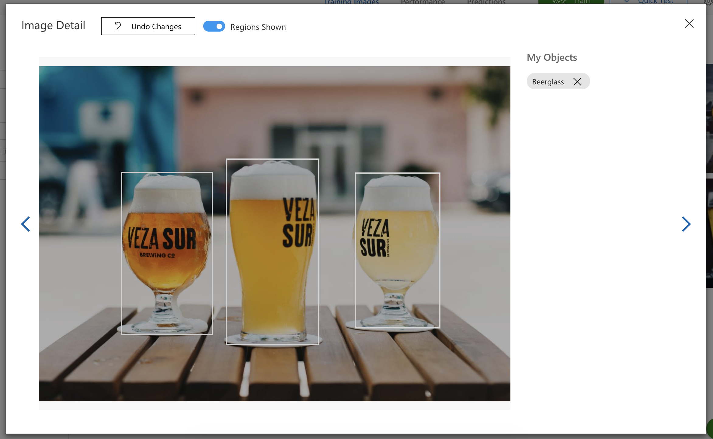

Once we've tagged all 15 images (that's the minimum), we can hit the `Train` button. After 1-2 minutes, we'll see the training statistics:

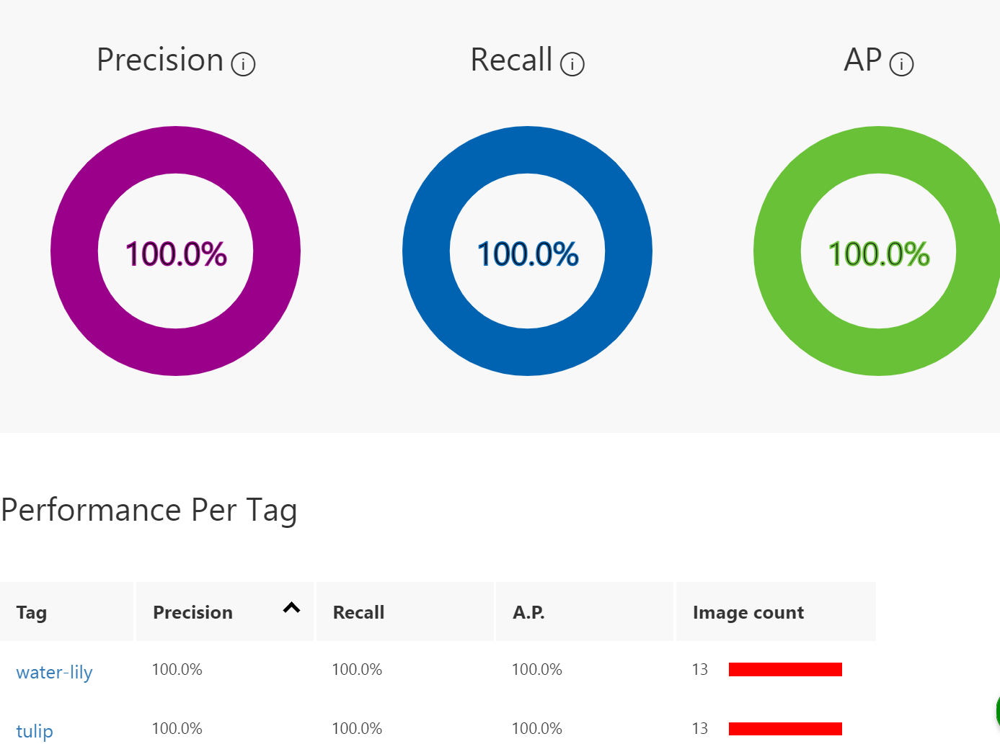

Let's briefly look at the results and make sure we understand them:

Sliders - they set the results given certain thresholds
* Probability Threshold: 82% - this means we only count detections with over 82% probability as beer glasses
* Overlap Threshold: 51% - this means we want our detection results overlap at least 51% with the ground truth in the training set

Results:
* Precision: 30% - given a detection, it is 30% correct on average (meaning the algorithm will also detect other objects as glasses)
* Recall: 100% - a recall of 100% means, it will detect all beer glasses (but maybe mistake some other objects as beer glasses too)
* mAP: 83.3% - mean average precision - the average how well our detection algorithm works 

Under `Quick Test`, we can briefly upload our testing images and see what the service will detect. As we only added 15 training images with a lot of variance, the results are not great yet. By adding more images, we could most likely improve the detection performance significantly.

If we go to the `Performance` tab, we can get the `Prediction URL` and the `Prediction-Key`. We can use this endpoint to programmatically access the service.

So far we have covered a lot of Text Recognition, Translation, Face Recognition and Image Recognition, so now we will look at *Speech Recognition*.

In the following sample, you learn about the benefits and capabilities of the **Text-to-speech Cognitive Service**, which enables your applications, tools, or devices to convert text into human-like synthesized speech and the **Speech-to-text Cognitive service** which enables your application, tools, or devices to convert real-time transcription of audio streams into text.

## Azure Cognitive Services - Speech

:triangular_flag_on_post: **Goal:** Leverage Speech-to-Text and Text-to-Speech

In the language of your choice (Python solution is provided), write two small scripts or apps that

1. Convert written text into speech (German or English)
1. Convert speech into written text (German or English)

You can use can use this file: [`data/test.wav`](data/test.wav) (English).

Let's deploy a Speech service:

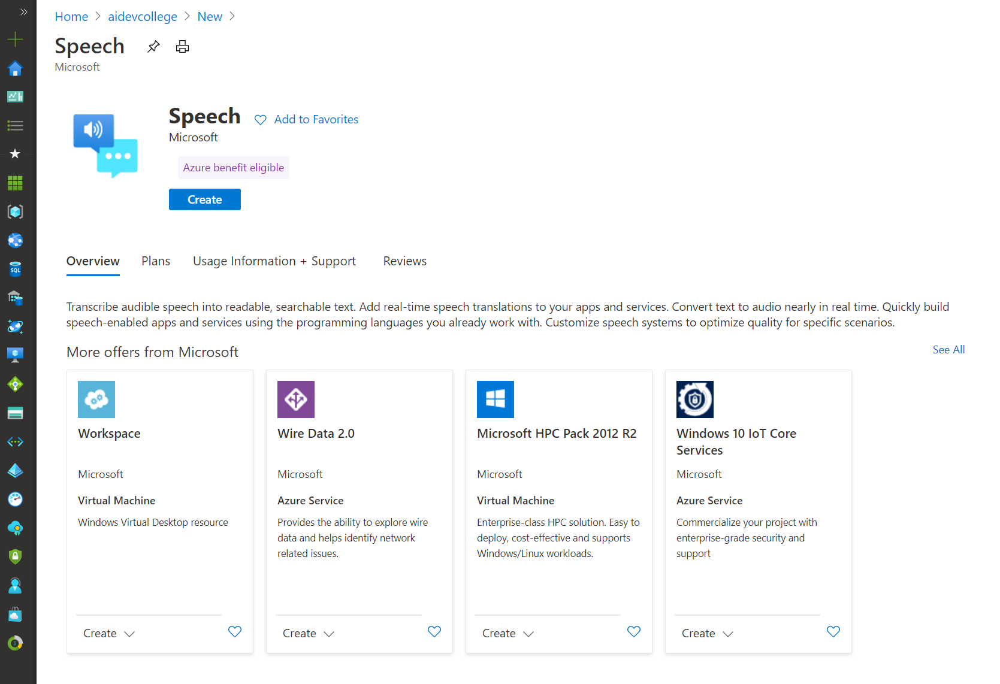

Fill in a *unique name* and select *create*:

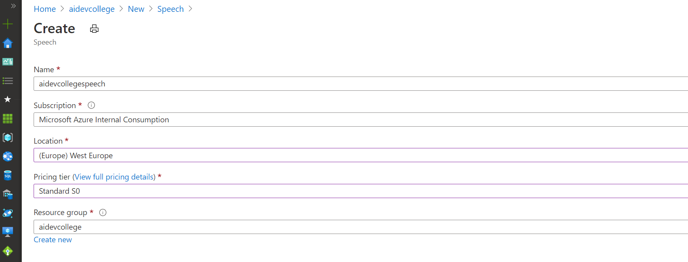

As region, we'll be using `West Europe` in this example. You can find your API key under the service, then `Keys`.

You can use this file [`test.wav`](../data/test.wav) for testing.

### Text-to-Speech

First, we need to request a token from the `Issue Token endpoint` of the Speech API. Each token is valid for 10 minutes, hence we can either reuse it multiple times (to minimize network traffic and latency), or request a new one for each call:

```python
import requests, json
import IPython.display as ipd

api_key = "xxxx" # Enter your API key here

token_url = "https://westeurope.api.cognitive.microsoft.com/sts/v1.0/issuetoken"
headers = {'Ocp-Apim-Subscription-Key': api_key}

response = requests.post(token_url, headers=headers)
token = response.text

print("Token: " + token)
```

Once we have the token, we can form our request for generating speech:

```python
url = "https://westeurope.tts.speech.microsoft.com/cognitiveservices/v1"
headers = {'Authorization': token,
           'Content-Type': 'application/ssml+xml',
           'User-Agent': 'Test',
           'X-Microsoft-OutputFormat': 'riff-16khz-16bit-mono-pcm'}

data = "<speak version='1.0' xmlns='http://www.w3.org/2001/10/synthesis' xml:lang='en-US'> \
<voice name='Microsoft Server Speech Text to Speech Voice (en-US, JessaRUS)'> \
    Hello, welcome to the AI Developer College!  \
</voice></speak>"

response = requests.post(url, headers=headers, data=data)
audio_data = response.content

print(response.headers)
```

We can just write it out to a `*.wav` file and then download or play it:

```python
with open("test.wav", "wb") as f: 
    f.write(audio_data)
    
ipd.Audio('test.wav')
```

There are [many different voices](https://docs.microsoft.com/en-us/azure/cognitive-services/speech-service/language-support#text-to-speech) available to choose from. By updating the [XML request](https://docs.microsoft.com/en-us/azure/cognitive-services/speech-service/how-to-text-to-speech#specify-a-voice), we can easily specify a different voice or language. From here on, it should be easy to generate German speech.

### Speech-to-Text

Let's take the generated or provided `test.wav` from the example before and convert it back to text. Again, copy the code and let's first create a token:

```python
import requests, json

api_key = "xxx" # Enter your API key here

token_url = "https://westeurope.api.cognitive.microsoft.com/sts/v1.0/issuetoken"
headers = {'Ocp-Apim-Subscription-Key': api_key}

response = requests.post(token_url, headers=headers)
token = response.text

print("Token: " + token)
```

Now that we have a token, we can call the speech-to-text endpoint and include the `wav` data:

```python
url = "https://westeurope.stt.speech.microsoft.com/speech/recognition/conversation/cognitiveservices/v1"

headers = {'Authorization': 'Bearer ' + token,
           'Accept': 'application/json',
           'Ocp-Apim-Subscription-Key': api_key,
           'Content-Type': 'audio/wav; codec=audio/pcm; samplerate=16000'}

params = {'language': 'en-US', 'format': 'detailed'}

with open("test.wav", 'rb') as f:
    data = f.read()

response = requests.post(url, headers=headers, params=params, data=data)
print(json.dumps(response.json(), indent=2))
```

For recognizing longer text with multiple sentences, you can follow the [following tutorial](https://docs.microsoft.com/en-us/azure/cognitive-services/speech-service/quickstart-python).

***Note:***

Compressed audio is supported (e.g., MP3s), see [here](https://docs.microsoft.com/en-us/azure/cognitive-services/speech-service/how-to-use-codec-compressed-audio-input-streams),

Besides that, the speech-to-text API expects audio with the following specifics:
* 16-bit WAV format with PCM or OGG format with OPUS
* Single channel (mono) at 8 or 16 KHz

More details, see [here](https://docs.microsoft.com/en-us/azure/cognitive-services/speech-service/how-to-use-audio-input-streams).

Now that we've converted the user's speech into text, we can detect the intent of the text in the next challenge!
**Language Understanding (LUIS)** is a cloud-based conversational AI service that applies custom machine-learning intelligence to a user's conversational, natural language text to predict overall meaning, and pull out relevant, detailed information.

A client application for LUIS is any conversational application that communicates with a user in natural language to complete a task. Examples of client applications include social media apps, AI chatbots, and speech-enabled desktop applications.

## Azure Cognitive Services - Language - Reveal the intention of the text

For retrieving the intent of the text, we'll be using the Language Understanding service in Azure, called LUIS. In many cases, LUIS is used to power chatbots, but it can also be used for "standalone" processing of text. We could even use it for e.g., automatically analyzing emails and categorizing them, or figuring out what products and amounts are on an invoice.

:triangular_flag_on_post: **Goal:** Make your application understand the meaning of text

In the language of your choice (Python solution is provided), write two small scripts or apps that

1. Translate the input text into German (using the Text Translator API)
1. Detect the intent and entities of the text (German) 

> As an alternative you can also deploy a Language Understanding Resource in the **Azure Portal**. Once the resource is deployed you could either use the provided link to switch to the __Language Understanding Portal Europe__ in the *Quick start* Guide in *step 2*.

Or we directly jump into the __Language Understanding Portal Europe__ (using [https://eu.luis.ai](https://eu.luis.ai)) and deploy the *Language Understanding Service* from there.

Head to [`eu.luis.ai`](https://eu.luis.ai) and create a new LUIS app. First we need create an *authorizing LUIS resource*.

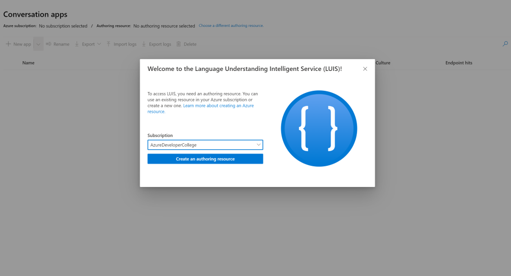

The User Interface will guide you to deploy a new LUIS resource to make sure to migrate new and existing Apps to that resource.

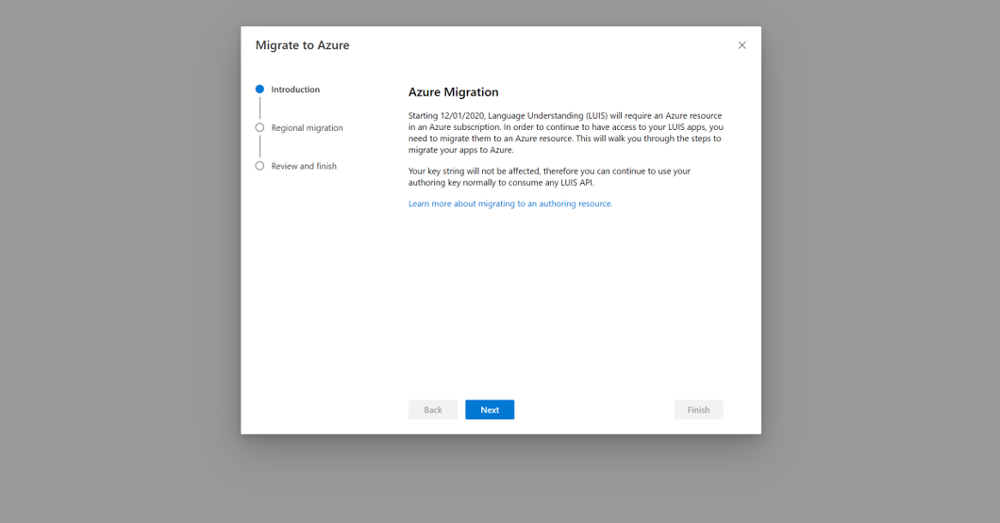

In our case it is a regional migration of `west europe`:

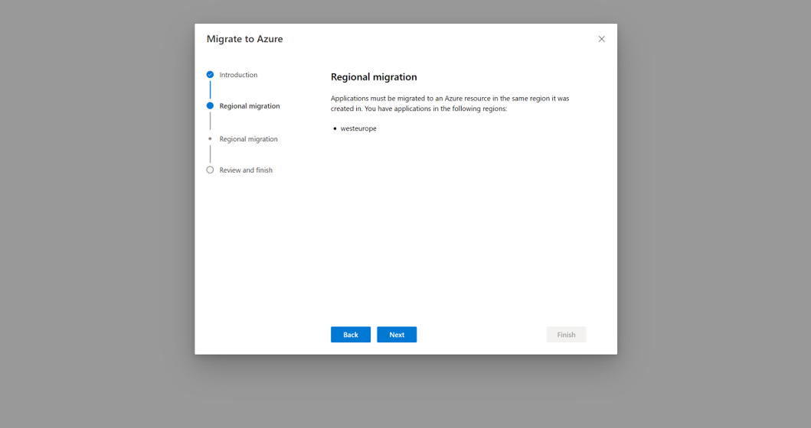

Then you select `Create new authoring resource`, choose your `Azure subscription` and an `Azure resource group` and give it an `Azure resource name`:

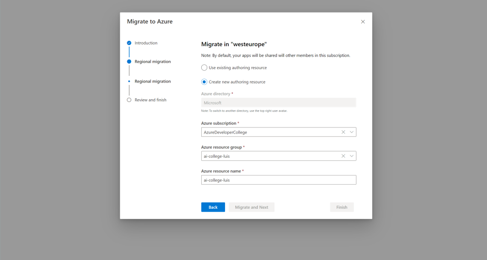

Once the Resource is deployed you can go ahead and create the LUIS app. Select `New app`, keep the default *Culture English* as default and give it the name `Pizza Order App`. Let's use an example where we want to detect a Pizza order from the user. We also want to detect if the user wants to cancel an order.

> **Note:** Culture is the language that your app understands, not the interface language.

Quick explanation on how LUIS works:

* Under Intents, we'll define the "actions" we can to detect
* Under Entities, we'll define the "things" we want to extract from the intents
* Utterances a**re just examples that we'll use to train LUIS

Create two new intents:

* `CreateOrder`
* `CancelOrder`

Then, add the utterances (our training examples) from the main page of this repository to the three intents.

There are five different options for choosing intents:

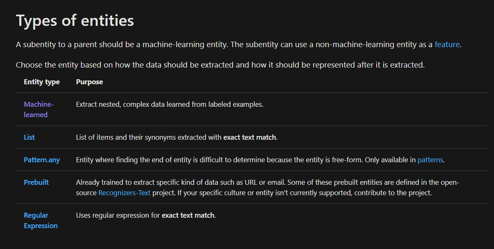

In this scenario we are using `Prebuilt Entity` and the `Machine Learned Entity`. We could also use the `List Entity` for the `PizzaType`, but as it has to be exactly the synonym we will prefer [Machine Learned Entity](https://docs.microsoft.com/en-us/azure/cognitive-services/luis/luis-concept-entity-types) instead to [*learn*](https://docs.microsoft.com/en-us/azure/cognitive-services/luis/luis-concept-feature) new PizzaTypes ordered by the User.

For this challenge we are copying the following LUIS phrases as shown below into the specific intents in the [User Interface](https://eu.luis.ai):

```
2 Intents: "CreateOrder", "CancelOrder"

Utterances:

(CreateOrder) Ich moechte eine Pizza Salami bestellen 
(CreateOrder) Vier Pizza Hawaii bitte 

(CancelOrder) Bitte Bestellung 123 stornieren
(CancelOrder) Cancel bitte Bestellung 42
(CancelOrder) Ich will Order 933 nicht mehr

(None) Wieviel Uhr ist heute?
(None) Wie ist das Wetter in Berlin?
(None) Bitte Termin fuer Montag einstellen
```

Next, we can try to detect `Entities` in our text inputs. For that, goto Entities and add a `Prebuilt Entity` with the type `Number`. This will automatically detect all numbers (e.g. the order number or amount of pizzas) in our text. Secondly, add a normal Entity `PizzaType` with entity type `Machine learned` (ideally we could also use an entity and specify all possible Pizzas we sell). Lastly, add an entity of type `Machine learned` with the name `PizzaOrder` and add `Number` and `PizzaType` as children. 

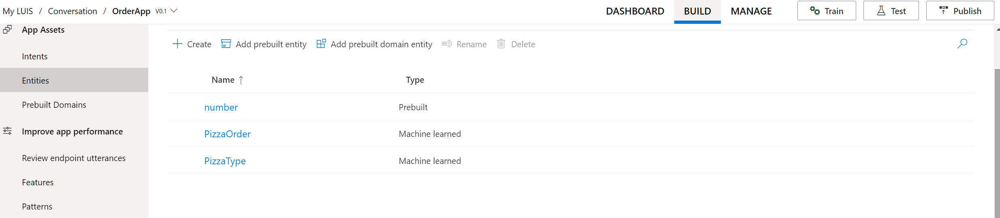

Further we will add a `PizzaPhraseList` with some `Pizza Type Samples`:

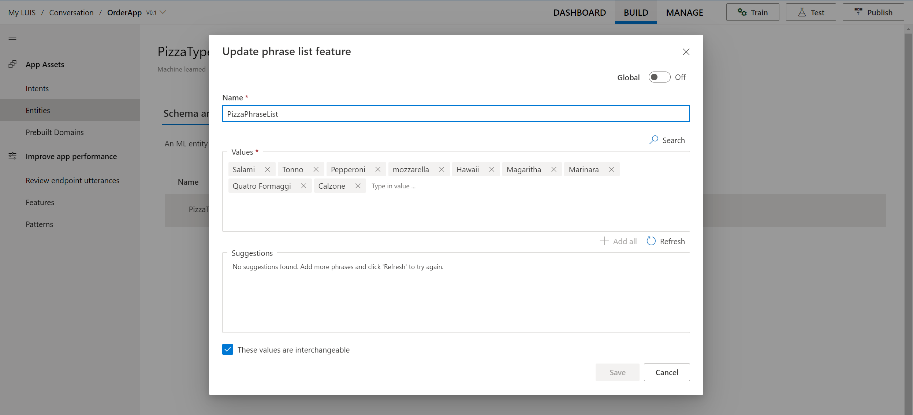

Then we connect the `PizzaType` to the `PizzaPhraseList`:

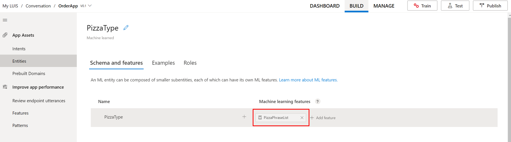

As we can see, LUIS supports a range of entity types, like regex, lists, etc.

Finally, we can annotate our training examples. Numbers will automatically be detected (as it is a prebuilt type), but we need to tell LUIS, what `PizzaOrder` is. This is a bit tricky, first click the beginning of the entity (= the detected number) and then directly click the last part of the entity (= the pizza type) and then select `PizzaOrder`. Then tag all pizza types inside the `PizzaOrder` as `Pizza Type`. The final tagging should look something like this (make sure the green line covers the whole phrase):

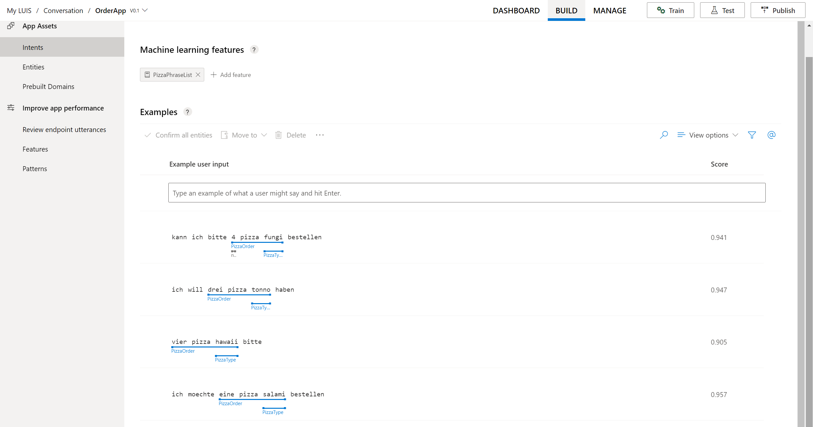

Hit `Train` to give it a training. Lastly, hit `Publish` and publish it to `Production`. Review the endpoints and copy the endpoint URL (can be found under `Manage` --> `Azure Resources`). It should look something like this:

```
https://westeurope.api.cognitive.microsoft.com/luis/v2.0/apps/xxxxxx-xxxx-xxxx-xxxx-xxxxxxxx?subscription-key=xxxxxxx&timezoneOffset=-360&q=
```

With a bit of Python, we can now get the intent through the API:

```python
import requests, json

# Paste your Endpoint URL here
url = "https://westeurope.api.cognitive.microsoft.com/luis/v2.0/apps/xxxxxx-xxxx-xxxx-xxxx-xxxxxxxx?subscription-key=xxxxxxx&timezoneOffset=-360&q="

query = "ich hätte gerne 9 pizza calzone"

response = requests.get(url + query)
print(json.dumps(response.json(), indent=2))
```

The output should look something like this:

```json

{
  "query": "ich h\u00e4tte gerne 9 pizza calzone",
  "topScoringIntent": {
    "intent": "CreateOrder",
    "score": 0.4941804
  },
  "entities": [
    {
      "entity": "calzone",
      "type": "PizzaType",
      "startIndex": 24,
      "endIndex": 30,
      "score": 0.80077827
    },
    {
      "entity": "9 pizza calzone",
      "type": "PizzaOrder",
      "startIndex": 16,
      "endIndex": 30,
      "score": 0.566134334
    },
    {
      "entity": "9",
      "type": "builtin.number",
      "startIndex": 16,
      "endIndex": 16,
      "resolution": {
        "subtype": "integer",
        "value": "9"
      }
    }
  ]
}
​
​
```

Excellent - Now we know what the user wants to order, and the associated quantities. :pizza: :pizza: :pizza:

This service is highly used in Bot scenarios which you can read about [here](https://docs.microsoft.com/en-us/azure/bot-service/bot-builder-howto-v4-luis?view=azure-bot-service-4.0&tabs=python).

Last but not least as Searching is essential these days we will look at the **Bing Search Cognitive Service**. The Bing Search APIs add intelligent search to your app, combing hundreds of billions of webpages, images, videos, and news to provide relevant results with no ads. The results can be automatically customized to your users' locations or markets, increasing relevancy by staying local.

## Azure Cognitive Services - Bing Search

:triangular_flag_on_post: **Goal:** Write a script for auto-suggestion of text

1. Leverage Bing Search to make predictions on how a user might wants to continue an half-written sentence

First, create a `Bing Search v7` API Key in the Azure Portal:

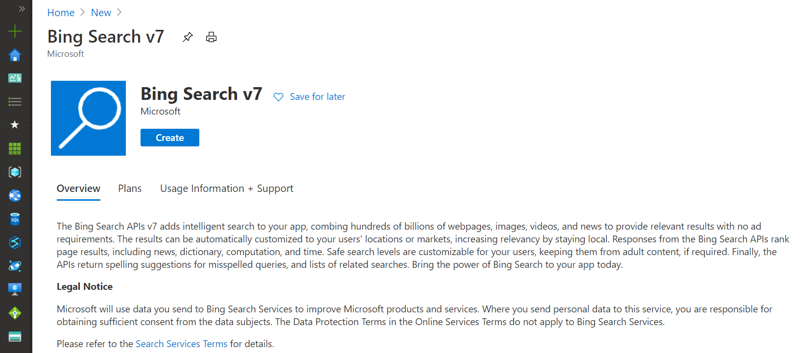

As in the previous tasks, we can either create a token for our requests, or directly access the service by specifying the API key we've just created:

```python
import requests, json

key = "xxx" # Paste your API key here
url = "https://api.bing.microsoft.com/v7.0/Suggestions"

search_term = "warum ist"

headers = {"Ocp-Apim-Subscription-Key" : key}
params  = {"q": search_term}

response = requests.get(url, headers=headers, params=params)
print(json.dumps(response.json(), indent=2))
```

Let's print it a bit nicer:

```python
suggestions = response.json()['suggestionGroups'][0]['searchSuggestions']

for s in suggestions:
    print(s['displayText'])
```

Output:

```json
warum ist
warum ist das
warum ist es so
warum ist blut rot
warum ist messi klein
warum ist stuhl braun
warum ist diamant hart
warum ist rauchen cool
```

People search for weird stuff... :flushed: :satisfied:


## House Keeping: Lab Cleanup

### Use Azure CLI to Delete Resource Group

1. In the **Cloud Shell** command prompt at the bottom of the portal, type in the following command and press **Enter** to list all resource groups in the subscription:

    ```sh
    az group list
    ```

2. Type in the following command and press **Enter** to delete the **yourResourceGroup** *Resource Group*:

    ```sh
    az group delete --name "yourResourceGroup" --no-wait --yes
    ```

3. Close the **Cloud Shell** prompt at the bottom of the portal.

4. Close your browser application.

## Optional: Play around with the: Intelligent Kiosk 

Find the Sample on Github here: [Intelligent Kiosk](https://github.com/microsoft/Cognitive-Samples-IntelligentKiosk)
