# AI Developer College Day2 - Cognitive Services

As we have looked at Cognitive Search so far and saw how we can enrich our search service with the Azure Cognitive Services we will now go into detail of some of those services. Yesterday we have trained and registered a model and deployed it as an endpoint. Microsoft is offering such services for developers to be able to make your applications smarter by enriching those with intelligence.

## Focus of Today:

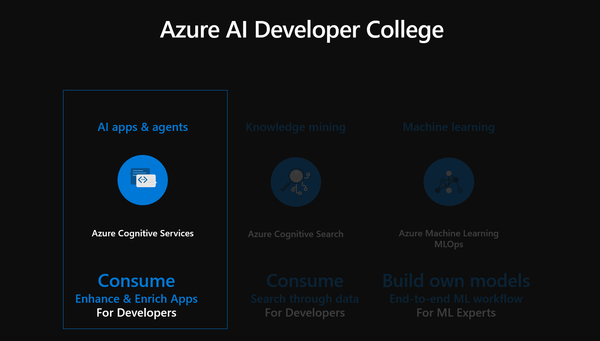

## Here is what you will learn

Today will be an overview of Azure Cognitive Services, as you will learn:

- How to deploy Cognitive Services from the area Decision, Vision, Language, Speech and Web Search
- How to use those Cognitive Services using Python
- How to train and use custom models (e.g. Custom Vision and Language Understanding) yourself

Thus we will cover the following topics in several sections:

|Topic|Section|
|---|---|
|Text Analytics |[Azure Cognitive Services - Text Analytics](#azure-cognitive-services---text-analytics)|
|Translate Text|[Azure Cognitive Services - Translate Text](#azure-cognitive-services---translate-text)|
|Face|[Azure Cognitive Services - Face](#azure-cognitive-services---face)|
|Computer Vision|[Azure Cognitive Services - Computer Vision Service](#azure-cognitive-services---computer-vision-service)|
|Custom Vision|[Azure Cognitive Services - Custom Vision Service for Detecting Objects in Images](#azure-cognitive-services---custom-vision-service-for-detecting-objects-in-images)|
|Speech|[Azure Cognitive Services - Speech](#azure-cognitive-services---speech)|
|Language|[Azure Cognitive Services - Language - Reveal the intention of the text](#azure-cognitive-services---language---reveal-the-intention-of-the-text)|
|Search|[Azure Cognitive Services - Search](#azure-cognitive-services---search)|

# Azure Cognitive Services

## What are Azure Cognitive Services?

Azure Cognitive Services: 
- are APIs, SDKs and services available to help developers build intelligent applications without having direct Artificial Intelligence (AI), ml expert skills or knowledge. 
- enable developers to easily add cognitive features into their applications. 
- The goal of Azure Cognitive Services is to help developers create applications that can see, hear, speak, understand and even begin to reason. 
- The catalog of services within Azure Cognitive Services can be categorized into five main pillars - *Vision*, *Speech*, *Language*, *Web Search*, and *Decision*.

If you are interested to read more about each service we have added a list of valuable links in the **`Details`** section below.

<details>
We'll touch on the following services:

|Service|Where?|
|---|---|
|Text Analytics|[Text Analytics API](https://azure.microsoft.com/en-us/services/cognitive-services/text-analytics/)|
|Translate Text|[Translate Text](https://docs.microsoft.com/en-us/azure/cognitive-services/Translator/translator-info-overview)|
|Face Recognition|[Face API](https://docs.microsoft.com/en-us/azure/cognitive-services/Face/overview)|
|Computer Vision|[Computer Vision API](https://azure.microsoft.com/en-us/services/cognitive-services/computer-vision/)|
|Custom Vision|[Custom Vision API](https://docs.microsoft.com/en-us/azure/cognitive-services/Custom-Vision-Service/overview)|
|Speech|[Speech Services](https://azure.microsoft.com/en-us/services/cognitive-services/speech-services/)|
|Language Understanding|[Language Understanding](https://azure.microsoft.com/en-us/services/cognitive-services/language-understanding-intelligent-service/)|
|Bing Search API|[Bing Search API](https://docs.microsoft.com/en-us/bing/search-apis/bing-web-search/create-bing-search-service-resource)|

</details>

You can solve these tasks in a programming language of your choice. For sake of convenience, we are providing hints in `Python`, which you can easily run on the `Compute Instance (VM) from the Azure Machine Learning Service` or in `Visual Studio Code`. SDK Support for `C#`, `Node.js` or `.NET Core` is available for most challenges. Especially Azure Search features an easy-to-use `.NET SDK`. You can find code examples in the Azure documentation for the associated services.

For this entire challenge we can create a `Resource Group` called `CognitiveServices` as previously shown and described in the **Azure Portal**. All Cognitive Services can be `added` and deployed in this Resource Group.

As the world gets more and more connected we'd like to translate some languages in the following. **Translator Cognitive Service** is a cloud-based machine translation service and is part of the Azure Cognitive Services family of cognitive APIs used to build intelligent apps. Translator is easy to integrate in your applications, websites, tools, and solutions. It allows you to add multi-language user experiences in more than [70 languages](https://docs.microsoft.com/en-us/azure/cognitive-services/Translator/language-support), and can be used on any hardware platform with any operating system for text translation.

## Azure Cognitive Services - Translator

:triangular_flag_on_post: **Goal:** Translation of multiple sentences, detection of one or more input languages to one or several output languages concurrently.

First, create a `Translator` API Key in the Azure Portal:

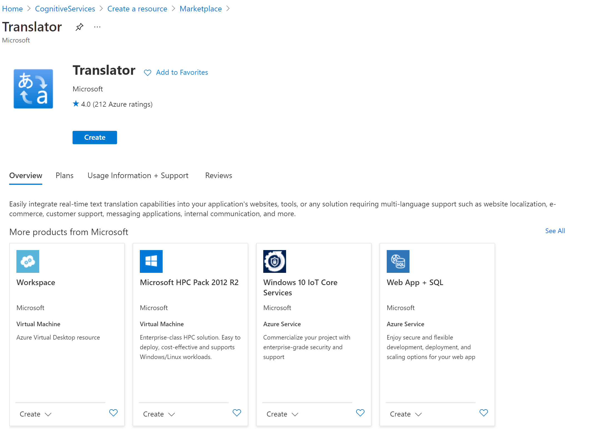


The Translator API allows to directly access the service by specifying the API key. As with other services, you can find the key under "Keys and Endpoint".

Use the same `CognitiveServices.ipynb` Notebook as before and copy the following code in a cell below the earlier code in the Notebook. Again, we will conduct a REST Call by sending data to the *Translate Cognitive Service* and receiving a response from the pre-trained Machine Learning model behind the scenes. In this case, we are translating text from English to German.

```python
import requests, json

api_key = "xxx" # Paste your API key here
region = "<paste-your-text-translator-service-region here>" # Paste your region here
url = "https://api.cognitive.microsofttranslator.com/translate?api-version=3.0"
headers = {'Ocp-Apim-Subscription-Key': api_key, 'Ocp-Apim-Subscription-Region': region, 'Content-type': 'application/json'}

params = {'to': 'de'}

body = [{'text' : 'I want to order 4 pizza Magarita and 8 beer!'},
        {'text' : 'Please add 42 salads to the order!'}]

response = requests.post(url, headers=headers, params=params, json=body)
print(json.dumps(response.json(), indent=2))
```
Example Result: 

```json
[
  {
    "detectedLanguage": {
      "language": "en",
      "score": 1.0
    },
    "translations": [
      {
        "text": "Ich m\u00f6chte 4 Pizza Magarita und 8 Bier bestellen!",
        "to": "de"
      }
    ]
  },
  {
    "detectedLanguage": {
      "language": "en",
      "score": 1.0
    },
    "translations": [
      {
        "text": "Bitte f\u00fcgen Sie der Bestellung 42 Salate hinzu!",
        "to": "de"
      }
    ]
  }
]
```

As we can see, we can translate multiple sentences within one API call. The service also automatically detects the input language. If desired, we can even directly translate the input to several output languages concurrently. It is possible to add optional parameters such as a profanity filter and more. The Translator Service does not only translate text, but also has the capability of transliterating text from one type of script to another (and much more). You can try it out with the code below:

```python
api_key = "xxx" # Paste your API key here
region = "<paste-your-text-translator-service-region here>" # Paste your region here
url = "https://api.cognitive.microsofttranslator.com/transliterate?api-version=3.0"
headers = {'Ocp-Apim-Subscription-Key': api_key, 'Ocp-Apim-Subscription-Region': region, 'Content-type': 'application/json'}

params = {
    'language': 'ja',
    'fromScript': 'jpan',
    'toScript': 'latn'
    }

body = [{'text' : 'こんにちは'}]
response = requests.post(url, headers=headers, params=params, json=body)
print(json.dumps(response.json(), indent=2))
```

This should be the result:
```json
[
  {
    "text": "Kon'nichiwa",
    "script": "latn"
  }
]
```

So far we have focused on text. Now we want to jump to analysing images. Since more and more apps recognize faces, there is also a **Face Cognitive Service** for that.

The Azure Face service provides AI algorithms that detect, recognize, and analyze human faces in images. Facial recognition software is important in many different scenarios, such as security, natural user interface, image content analysis and management, mobile apps, and robotics.

## Azure Cognitive Services - Face

:triangular_flag_on_post: **Goal:** Detect, identify, and analyze faces in images.

Again we conduct a REST Call and send an image of a face to the *Face Cognitive Service* and get a JSON response in return which explains the found characteristics of a face e.g. `faceAttributes`

0. Deploy a Face Api Service in the Portal

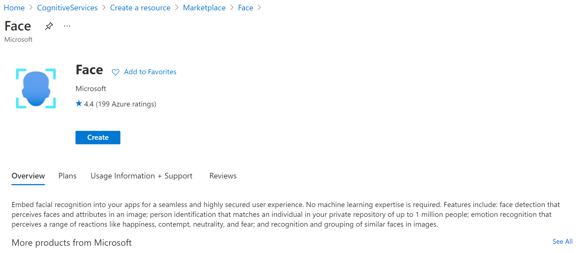


To use **Face API**, perform the following steps:

1. Copy code below into a new cell into the `CognitiveServices.ipynb` Notebook.
2. Make the following changes in code where needed:
    1. Replace the value of `subscription_key` with your subscription key.
    2. Edit the value of `face_api_url` to include the endpoint URL for your Face API resource.
    3. Optionally, replace the value of `image_url` with the URL of a different image that you want to analyze.
3. Run the Cell and examine the response.

```python
import requests
import json

# set to your own api key value
api_key = "xxx" # Paste your API key here

face_api_url = '<My Endpoint String>face/v1.0/detect' # Replace with endpoint

image_url = 'https://upload.wikimedia.org/wikipedia/commons/3/37/Dagestani_man_and_woman.jpg'

headers = {'Ocp-Apim-Subscription-Key': api_key}

params = {
    'returnFaceId': 'true',
    'returnFaceLandmarks': 'false',
    'returnFaceAttributes': 'age,gender,headPose,smile,facialHair,glasses,emotion,hair,makeup,occlusion,accessories,blur,exposure,noise',
}

response = requests.post(face_api_url, params=params,
                         headers=headers, json={"url": image_url})
print(json.dumps(response.json(), indent = 2))
```

### Examine the response

A successful response is returned in JSON (snippet):

```json
[
  {
    "faceId": "e93e0db1-036e-4819-b5b6-4f39e0f73509",
    "faceRectangle": {
      "top": 621,
      "left": 616,
      "width": 195,
      "height": 195
    },
    "faceAttributes": {
      "smile": 0,
      "headPose": {
        "pitch": 0,
        "roll": 6.8,
        "yaw": 3.7
      },
      "gender": "male",
      "age": 37,
      "facialHair": {
        "moustache": 0.4,
        "beard": 0.4,
        "sideburns": 0.1
      },
      "glasses": "NoGlasses",
      "emotion": {
        "anger": 0,
        "contempt": 0,
        "disgust": 0,
        "fear": 0,
        "happiness": 0,
        "neutral": 0.999,
        "sadness": 0.001,
        "surprise": 0
      }
```

As you can see in the image yourself and from the JSON-response, the image shows a male 37-year old with a moustache. He is not wearing glasses and shows a neutral emotion. The image also shows a 56-year old female person without glasses.

As we have already started to investigate images, we will now look at a different service the **Computer Vision Cognitive Service** to analyze text on an image.

Azure's Computer Vision API includes Optical Character Recognition (OCR) capabilities that extract printed or handwritten text from images. You can extract text from images, such as photos of license plates or containers with serial numbers, as well as from documents - invoices, bills, financial reports, articles, and more.

## Azure Cognitive Services - Computer Vision Service

|Azure Cognitive Services|Information|
|---|---|
|[Computer Vision API](https://azure.microsoft.com/en-us/services/cognitive-services/computer-vision)|https://docs.microsoft.com/en-us/azure/cognitive-services/computer-vision/home

In the language of your choice (Python solution is provided), write two small scripts that

1. Convert hand-written text from an image into text - Test data: [1](https://bootcamps.blob.core.windows.net/ml-test-images/ocr_handwritten_1.jpg), [2](https://bootcamps.blob.core.windows.net/ml-test-images/ocr_handwritten_2.jpg)
1. Convert printed text from an image into text - Test data: [1](https://bootcamps.blob.core.windows.net/ml-test-images/ocr_printed_1.jpg), [2](https://bootcamps.blob.core.windows.net/ml-test-images/ocr_printed_2.jpg)

Once again we will conduct REST Calls to the Computer Vision Cognitive Service and get a JSON in response.

The Computer Vision API offers several services for processing images:
- Optical Character Recognition (OCR)
- Image Analysis
- Spatial Analysis

 In this section, we will concentrate on the service's OCR capabilities. It can extract information from printed text (in several languages), handwritten text (English only + Chinese, French, German and Italian in preview), digits, and currency symbols from images and multi-page PDF documents. It's optimized to extract text from text-heavy images and multi-page PDF documents with mixed languages. It supports detecting both printed and handwritten text in the same image or document. You can get more details [here](https://docs.microsoft.com/en-us/azure/cognitive-services/computer-vision/concept-recognizing-text#:~:text=%20Optical%20Character%20Recognition%20%28OCR%29%20%201%20Read,PDF%20document%20as%20the%20input%20and...%20More%20).

### Optical Character Recognition - Images to Text - Handwritten content

:triangular_flag_on_post: **Goal:** Leverage OCR to make a hand-written text document in images machine-readable

First, create a `Computer Vision` API Key in the Azure Portal


As we're dealing with images, we need a few Python packages to help with this. Go ahead and copy the code into a new Cell in your `CognitiveServices.ipynb` Notebook.

```python
import requests, json, time
import matplotlib.pyplot as plt
from matplotlib.patches import Rectangle
from matplotlib.patches import Polygon
from PIL import Image
from io import BytesIO
```

Ok, now we can start recognizing some text. With the Computer Vision API, this is a two-step process:

1. Submit the image (Post-request)
1. Query if the image has been processed (Get-request)

```python
api_key = "xxx" # Paste your API Key here!

url = "https://<YOUR ENDPOINT>.api.cognitive.microsoft.com/vision/v3.2/read/analyze" # Paste your Endpoint here
image_url = "https://bootcamps.blob.core.windows.net/ml-test-images/ocr_handwritten_1.jpg"

headers = {'Ocp-Apim-Subscription-Key': api_key, 'Content-type': 'application/json'}
data    = {'url': image_url}

# Post image URL to the API
response = requests.post(url, headers=headers, params=params, json=data)

# Return query URL for getting the status
operation_url = response.headers["Operation-Location"]

# Poll until we get a result (...or something failed)
recognition = {}
poll = True
while (poll):
    response_final = requests.get(operation_url, headers=headers)
    recognition = response_final.json()
    time.sleep(1)
    if ("analyzeResult" in recognition):
        poll = False 
    if ("status" in recognition and recognition['status'] == 'failed'):
        poll = False

print(json.dumps(recognition, indent=2))
```

The result should look like this (just a snippet):

```json
{
  "status": "succeeded",
  "createdDateTime": "2022-02-22T10:47:47Z",
  "lastUpdatedDateTime": "2022-02-22T10:47:48Z",
  "analyzeResult": {
    "version": "3.2.0",
    "modelVersion": "2021-04-12",
    "readResults": [
      {
        "page": 1,
        "angle": 4.7589,
        "width": 1000,
        "height": 978,
        "unit": "pixel",
        "lines": [
          {
            "boundingBox": [
              272,
              260,
              858,
              286,
              856,
              389,
              266,
              366
            ],
            "text": "Shopping list :",
            "appearance": {
              "style": {
                "name": "handwriting",
                "confidence": 0.785
              }
            },
            "words": [
              {
                "boundingBox": [
                  279,
                  260,
                  653,
                  284,
                  649,
                  389,
                  267,
                  348
                ],
                "text": "Shopping",
                "confidence": 0.994
              },
              {
                "boundingBox": [
                  676,
                  285,
                  803,
                  286,
                  803,
                  388,
                  673,
                  389
                ],
                "text": "list",
                "confidence": 0.92
              }
```

Ok, looks like it recognized something. Let's visualize it:

```python
polygons = []

# Get bounding boxes of the text 
if ("analyzeResult" in recognition):
    analyzeResult = recognition["analyzeResult"]
    readResults = analyzeResult["readResults"]
   # print(json.dumps(r, indent=2))
    for line in readResults[0]["lines"]:
        polygons += [(line["boundingBox"], line["text"])]
        
# Display image and overlay text
plt.figure(figsize=(15, 15))
image = Image.open(BytesIO(requests.get(image_url).content))
ax = plt.imshow(image)
for polygon in polygons:
    vertices = [(polygon[0][i], polygon[0][i+1])
        for i in range(0, len(polygon[0]), 2)]
    text = polygon[1]
    patch = Polygon(vertices, closed=True, fill=False, linewidth=2, color='y')
    ax.axes.add_patch(patch)
    plt.text(vertices[0][0], vertices[0][1], text, fontsize=20, va="top")
_ = plt.axis("off")
```

**Visualization:**

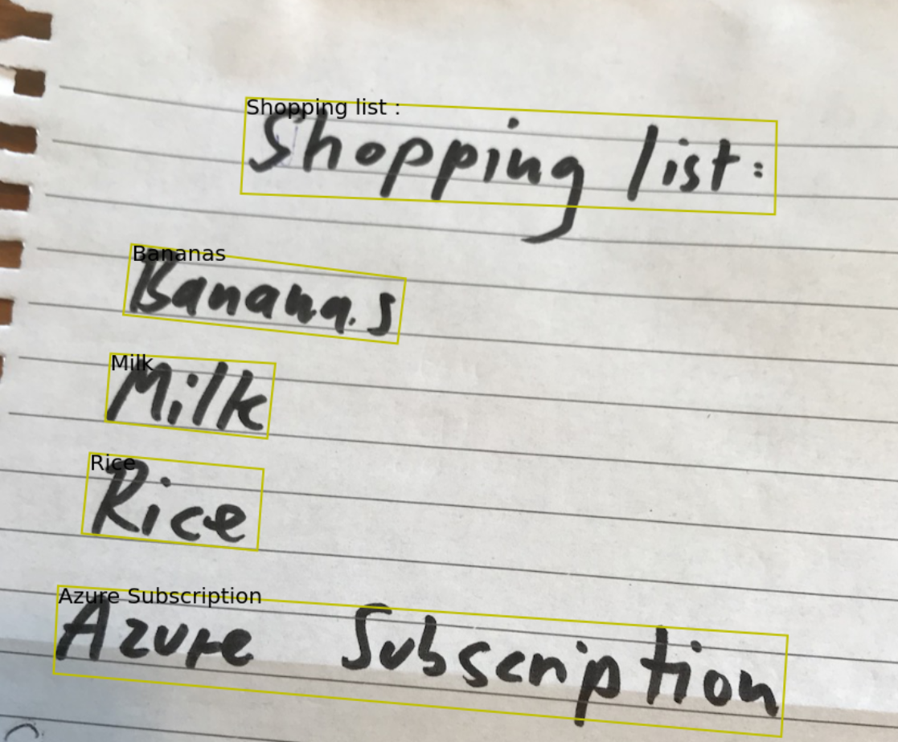

**Here is another image we can test with:**

> [Calender Motto Test Image](https://bootcamps.blob.core.windows.net/ml-test-images/ocr_handwritten_2.jpg)


In a next step, we will use the same service by just extracting text from printed text in images. 

### Optical Character Recognition - Images to Text - Printed content

:triangular_flag_on_post: **Goal:** Leverage OCR to make a printed text document in images machine-readable

It is very similar as the previous example- except that is a synchronous call, hence we directly get back the recognition result. Go ahead and copy the Code into a new Cell into your `CognitiveServices.ipynb` Notebook:

```python
key = "xxxx" # Paste your API Key here or comment this line to use the key from above

url = "https://westeurope.api.cognitive.microsoft.com/vision/v3.2/ocr"
image_url = "https://bootcamps.blob.core.windows.net/ml-test-images/ocr_printed_1.jpg"

headers = {'Ocp-Apim-Subscription-Key': key}
params  = {'language': 'unk', 'detectOrientation': 'true'}
data    = {'url': image_url}

response = requests.post(url, headers=headers, params=params, json=data)
recognition_result = response.json()

# Extract the word bounding boxes and text
line_infos = [region["lines"] for region in recognition_result["regions"]]
word_infos = []
for line in line_infos:
    for word_metadata in line:
        for word_info in word_metadata["words"]:
            word_infos.append(word_info)
word_infos
```

**Example JSON response (just a snippet):**

```json
[{'boundingBox': '31,50,817,70', 'text': 'LUFTPOLSTERTASCHEN'},
 {'boundingBox': '30,219,23,24', 'text': 'u'},
 {'boundingBox': '68,216,168,27', 'text': 'Fensterlose'},
 {'boundingBox': '247,216,263,37', 'text': 'Schutzumschläge'},
 {'boundingBox': '522,221,47,26', 'text': 'mit'},
 {'boundingBox': '580,221,182,37', 'text': 'Haftklebung'},
 {'boundingBox': '66,276,149,34', 'text': 'Optimaler'},
 {'boundingBox': '225,276,99,27', 'text': 'Schutz'},
 {'boundingBox': '334,277,84,26', 'text': 'durch'},
 {'boundingBox': '432,277,227,35', 'text': 'Luftpolsterfolie'}]
```

**Visualization:**

```python
# Display the image and overlay it with the extracted text
plt.figure(figsize=(15, 15))
image = Image.open(BytesIO(requests.get(image_url).content))
ax = plt.imshow(image, alpha=0.5)
for word in word_infos:
    bbox = [int(num) for num in word["boundingBox"].split(",")]
    text = word["text"]
    origin = (bbox[0], bbox[1])
    patch  = Rectangle(origin, bbox[2], bbox[3], fill=False, linewidth=2, color='y')
    ax.axes.add_patch(patch)
    plt.text(origin[0], origin[1], text, fontsize=11, va="top")
plt.axis("off")
```

**Example Result:**


**Here is one more [image](https://bootcamps.blob.core.windows.net/ml-test-images/ocr_printed_2.jpg) we can test with!**

From recognizing text on images we will now detect objects on images for this we will introduce the **Custom Vision Cognitive Service.**

**Azure Custom Vision** is an image recognition service that lets you build, deploy, and improve your own image identifiers. An image identifier applies labels (which represent classes or objects) to images, according to their visual characteristics. Unlike the Computer Vision service, Custom Vision allows you to specify the labels and train custom models to detect them.

**What it does?**
The Custom Vision service uses a machine learning algorithm to analyze images. You, the developer, submit groups of images that feature and lack the characteristics in question. You label the images yourself at the time of submission. Then, the algorithm trains to this data and calculates its own accuracy by testing itself on those same images. Once the algorithm is trained, you can test, retrain, and eventually use it in your image recognition app to classify new images. You can also export the model itself for offline use.

Now let's create our own Custom Vision Service.

## Azure Cognitive Services - Custom Vision Service for Detecting Objects in Images

|Azure Cognitive Services|Information|
|---|---|
|[Custom Vision API](https://docs.microsoft.com/en-us/azure/cognitive-services/custom-vision-service/)|https://docs.microsoft.com/en-us/azure/cognitive-services/custom-vision-service/

:triangular_flag_on_post: **Goal:** Detect beer glasses in images

1. Use [Custom Vision](https://customvision.ai) to detect beer glasses in images - [Image Dataset for training and testing](https://bootcamps.blob.core.windows.net/ml-test-images/beer_glasses.zip)

First we deploy the **Azure Custom Vision** Service in the **Azure Portal**:

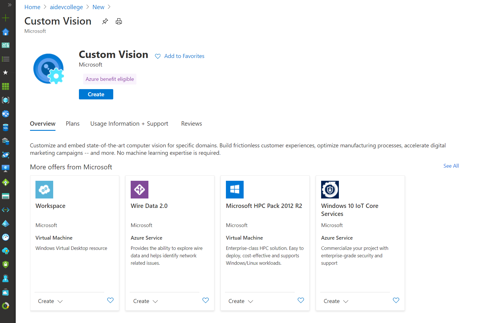

The Custom Vision Service has 2 types of endpoints. One for training the model and one for running predictions against the model. Fill in the *name* and the *location* as well as the *pricing tier* for the training and the prediction resource:

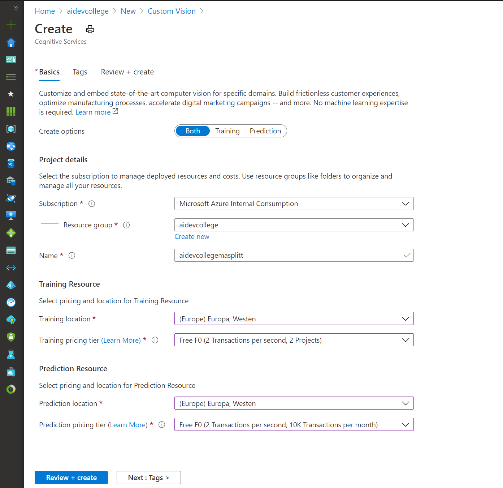

Then, log in to [Custom Vision](https://www.customvision.ai/) with your Azure credentials.

Create a new project of type `Object detection`:

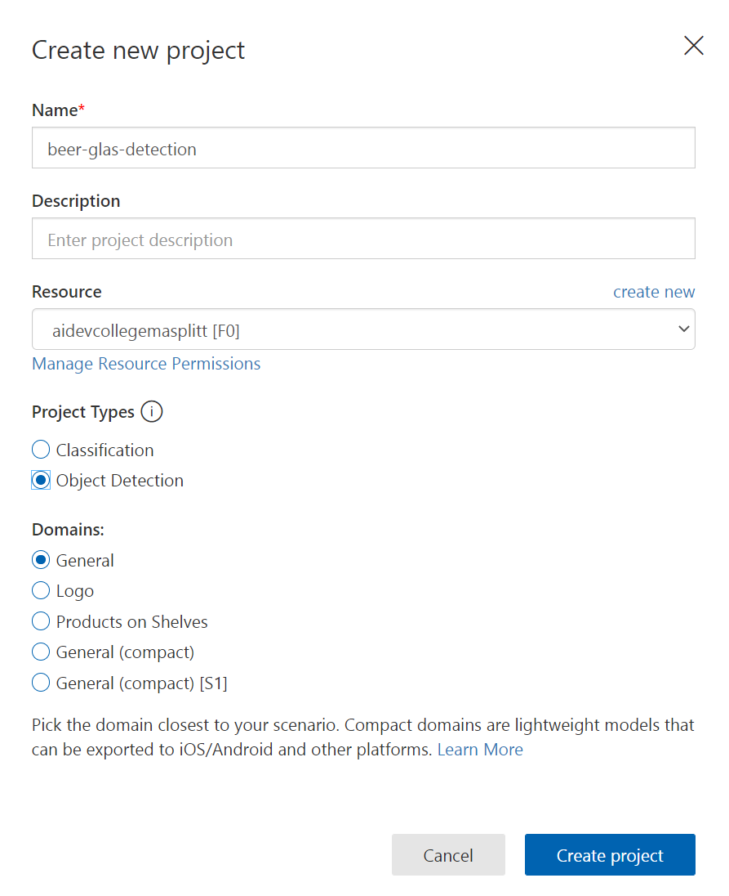

Next, add all the **training images** from the **unzipped** [dataset](https://bootcamps.blob.core.windows.net/ml-test-images/beer_glasses.zip) within the **beer_glasses_train**. 

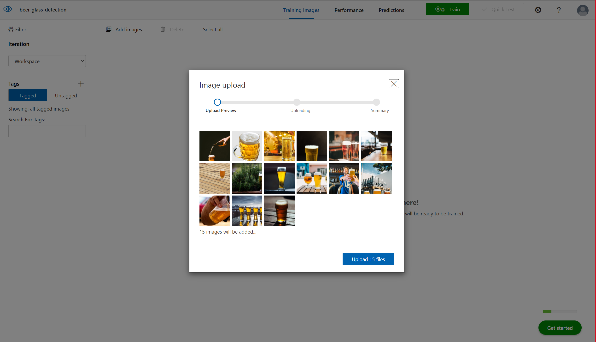

Once added, we need to tag all the beer glasses in the images. If there are multiple glasses in one image, tag each one individually:


Once we've tagged all 15 images (that's the minimum), we can hit the `Train` button. After 1-2 minutes, we'll see the training statistics:


Let's briefly look at the results and make sure we understand them:

Sliders - they set the results given certain thresholds
* Probability Threshold: 82% - this means we only count detections with over 82% probability as beer glasses
* Overlap Threshold: 51% - this means we want our detection results overlap at least 51% with the ground truth in the training set

Results:
* Precision: 30% - given a detection, it is 30% correct on average (meaning the algorithm will also detect other objects as glasses)
* Recall: 100% - a recall of 100% means, it will detect all beer glasses (but maybe mistake some other objects as beer glasses too)
* mAP: 83.3% - mean average precision - the average how well our detection algorithm works 

Under `Quick Test`, we can briefly upload our testing images and see what the service will detect. As we only added 15 training images with a lot of variance, the results are not great yet. By adding more images, we could most likely improve the detection performance significantly.

If we go to the `Performance` tab, we can get the `Prediction URL` and the `Prediction-Key`. We can use this endpoint to programmatically access the service.

So far we have covered a lot of Text Recognition, Translation, Face Recognition and Image Recognition, so now we will look at *Speech Recognition*.

In the following sample, you learn about the benefits and capabilities of the **Text-to-speech Cognitive Service**, which enables your applications, tools, or devices to convert text into human-like synthesized speech and the **Speech-to-text Cognitive Service** which enables your application, tools, or devices to convert real-time transcription of audio streams into text.

## Azure Cognitive Services - Speech

|Azure Cognitive Services|Information|
|---|---|
|[Speech API](https://docs.microsoft.com/en-us/azure/cognitive-services/speech-service/)|https://docs.microsoft.com/en-us/azure/cognitive-services/speech-service/

:triangular_flag_on_post: **Goal:** Leverage Speech-to-Text and Text-to-Speech

In the language of your choice (Python solution is provided), write two small scripts or apps that

1. Convert written text into speech (German or English)
1. Convert speech into written text (German or English)

You can use can use this file: [`data/test.wav`](data/test.wav) (English).

Let's deploy a Speech service:


Fill in a *unique name* and select *create*:


As region, we'll be using the region `West Europe` in this example. You can find your API key under the service, then `Keys`.

You can use this file [`test.wav`](../data/test.wav) for testing.

### Text-to-Speech

First, we need to request a token from the `Issue Token endpoint` of the Speech API. Each token is valid for 10 minutes, hence we can either reuse it multiple times (to minimize network traffic and latency), or request a new one for each call:

```python
import requests, json
import IPython.display as ipd

api_key = "xxxx" # Enter your API key here

token_url = "https://westeurope.api.cognitive.microsoft.com/sts/v1.0/issuetoken"
headers = {'Ocp-Apim-Subscription-Key': api_key}

response = requests.post(token_url, headers=headers)
token = response.text

print("Token: " + token)
```

Once we have the token, we can form our request for generating speech:

```python
url = "https://westeurope.tts.speech.microsoft.com/cognitiveservices/v1"
headers = {'Authorization': token,
           'Content-Type': 'application/ssml+xml',
           'User-Agent': 'Test',
           'X-Microsoft-OutputFormat': 'riff-16khz-16bit-mono-pcm'}

data = "<speak version='1.0' xmlns='http://www.w3.org/2001/10/synthesis' xml:lang='en-US'> \
<voice name='en-US-JennyNeural'> \
    Hello, welcome to the AI Developer College!  \
</voice></speak>"

response = requests.post(url, headers=headers, data=data)
audio_data = response.content

print(response.headers)
```

We can just write it out to a `*.wav` file and then download or play it:

```python
with open("test.wav", "wb") as f: 
    f.write(audio_data)
    
ipd.Audio('test.wav')
```

There are [many different voices](https://docs.microsoft.com/en-us/azure/cognitive-services/speech-service/language-support#text-to-speech) available to choose from. By updating the [XML request](https://docs.microsoft.com/en-us/azure/cognitive-services/speech-service/how-to-text-to-speech#specify-a-voice), we can easily specify a different voice or language. From here on, it should be easy to generate German speech. Try it out!

### Speech-to-Text

Let's take the generated or provided `test.wav` from the example before and convert it back to text. Again, copy the code and let's first create a token:

```python
import requests, json

api_key = "xxx" # Enter your API key here

token_url = "https://westeurope.api.cognitive.microsoft.com/sts/v1.0/issuetoken"
headers = {'Ocp-Apim-Subscription-Key': api_key}

response = requests.post(token_url, headers=headers)
token = response.text

print("Token: " + token)
```

Now that we have a token, we can call the speech-to-text endpoint and include the `wav` data:

```python
url = "https://westeurope.stt.speech.microsoft.com/speech/recognition/conversation/cognitiveservices/v1"

headers = {'Authorization': 'Bearer ' + token,
           'Accept': 'application/json',
           'Ocp-Apim-Subscription-Key': api_key,
           'Content-Type': 'audio/wav; codec=audio/pcm; samplerate=16000'}

params = {'language': 'en-US', 'format': 'detailed'}

with open("test.wav", 'rb') as f:
    data = f.read()

response = requests.post(url, headers=headers, params=params, data=data)
print(json.dumps(response.json(), indent=2))
```

For recognizing longer text with multiple sentences, you can follow the [following tutorial](https://docs.microsoft.com/en-us/azure/cognitive-services/speech-service/quickstart-python).

***Note:***

Compressed audio is also supported (e.g., MP3s), see [here](https://docs.microsoft.com/en-us/azure/cognitive-services/speech-service/how-to-use-codec-compressed-audio-input-streams),

Besides that, the speech-to-text API expects audio with the following specifics:
* 16-bit WAV format with PCM or OGG format with OPUS
* Single channel (mono) at 8 or 16 KHz

More details, see [here](https://docs.microsoft.com/en-us/azure/cognitive-services/speech-service/how-to-use-audio-input-streams).

Now let's start with the **Cognitive Service for Language**. The Cognitive Service for Language API (Application Programming Interface) is a cloud-based service that provides Natural Language Processing (NLP) features for understanding and analyzing text.

### Azure Cognitive Services - Language Service

|Azure Cognitive Services|Information|
|---|---|
|[Text Analytics API](https://azure.microsoft.com/en-us/services/cognitive-services/text-analytics/)|https://docs.microsoft.com/en-us/azure/cognitive-services/text-analytics/quickstarts/python|

:triangular_flag_on_post: **Goal:** Leverage Text Analytics API for extracting language, sentiment, key phrases, and entities from text

1. In the following tasks we will reuse the `Compute Instance (VM)` from the __Azure Machine Learning Service__ and create a new Notebook. We can click the `New` button and create a new Notebook of type: `Python 3.6 - AzureML`. A new browser tab should open up and we can click the name `Untitled` and rename it to `CognitiveServices.ipynb`.

First we deploy the **Language** Service in the **Azure Portal**:

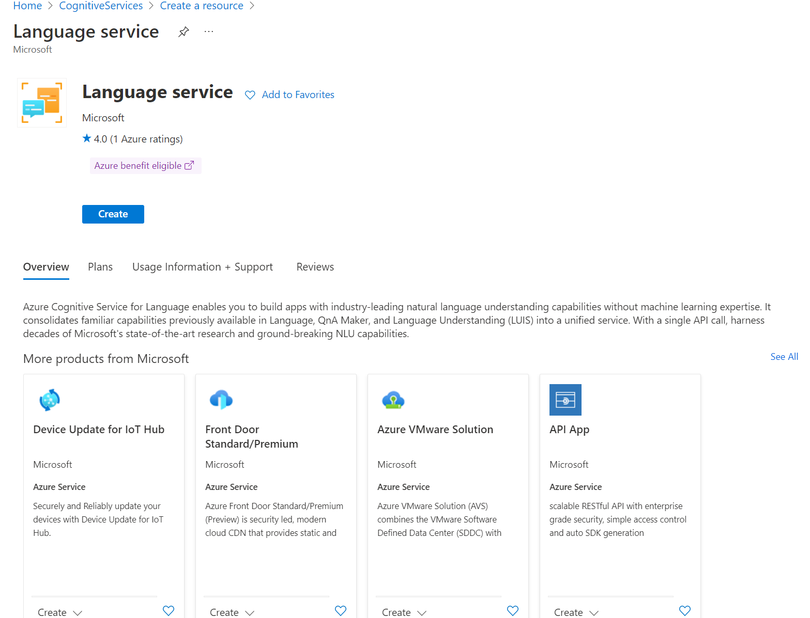

By default, the service comes with several pre-built capabilities like sentiment analysis, key phrase extraction or question answering. It is possible to add customizable features. However, for this exercise we will stick with the pre-built capabilities:

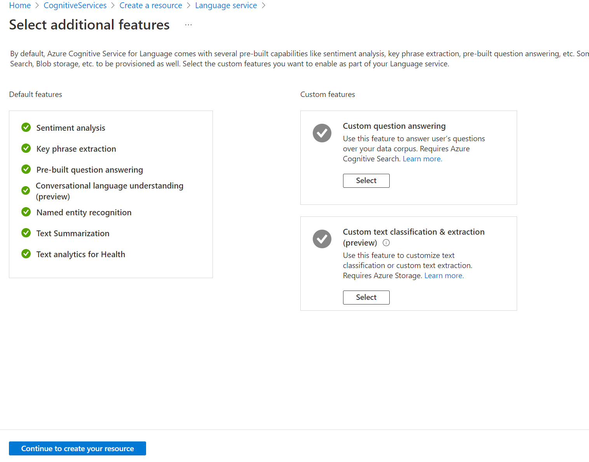

Fill in the *name*, agree to the *Legal Terms* and *terms of Responsible AI* and hit *create*:

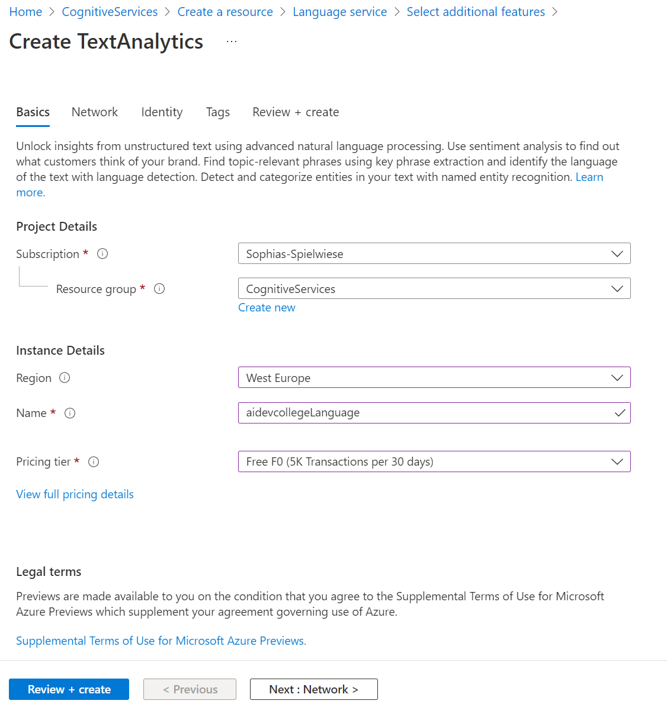

Get the Key and the URL (endpoint) under the section *keys* from the Azure portal:

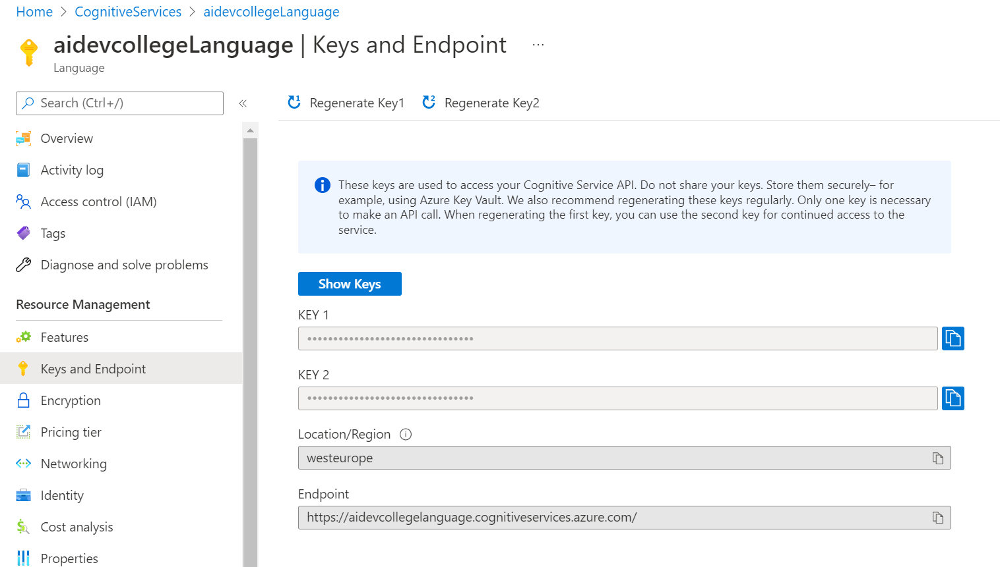

Let's start with connecting to your Language Service by copying the Code with the **filled in key and endpoint** as shown above into a new Cell in your `CognitiveServices.ipynb` notebook:

```python
import requests
from pprint import pprint

subscription_key = "xxx" # Paste your API key here
text_analytics_base_url = "xxx" # Paste your URL in here
headers = {"Ocp-Apim-Subscription-Key": subscription_key}
```

Azure Cognitive Service for Language provides several features. In the following, we will try out only a few of the available features:
- Language Detection ([documentation](https://docs.microsoft.com/en-us/azure/cognitive-services/language-service/language-detection/overview))
- Sentiment Analysis ([documentation](https://docs.microsoft.com/en-us/azure/cognitive-services/language-service/sentiment-opinion-mining/overview))
- Key Phrase Extraction ([documentation](https://docs.microsoft.com/en-us/azure/cognitive-services/language-service/key-phrase-extraction/overview))
- Entity Linking ([documentation](https://docs.microsoft.com/en-us/azure/cognitive-services/language-service/entity-linking/overview))


In general, we will conduct [REST](https://restfulapi.net/) Calls to the Cognitive Service by sending some data to the service and letting the **pre-trained Machine Learning Model** behind the scenes give responses in [JSON format](https://www.w3schools.com/whatis/whatis_json.asp) regarding the data.

For each of the following features, copy the code blocks into new cells of your Jupyter Notebook.

### Language Detection

Firstly, we can extract the language from text. Run this in a new Cell in your `CognitiveServices.ipynb` notebook:

```python
language_detection_api_url = endpoint + "/text/analytics/v3.1/languages"

documents = { "documents": [
    { "id": "1", "text": "This is a document written in English." },
    { "id": "2", "text": "Este es un document escrito en Español." },
    { "id": "3", "text": "这是一个用中文写的文件" }
]}

response  = requests.post(language_detection_api_url, headers=headers, json=documents)
languages = response.json()
pprint(languages)
```

Your result should look like this:

```json
{'documents': [{'detectedLanguage': {'confidenceScore': 1.0,
                                     'iso6391Name': 'en',
                                     'name': 'English'},
                'id': '1',
                'warnings': []},
               {'detectedLanguage': {'confidenceScore': 0.75,
                                     'iso6391Name': 'es',
                                     'name': 'Spanish'},
                'id': '2',
                'warnings': []},
               {'detectedLanguage': {'confidenceScore': 1.0,
                                     'iso6391Name': 'zh_chs',
                                     'name': 'Chinese_Simplified'},
                'id': '3',
                'warnings': []}],
 'errors': [],
 'modelVersion': '2021-11-20'}
```

### Sentiment Analysis

Secondly, we can analyse the sentiment of a given phrase, go ahead and copy the code into your `CognitiveServices.ipynb` notebook:

```python
sentiment_api_url = endpoint + "/text/analytics/v3.2-preview.1/sentiment"

documents = {"documents" : [
  {"id": "1", "language": "en", "text": "I had a wonderful experience! The rooms were wonderful and the staff was helpful."},
  {"id": "2", "language": "en", "text": "I had not a great time at the hotel. The staff was rude and the food was awful."},  
  {"id": "3", "language": "es", "text": "Los caminos que llevan hasta Monte Rainier son espectaculares y hermosos."},  
  {"id": "4", "language": "es", "text": "La carretera estaba atascada. Había mucho tráfico el día de ayer."}
]}

response  = requests.post(sentiment_api_url, headers=headers, json=documents)
sentiments = response.json()
pprint(sentiments)
```

Your result should look like this:

```json
{'documents': [{'confidenceScores': {'negative': 0.0,
                                     'neutral': 0.0,
                                     'positive': 1.0},
                'id': '1',
                'sentences': [{'confidenceScores': {'negative': 0.0,
                                                    'neutral': 0.0,
                                                    'positive': 1.0},
                               'length': 29,
                               'offset': 0,
                               'sentiment': 'positive',
                               'text': 'I had a wonderful experience!'},
                              {'confidenceScores': {'negative': 0.0,
                                                    'neutral': 0.0,
                                                    'positive': 1.0},
                               'length': 51,
                               'offset': 30,
                               'sentiment': 'positive',
                               'text': 'The rooms were wonderful and the staff '
                                       'was helpful.'}],
                'sentiment': 'positive',
                'warnings': []},
               {'confidenceScores': {'negative': 1.0,
                                     'neutral': 0.0,
                                     'positive': 0.0},
```

### Key Phrase Extraction

Thirdly, we can easily extract key phrases from text. In order to do so, copy the code into your `CognitiveServices.ipynb` notebook:

```python
keyphrase_url = endpoint + "/text/analytics/v3.1/keyphrases"

documents = {"documents" : [
  {"id": "1", "language": "en", "text": "I had a wonderful experience! The rooms were wonderful and the staff was helpful."},
  {"id": "2", "language": "en", "text": "I had a terrible time at the hotel. The staff was rude and the food was awful."},  
  {"id": "3", "language": "es", "text": "Los caminos que llevan hasta Monte Rainier son espectaculares y hermosos."},  
  {"id": "4", "language": "es", "text": "La carretera estaba atascada. Había mucho tráfico el día de ayer."}
]}

response  = requests.post(keyphrase_url, headers=headers, json=documents)
key_phrases = response.json()
pprint(key_phrases)
```
Example Result: 

```json
{'documents': [{'id': '1',
                'keyPhrases': ['wonderful experience', 'rooms', 'staff'],
                'warnings': []},
               {'id': '2',
                'keyPhrases': ['terrible time', 'hotel', 'staff', 'food'],
                'warnings': []},
               {'id': '3',
                'keyPhrases': ['Monte Rainier', 'caminos'],
                'warnings': []},
               {'id': '4',
                'keyPhrases': ['mucho tráfico', 'día', 'carretera', 'ayer'],
                'warnings': []}],
 'errors': [],
 'modelVersion': '2021-06-01'}
```

### Entity Linking

And last but not least, we can detect and link entities in text. Entity linking identifies and disambiguates the identity of entities found in text. For example, in the sentence "We went to Seattle last week.", the word "Seattle" would be identified, with a link to more information on Wikipedia. In order to try it out, copy the code into your `CognitiveServices.ipynb` notebook:

```python
entities_url = endpoint + "/text/analytics/v3.1/entities/linking"

documents = {"documents" : [
  {"id": "1", "text": "Microsoft was founded by Bill Gates and Paul Allen on April 4, 1975, to develop and sell BASIC interpreters for the Altair 8800."}
]}

response  = requests.post(entities_url, headers=headers, json=documents)
entities = response.json()
pprint(entities)
```
Example Result (snippet): 

```json
[{'documents': [{'entities': [{'bingId': 'a093e9b9-90f5-a3d5-c4b8-5855e1b01f85',
                              'dataSource': 'Wikipedia',
                              'id': 'Microsoft',
                              'language': 'en',
                              'matches': [{'confidenceScore': 0.51,
                                           'length': 9,
                                           'offset': 0,
                                           'text': 'Microsoft'}],
                              'name': 'Microsoft',
                              'url': 'https://en.wikipedia.org/wiki/Microsoft'},
                             {'bingId': '0d47c987-0042-5576-15e8-97af601614fa',
                              'dataSource': 'Wikipedia',
                              'id': 'Bill Gates',
                              'language': 'en',
                              'matches': [{'confidenceScore': 0.56,
                                           'length': 10,
                                           'offset': 25,
                                           'text': 'Bill Gates'}],
                              'name': 'Bill Gates',
                              'url': 'https://en.wikipedia.org/wiki/Bill_Gates'},
                             {'bingId': 'df2c4376-9923-6a54-893f-2ee5a5badbc7',
                              'dataSource': 'Wikipedia',
                              'id': 'Paul Allen',
                              'language': 'en',
                              'matches': [{'confidenceScore': 0.56,
                                           'length': 10,
                                           'offset': 40,
                                           'text': 'Paul Allen'}]
```

If you want to directly create a dashboard within Power BI from the derived results, have a look at [this tutorial](https://docs.microsoft.com/en-us/azure/cognitive-services/text-analytics/tutorials/tutorial-power-bi-key-phrases).

### Optional: Language Studio

[Language Studio](https://aka.ms/languageStudio) is a set of UI-based tools that lets you explore, build, and integrate features from Azure Cognitive Service for Language into your applications. Using the Studio, you can get started without needing to write code, and then use the available client libraries and REST APIs in your application.

Each of the features of the Cognitive Service for Language has a demo-like experience inside Language Studio that lets you input text, and presents the response both visually, and in JSON. These demos help you quickly test these prebuilt features without using code.

Since we looked at *Entity Linking* in the last paragraph, let's check out the Studio's capabilities for this feature.

1. Go to the [Language Studio](https://aka.ms/languageStudio)
2. Log in using your Azure account.
3. A window will pop up prompting you to choose a language resource. Choose the one you created previously.
4. Choose *Find linked entities*

## What we have done so far:

- We deployed several Cognitive Services using the Azure Portal
- We called those Cognitive Service REST APIs by using Python
- We trained custom machine learning models (e.g. Custom Vision and Language Understanding) using an UI

As we have seen the Cognitive Services one by one, we want to still continue to combine the ml expert view with the developer view. Thus we will take the Custom Vision Service which we have learned about and will integrate it into a small application. So let's continue to the next challenge.

:zap: Let's go to **[AI Developer College Day2 - Custom Vision Application](../../CustomVisionApp/CustomVisionApp.md)**!

## House Keeping: Lab Cleanup

Remove the sample resource group.

```shell
$ az group delete -n <yourResourceGroup>
```

## Optional: Play around with the: Intelligent Kiosk 

Find the Sample on Github here: [Intelligent Kiosk](https://github.com/microsoft/Cognitive-Samples-IntelligentKiosk)
