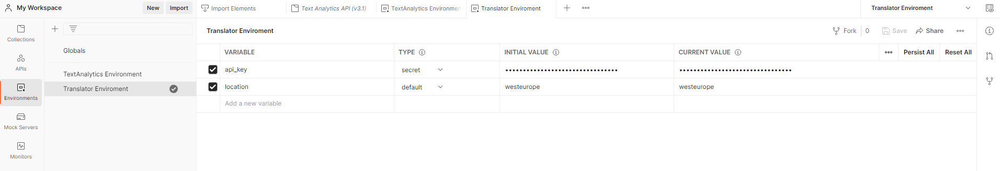
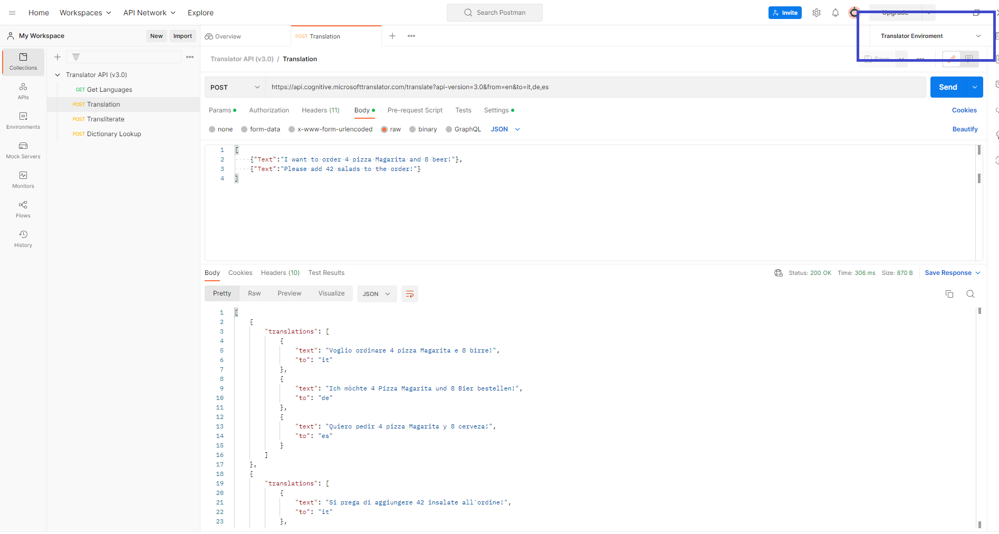
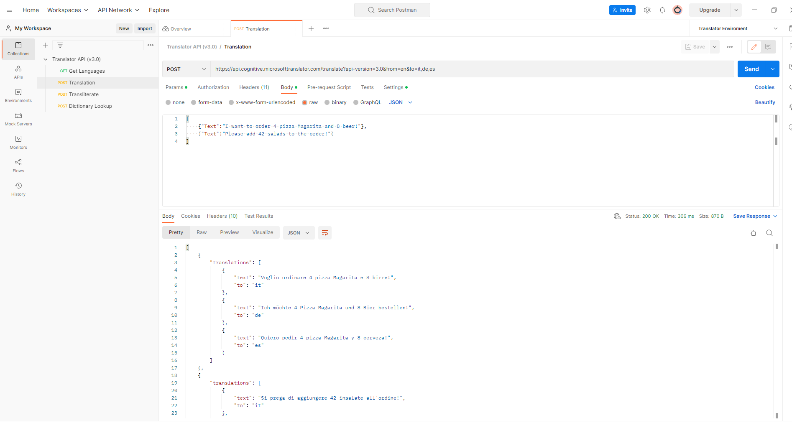
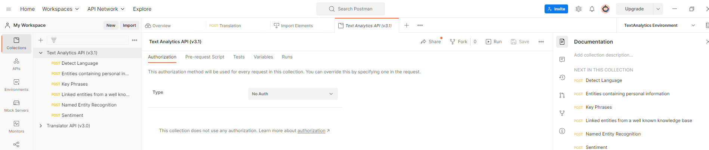

# AI Developer College Day2 - Cognitive Services

As we have looked at Cognitive Search so far and saw how we can enrich our search service with the Azure Cognitive Services, we will now go into detail of some of those services. Yesterday we trained and registered a model and deployed it as an endpoint. Microsoft offers these services for developers to be able to make your applications smarter by enriching them with intelligence.

## Focus of Today:


## Here is what you will learn

Today will be an overview of Azure Cognitive Services, as you will learn:

- Use the **Cloud Shell** as _launch point_ for PowerShell and Bash scripts.
- Use **Cloud Shell** to automate Azure resource creation and configuration. 
- How to deploy Cognitive Services from the areas _Language_, _Speech_, _Vision_ and _Decision_ with UI and Azure CLI
- How to use those Cognitive Services using Python
- How to train and use custom models (e.g. Custom Vision) yourself

We will cover the following topics in several sections:

| Pillar                | API Service (section)                                                                                                                                                                                          | Documentation                                                                                     |
| --------------------- | -------------------------------------------------------------------------------------------------------------------------------------------------------------------------------------------------------------- | ------------------------------------------------------------------------------------------------- |
|[Cloud Shell](https://learn.microsoft.com/en-us/azure/cloud-shell/overview)  | - | [Documentation](https://learn.microsoft.com/en-us/azure/cloud-shell/overview) |
| [Language](#language) | [Translator](#translator)                                                                                                                                                                                      | [Documentation](https://docs.microsoft.com/en-us/azure/cognitive-services/Translator/)            |
| [Language](#language) | [Language Service](#language-service): [Language Detection](#language-detection), [Sentiment Analyis](#sentiment-analysis), [Key Phrase Extraction](#key-phrase-extraction), [Entity Linking](#entity-linking) | [Documentation](https://docs.microsoft.com/en-us/azure/cognitive-services/language-service/)      |
| [Speech](#speech)     | [Text-to-Speech](#text-to-speech), [Speech-to-Text](#speech-to-text)                                                                                                                                           | [Documentation](https://docs.microsoft.com/en-us/azure/cognitive-services/speech-service/)        |
| [Vision](#vision)     | [Computer Vision](#computer-vision)                                                                                                                                                                            | [Documentation](https://docs.microsoft.com/en-us/azure/cognitive-services/computer-vision/)       |
| [Vision](#vision)     | [Custom Vision](#custom-vision)                                                                                                                                                                                | [Documentation](https://docs.microsoft.com/en-us/azure/cognitive-services/Custom-Vision-Service/) |

# Why is Cloud Shell aka Azure CLI important?

We want to give you the greatest possible insight into the AI world on Azure. Therefore, we will first deploy the Cognitive Service "Translator" via the UI. After that, all other Cognitive Services will be deployed via the **Azure CLI**, which is why you will find a short introduction in the following text. 

## Cloud Shell - Coding Your Azure Resources 

## Benefits of the Azure Cloud Shell

Ok - quite impressive what the Azure portal as a single page application allows us to do, isn't it?  
However sometimes a shell is faster and better for repetitive tasks. But you may not want to install software nor tools for this in your machine.  
The Azure **Cloud Shell** is a shell | console hosted in your browser window, ready to execute commands to create, delete, modify Azure resources in your subscription.  
While it is also possible to use PowerShell on your local PC to administer Azure, using the Cloud Shell brings some advantages compared to using your PC.

Using the Cloud Shell saves you time as:

- you do not need to explicitly code the Azure logon within the script - you are already authenticated to Azure via the browser
- you do not need anything to be installed on your PC. So no more asking [which version of PowerShell and what modules](https://docs.microsoft.com/powershell/azure) are necessary

## Create an Azure Cloud Shell

```
[Azure Portal]
-> Click the 'Cloud Shell' symbol close to your login details on the right upper corner.
```

)

- The Azure Cloud Shell is an in-browser-accessible shell for managing Azure resources.
- It already has the required SDKs and tools installed to interact with Azure.
- The Azure Cloud Shell comes in 2 flavors: PowerShell or Bash. When being asked choose PowerShell this time.
  

- The first time you use the 'Cloud Shell' you will be asked to setup a storage account e.g. to store files you have uploaded persistently. [See](https://docs.microsoft.com/azure/cloud-shell/persisting-shell-storage)

```
[Azure Portal] -> Click 'Show advanced settings'
```


| Name                 | Value               |
| -------------------- | ------------------- |
| _Subscription_       | %your subscription% |
| _Cloud Shell Region_ | e.g. West Europe    |
| _Resource Group_     | e.g. rg-cloudshell  |
| _Storage Account_    | %some unique value% |
| _File Share_         | cloudshell          |

```
[Azure Portal] -> Create storage
```

- Once successful your shell should appear at the bottom of the page:

  

# Azure Cognitive Services

## What are Azure Cognitive Services?

Azure Cognitive Services:

- are APIs, SDKs and services available to help developers build intelligent applications without having direct Artificial Intelligence (AI), Machine Learning expert skills.
- enable developers to easily add cognitive features into their applications.
- help developers create applications that can see, hear, speak, understand and even begin to reason.
- can be categorized into five main pillars - _Language_, _Speech_, _Vision_ and _Decision_.

You can solve the tasks in a programming language of your choice. For sake of convenience, we are providing hints in `Python`, which you can easily run on the `Compute Instance (VM) from the Azure Machine Learning Service` or in `Visual Studio Code`. SDK Support for `C#`, `Node.js` or `.NET Core` is available for most challenges. You can find code examples in the Azure documentation for the associated services.

For this entire challenge we will create a `Resource Group` called `CognitiveServices` as previously shown and described in the **Azure Portal**. All Cognitive Services can be `added` and deployed in this Resource Group.

In the upcoming tasks, we will reuse the `Compute Instance (VM)` from the **Azure Machine Learning Service** and create a new Notebook. We can click the `New` button and create a new Notebook of type: `Python 3.8 - AzureML`. A new browser tab should open up and we can click the name `Untitled` and rename it to `CognitiveServices.ipynb`.

Let's look at the first pillar of Cognitive Services - Language.

# Language

The world is getting more and more connected and therefore, translation services are gaining more significance. The **Azure Translator Cognitive Service** is a cloud-based machine translation service. It is easy to integrate into your applications, websites, tools, and solutions. It allows you to add multi-language user experiences in various [languages](https://docs.microsoft.com/en-us/azure/cognitive-services/Translator/language-support) and can be used on any hardware platform with any operating system for text translation.

## Translator

:triangular_flag_on_post: **Goal:** Translation of multiple sentences, detection of one or more input languages to one or several output languages concurrently.

Let's get started with using the translator service!

**`Note:`** This is our first Cognitive Service that we are deploying. As mentioned at the beginning, the **Translator** will be the first and only Cognitive Service we deploy using the UI. All other Cognitive Services will be deployed via the Azure CLI. 

First, create a `Translator` API Key in the Azure Portal:


The Translator API allows to directly access the service by specifying the API key. As with other services, you can find the key under "Keys and Endpoint".

Use the `CognitiveServices.ipynb` Notebook which you just created and copy the following code in a cell. We will conduct a REST Call by sending data to the _Translate Cognitive Service_ and receiving a response from the pre-trained Machine Learning model behind the scenes. In this case, we are translating text from English to German.
Replace `YOUR_SUBSCRIPTION_KEY` and `YOUR_RESOURCE_LOCATION` with the information from your Azure Translator Service as described above and run the cell.

```python
import requests, uuid, json

subscription_key = "YOUR_SUBSCRIPTION_KEY"
location = "YOUR_RESOURCE_LOCATION"
endpoint = "https://api.cognitive.microsofttranslator.com"
path = '/translate'
url = endpoint + path

headers = {
  'Ocp-Apim-Subscription-Key': subscription_key,
  'Ocp-Apim-Subscription-Region': location,
  'Content-type': 'application/json',
  'X-ClientTraceId': str(uuid.uuid4())
}

params = {
  'api-version': '3.0',
  'from': 'en',
  'to': ['de', 'it']
}

body = [
  {'text' : 'I want to order 4 pizza Magarita and 8 beer!'},
  {'text' : 'Please add 42 salads to the order!'}
]

response = requests.post(url, headers=headers, params=params, json=body)
print(json.dumps(response.json(), indent=2))
```

Example Result:

```json
[
  {
    "translations": [
      {
        "text": "Ich m\u00f6chte 4 Pizza Magarita und 8 Bier bestellen!",
        "to": "de"
      },
      {
        "text": "Voglio ordinare 4 pizza Magarita e 8 birre!",
        "to": "it"
      }
    ]
  },
  {
    "translations": [
      {
        "text": "Bitte f\u00fcgen Sie der Bestellung 42 Salate hinzu!",
        "to": "de"
      },
      {
        "text": "Si prega di aggiungere 42 insalate all'ordine!",
        "to": "it"
      }
    ]
  }
]
```

As we can see, we can translate multiple sentences to multiple languages within one API call. The service also automatically detects the input language. (_Optional_: Try deleting the 'from': 'en' from the params section of the code and see how the json response changes.) It is possible to add optional parameters such as a profanity filter and more.

The Translator Service does not only translate text, but also has the capability of transliterating text from one type of script to another (and much more). You can try it out with the code below:

```python
path = '/transliterate'
url = endpoint + path

params = {
    'api-version': '3.0',
    'language': 'ja',
    'fromScript': 'jpan',
    'toScript': 'latn'
}

body = [
  {'text' : 'こんにちは'}
]

response = requests.post(url, headers=headers, params=params, json=body)
print(json.dumps(response.json(), indent=2))
```

This should be the result:

```json
[
  {
    "text": "Kon'nichiwa",
    "script": "latn"
  }
]
```

### Optional (but highly recommended): Postman

[Postman](https://www.postman.com/) is an API platform for building and using APIs. Postman simplifies each step of the API lifecycle and streamlines collaboration. Since the Azure Cloud Platform consists out of many APIs this tool is perfect to get a deeper understanding of its functionalities. 

[Download](https://app.getpostman.com/app/download/win64) and install Postman.

[Here](./postman/) you will find 2 Postman collections we have created for you for the Translator API and Text Analytics API. These collections cover all API requests for the services. Download them.

After you have installed Postman open it. On the left side you will find the tab _Collections_. Navigate there and hit the _Import_ button to upload the Translation collection.

Now go to the _Environments_ tab again on the left side and [create an environment](https://learning.postman.com/docs/sending-requests/managing-environments/#creating-environments) for the Translator API by selecting the **+**. Name it `Translator Environment`.

- Create a  variable called "api_key", select "secret" as a type, and paste your API key from the portal.
- Create a variable called "location" with the location you chose for the Translator service (e.g., westeurope)



Finally, assign the environment created to the Translator collection. 

.

Now, you can play around with the APIs! You can select the different services from the collections tab and click on "Send" to send a request. At the bottom, you should receive a response. You can also change the Parameters to check out different languages, or you can change the body to try out other texts. 




## Language Service

| Azure Cognitive Services                                                                                              | Information                                                                         |
| --------------------------------------------------------------------------------------------------------------------- | ----------------------------------------------------------------------------------- |
| [Cognitive Service for Language](https://docs.microsoft.com/en-us/azure/cognitive-services/language-service/overview) | https://docs.microsoft.com/en-us/azure/cognitive-services/language-service/overview |

:triangular_flag_on_post: **Goal:** Leverage the Cognitive Service for Language for extracting language, sentiment, key phrases, and entities from text

Now let's continue with some of the remaining **Cognitive Services for Language**. They are deployed using one service called _Language Service_. It provides Natural Language Processing (NLP) features for understanding and analyzing text.

Since we first deployed the **Translator** service via the UI, we now create the **Language** service via the **Azure CLI**.

To create and subscribe to a new Cognitive Services resource, use the **az cognitiveservices account create** command. This command adds a new billable resource to the resource group you created earlier. When you create your new resource, you'll need to know the "kind" of service you want to use, along with its pricing tier (or SKU) and an Azure location. You can either get an overview of the different "kinds" of Cognitive Services [here](https://learn.microsoft.com/en-us/azure/cognitive-services/cognitive-services-apis-create-account-cli?tabs=windows), or use the following command:

```python
az cognitiveservices account list-kinds
```

Let us now create a free tier **Language** service with the following command in **Azure CLI**:

```python
az cognitiveservices account create --name aidevcollegeLanguage --resource-group <your resource group>  --kind TextAnalytics --sku F0 --location westeurope --yes
```
#
**`Hint:`** If you have already created a **Language** service with SKU F0, please use SKU S0!
#

This time we will use the Python SDK to use this service. Let's start with installing the _text analytics_ package. Switch to your VM (or whatever you are using) and copy the following snippet into a new cell in your `CognitiveServices.ipynb` notebook. You might need to restart the kernel.

```
pip install azure-ai-textanalytics
```

There are two approaches to get the key and the region of your Cognitive Service ressource.

1. under the section _Keys and Endpoint_ from the Azure portal:


2. Use the **Azure CLI** with the follwing code:

- Get the key:
```pyhton
az cognitiveservices account keys list --name aidevcollegeLanguage --resource-group <your resource-group-name>
```
- Get the endpoint:
```python
az cognitiveservices account show --name aidevcollegeLanguage --resource-group <your resource-group-name> --query "properties.endpoint"
```

In a next step, we need to create a client object ([TextAnalyticsClient](https://azuresdkdocs.blob.core.windows.net/$web/python/azure-ai-textanalytics/latest/azure.ai.textanalytics.html#azure.ai.textanalytics.TextAnalyticsClient)). Copy the code with the **filled in key and region** into a new cell in your notebook. We will reuse the client object for all following tasks concerning the language service.

```python
from azure.core.credentials import AzureKeyCredential
from azure.ai.textanalytics import TextAnalyticsClient

key = "YOUR_SUBSCRIPTION_KEY"
region = "YOUR_SUBSCRIPTION_REGION"

credential = AzureKeyCredential(key)
endpoint = f"https://{region}.api.cognitive.microsoft.com/"

text_analytics_client = TextAnalyticsClient(endpoint, credential)
```

Azure Cognitive Service for Language provides several features. In the following, we will try out only a few of the available features:

- Language Detection ([documentation](https://docs.microsoft.com/en-us/azure/cognitive-services/language-service/language-detection/overview))
- Sentiment Analysis ([documentation](https://docs.microsoft.com/en-us/azure/cognitive-services/language-service/sentiment-opinion-mining/overview))
- Key Phrase Extraction ([documentation](https://docs.microsoft.com/en-us/azure/cognitive-services/language-service/key-phrase-extraction/overview))
- Entity Linking ([documentation](https://docs.microsoft.com/en-us/azure/cognitive-services/language-service/entity-linking/overview))

In general, we will conduct [REST](https://restfulapi.net/) calls using the Python SDK to the Cognitive Service by sending some data to the service and letting the **pre-trained Machine Learning Model** behind the scenes give responses regarding the data.

For each of the following features, copy the code blocks into new cells of your Jupyter Notebook.

### Language Detection

Firstly, we can extract the language from text. Run this in a new cell in your `CognitiveServices.ipynb` notebook:

```python
documents = [
    """
    This whole document is written in English. In order for the whole document to be written
    in English, every sentence also has to be written in English, which it is.
    """,
    "Il documento scritto in italiano.",
    "Dies ist in deutsche Sprache verfasst.",
    "这是一个用中文写的文件",
    "Este es un document escrito en Español.",
    "আমি প্রতি সপ্তাহে বিএমডাব্লিউ-এর বোর্ড অফ ম্যানেজমেন্টের সাথে ফোনে কথা বলি।"
]

response = text_analytics_client.detect_language(documents)
result = [doc for doc in response if not doc.is_error]

for doc in result:
    print("Language detected: {}".format(doc.primary_language.name))
    print("ISO6391 name: {}".format(doc.primary_language.iso6391_name))
    print("Confidence score: {}\n".format(doc.primary_language.confidence_score))
```

Your result should look like this:

```
Language detected: English
ISO6391 name: en
Confidence score: 1.0

Language detected: Italian
ISO6391 name: it
Confidence score: 0.87

Language detected: German
ISO6391 name: de
Confidence score: 1.0

Language detected: Chinese_Simplified
ISO6391 name: zh_chs
Confidence score: 1.0

Language detected: English
ISO6391 name: en
Confidence score: 1.0

Language detected: Bengali
ISO6391 name: bn
Confidence score: 1.0
```

As you can see, the client can detect a wide range of languages, variants, dialects and some regional languages. If the service cannot detect a language, you will receive the response _unknown_. [Here](https://docs.microsoft.com/en-us/azure/cognitive-services/language-service/language-detection/language-support) you can find a list of all supported languages.

### Sentiment Analysis

Secondly, we can analyse the sentiment of a given phrase. Go ahead and copy the code into your `CognitiveServices.ipynb` notebook:

```python
documents = [
    "I did not like the restaurant. The food was somehow both too spicy and underseasoned. Additionally, I thought the location was too far away from the playhouse.",
    "The restaurant was decorated beautifully. The atmosphere was unlike any other restaurant I've been to.",
    "The food was yummy. :)",
    "I had a wonderful experience! The rooms were wonderful and the staff was helpful.",
    "I had not a great time at the hotel. The staff was rude and the food was awful.",
    "Los caminos que llevan hasta Monte Rainier son espectaculares y hermosos.",
    "La carretera estaba atascada. Había mucho tráfico el día de ayer."
]

response = text_analytics_client.analyze_sentiment(documents, language="en")
result = [doc for doc in response if not doc.is_error]

for doc in result:
    print("Overall sentiment of sentence {}: {}".format(int(doc.id)+1, doc.sentiment))
    print("Scores: positive={}; neutral={}; negative={} \n".format(
        doc.confidence_scores.positive,
        doc.confidence_scores.neutral,
        doc.confidence_scores.negative,
    ))
```

Your result should look like this:

```
Overall sentiment of sentence 1: negative
Scores: positive=0.01; neutral=0.02; negative=0.98

Overall sentiment of sentence 2: positive
Scores: positive=0.81; neutral=0.03; negative=0.16

Overall sentiment of sentence 3: positive
Scores: positive=0.99; neutral=0.0; negative=0.01

Overall sentiment of sentence 4: positive
Scores: positive=1.0; neutral=0.0; negative=0.0

Overall sentiment of sentence 5: negative
Scores: positive=0.01; neutral=0.0; negative=0.99

Overall sentiment of sentence 6: positive
Scores: positive=0.99; neutral=0.01; negative=0.01

Overall sentiment of sentence 7: negative
Scores: positive=0.07; neutral=0.15; negative=0.78
```

### Key Phrase Extraction

Thirdly, we can extract key phrases from text. In order to do so, copy the following code into your `CognitiveServices.ipynb` notebook:

```python
documents = [
    "Redmond is a city in King County, Washington, United States, located 15 miles east of Seattle.",
    """
    I need to take my cat to the veterinarian. He has been sick recently, and I need to take him
    before I travel to South America for the summer.
    """,
    "I had a wonderful experience! The rooms were wonderful and the staff was helpful."
]

response = text_analytics_client.extract_key_phrases(documents, language="en")
result = [doc for doc in response if not doc.is_error]

for doc in result:
    print("Key phrases of sentence {}: {}".format(int(doc.id)+1, ', '.join(doc.key_phrases)))
```

Example Result:

```
Key phrases of sentence 1: King County, United States, Redmond, city, Washington, Seattle
Key phrases of sentence 2: South America, cat, veterinarian, summer
Key phrases of sentence 3: wonderful experience, rooms, staff
```

### Entity Linking

And last but not least, we can detect and link entities in text. Entity linking identifies and disambiguates the identity of entities found in text. For example, in the sentence "We went to Seattle last week.", the word "Seattle" would be identified, with a link to more information on Wikipedia. In order to try it out, copy the code into your `CognitiveServices.ipynb` notebook:

```python
documents = [
    "Microsoft was founded by Bill Gates and Paul Allen. Its headquarters are located in Redmond.",
    "Easter Island, a Chilean territory, is a remote volcanic island in Polynesia.",
    "Angela Merkel war bis 2021 die deutsche Bundeskanzlerin und hatte im Deutschen Reichstagsgebäude ihren Sitz."
]

response = text_analytics_client.recognize_linked_entities(documents, language="en")
result = [doc for doc in response if not doc.is_error]

for doc in result:
    for entity in doc.entities:
        print("Entity: {}".format(entity.name))
        print("\tURL: {}".format(entity.url))
        print("\tData Source: {}".format(entity.data_source))
        print("\tEntity matches:")
        for match in entity.matches:
            print("\t\tEntity match text: {}".format(match.text))
            print("\t\tConfidence Score: {}".format(match.confidence_score))
            print("\t\tOffset: {}".format(match.offset))
```

Example result:

```
Entity: Microsoft
	URL: https://en.wikipedia.org/wiki/Microsoft
	Data Source: Wikipedia
	Entity matches:
		Entity match text: Microsoft
		Confidence Score: 0.49
		Offset: 0
Entity: Bill Gates
	URL: https://en.wikipedia.org/wiki/Bill_Gates
	Data Source: Wikipedia
	Entity matches:
		Entity match text: Bill Gates
		Confidence Score: 0.52
		Offset: 25
Entity: Paul Allen
	URL: https://en.wikipedia.org/wiki/Paul_Allen
	Data Source: Wikipedia
	Entity matches:
		Entity match text: Paul Allen
		Confidence Score: 0.54
		Offset: 40
Entity: Redmond, Washington
	URL: https://en.wikipedia.org/wiki/Redmond,_Washington
	Data Source: Wikipedia
	Entity matches:
		Entity match text: Redmond
		Confidence Score: 0.2
		Offset: 84
Entity: Easter Island
	URL: https://en.wikipedia.org/wiki/Easter_Island
	Data Source: Wikipedia
	Entity matches:
		Entity match text: Easter Island
		Confidence Score: 0.41
		Offset: 0
Entity: Chile
	URL: https://en.wikipedia.org/wiki/Chile
	Data Source: Wikipedia
	Entity matches:
		Entity match text: Chilean
		Confidence Score: 0.25
		Offset: 17
Entity: Polynesia
	URL: https://en.wikipedia.org/wiki/Polynesia
	Data Source: Wikipedia
	Entity matches:
		Entity match text: Polynesia
		Confidence Score: 0.25
		Offset: 67
Entity: Angela Merkel
	URL: https://en.wikipedia.org/wiki/Angela_Merkel
	Data Source: Wikipedia
	Entity matches:
		Entity match text: Angela Merkel
		Confidence Score: 0.83
		Offset: 0
Entity: Reichstag building
	URL: https://en.wikipedia.org/wiki/Reichstag_building
	Data Source: Wikipedia
	Entity matches:
		Entity match text: Reichstagsgebäude
		Confidence Score: 0.81
		Offset: 79
```

If you want to directly create a dashboard within Power BI from the derived results, have a look at [this tutorial](https://docs.microsoft.com/en-us/azure/cognitive-services/text-analytics/tutorials/tutorial-power-bi-key-phrases).

### Optional: Language Studio

[Language Studio](https://aka.ms/languageStudio) is a set of UI-based tools that lets you explore, build, and integrate features from Azure Cognitive Service for Language into your applications. Using the Studio, you can get started without needing to write code, and then use the available client libraries and REST APIs in your application.

Each of the features of the Cognitive Service for Language has a demo-like experience inside Language Studio that lets you input text, and presents the response both visually, and in JSON. These demos help you quickly test these prebuilt features without using code.

Since we looked at _Entity Linking_ in the last paragraph, let's check out the Studio's capabilities for this feature.

1. Go to the [Language Studio](https://aka.ms/languageStudio)
2. Log in using your Azure account.
3. A window will pop up prompting you to choose a language resource. Choose the one you created previously.
4. Choose the feature _Find linked entities_.
5. Paste the same text as before (Microsoft was founded by Bill Gates and Paul Allen on April 4, 1975, to develop and sell BASIC interpreters for the Altair 8800.) into the box and hit _Run_.
6. Examine the results.

Feel free to try out the Language Studio for some of the other features.


### Optional: Postman

We can repeat the previous steps to do the same for the Text Analytics API in Postman.

[Here](./postman/) you will find the Postman collections we have created for you for the Translation and Text Analytics API. 

- Download the Text Analytics file and  _Import_ it to your Postman. 
- Create an  _Environment_ for the Text Analytics API.
- Add only the api_key variable. Set it as "secret" and paste the key for that service as found in the portal.
- Finally, assign the environment created to the respective collection. 

.

Try the different APIs!

Note: the Text Analytics API has several optional parameters. You can untick those boxes in order to try out the API.


So far, we have covered the Language pillar of the Cognitive Services such as Translation. In a next step, we will look at the pillar _Speech_.

# Speech

| Azure Cognitive Services                                                                | Information                                                               |
| --------------------------------------------------------------------------------------- | ------------------------------------------------------------------------- |
| [Speech API](https://docs.microsoft.com/en-us/azure/cognitive-services/speech-service/) | https://docs.microsoft.com/en-us/azure/cognitive-services/speech-service/ |

:triangular_flag_on_post: **Goal:** Leverage Speech-to-Text and Text-to-Speech

In this section, you will learn about the benefits and capabilities of the **Text-to-speech Cognitive Service**, which enables your applications, tools, or devices to convert text into human-like synthesized speech and the **Speech-to-text Cognitive Service** which enables your application, tools, or devices to convert real-time transcription of audio streams into text. These are two among many more capabilities of the Speech service.

In the language of your choice write two small scripts or apps that:

1. Convert written text into speech (German or English)
1. Convert speech into written text (German or English)

This time, we will use the Python SDK for using the service.

First, we need to deploy a **Speech** service with **Azure CLI**:

```python
az cognitiveservices account create --name aidevcollegespeech --resource-group <your resource group>  --kind SpeechServices --sku F0 --location westeurope --yes
```

#
**`Hint:`** If you have already created a **Speech** service with SKU F0, please use SKU S0!
#

You can find your API key under the service, then `Keys`, or get it via **Azure CLI**:

- Get the key:
```pyhton
az cognitiveservices account keys list --name aidevcollegespeech --resource-group <your resource-group-name>
```
- Get the endpoint:
```python
az cognitiveservices account show --name aidevcollegespeech --resource-group <your resource-group-name> --query "properties.endpoint"
```


## Text-to-Speech

To use any SDK, you need to first install it. In this case we will install the Python Speech SDK. Paste the following code in your jupyter notebook:

```python
pip install azure-cognitiveservices-speech
```

If you are using a **Mac**, you might need to run this first:

```python
python3 -m pip install --upgrade pip
```

Once the SDK is installed, please restart the kernel. After that we can write our code. Firstly, create a speech configuration instance and import the necessary libraries. Next, define the [language and voice](https://docs.microsoft.com/en-us/azure/cognitive-services/speech-service/language-support#prebuilt-neural-voices). We have already selected them for your. Feel free to change them up a little. Then creates an `AudioOutputConfig` instance, which writes the audio output to a .wav file. Furthermore, execute the speech synthesis and writing to the .wav file. Lastly, display the audio output.

```python
import azure.cognitiveservices.speech as speechsdk # import the speech sdk
import IPython.display as ipd # import IPython.display to display the audio output

speech_config = speechsdk.SpeechConfig(subscription="YOUR_API_KEY", region="YOUR_RESOURCE_LOCATION")

def to_file():
  speech_config.speech_synthesis_language = "en-US"
  speech_config.speech_synthesis_voice_name ="en-GB-SoniaNeural"
  audio_config = speechsdk.audio.AudioOutputConfig(filename="welcome.wav")
  synthesizer = speechsdk.SpeechSynthesizer(speech_config=speech_config, audio_config=audio_config)
  synthesizer.speak_text_async("Hello, welcome to the AI Developer College!")

to_file()

ipd.Audio('welcome.wav')
```

As mentioned earlier, there are [many different voices](https://docs.microsoft.com/en-us/azure/cognitive-services/speech-service/language-support#text-to-speech) available to choose from. By updating `speech_config.speech_synthesis_voice_name` and `speech_config.speech_synthesis_voice_name` we can easily specify a different language or voice. From here on, it should be easy to generate German speech. Try it out!

## Speech-to-Text

Let's take the generated or provided `welcome.wav` from the example before and convert it back to text.

Paste the following code in the notebook you used before.

```python
def from_file():
  speech_config.speech_synthesis_language = "en-US"
  speech_config.speech_synthesis_voice_name ="en-GB-SoniaNeural"
  audio_input = speechsdk.AudioConfig(filename="welcome.wav")
  speech_recognizer = speechsdk.SpeechRecognizer(speech_config=speech_config, audio_config=audio_input)
  result = speech_recognizer.recognize_once_async().get()
  print(result.text)

from_file()
```

For recognizing longer text with multiple sentences, you can follow the [following tutorial](https://docs.microsoft.com/en-us/azure/cognitive-services/speech-service/quickstart-python).

**_Note:_**

Compressed audio is also supported (e.g., MP3s), see [here](https://docs.microsoft.com/en-us/azure/cognitive-services/speech-service/how-to-use-codec-compressed-audio-input-streams),

Besides that, the speech-to-text API expects audio with the following specifics:

- 16-bit WAV format with PCM or OGG format with OPUS
- Single channel (mono) at 8 or 16 KHz

More details, see [here](https://docs.microsoft.com/en-us/azure/cognitive-services/speech-service/how-to-use-audio-input-streams).

## Optional: Speech Studio

[Speech Studio](https://speech.microsoft.com/portal) is a set of UI-based tools for building and integrating features from Azure Cognitive Services Speech service in your applications. You create projects in Speech Studio by using a no-code approach, and then reference those assets in your applications by using the Speech SDK, the Speech CLI, or the REST APIs. This is especially useful if you want to run quick tests.

Try performing text-to-speech and speech-to-text with the Speech Studio.

1. Go to the [Speech Studio](https://speech.microsoft.com/portal)
2. Click on **Real-time Speech-to-text**

- Try out the different features

3. Click on **Audio Content Creation**

- Create a new text file or upload one
- Try out different voices
- Export the audio file

So far we have focused on the two pillars _Language_ and _Speech_. Now we want to jump to the pillar _Vision_ by analysing images.

# Vision

## Computer Vision

| Azure Cognitive Services                                                                             | Information                                                                    |
| ---------------------------------------------------------------------------------------------------- | ------------------------------------------------------------------------------ |
| [Computer Vision API](https://azure.microsoft.com/en-us/services/cognitive-services/computer-vision) | https://docs.microsoft.com/en-us/azure/cognitive-services/computer-vision/home |

In the language of your choice (Python solution is provided), write two small scripts that

1. Convert hand-written text from an image into text - Test data: [1](https://bootcamps.blob.core.windows.net/ml-test-images/ocr_handwritten_1.jpg), [2](https://bootcamps.blob.core.windows.net/ml-test-images/ocr_handwritten_2.jpg)
1. Convert printed text from an image into text - Test data: [1](https://bootcamps.blob.core.windows.net/ml-test-images/ocr_printed_1.jpg), [2](https://bootcamps.blob.core.windows.net/ml-test-images/ocr_printed_2.jpg)

Once again we will conduct REST Calls to the Computer Vision Cognitive Service and get a JSON in response.

The Computer Vision API offers several services for processing images:

- Optical Character Recognition (OCR)
- Image Analysis
- Spatial Analysis

In this section, we will concentrate on the service's OCR capabilities. It can extract information from printed text (in several languages), handwritten text (English only + Chinese, French, German and Italian in preview), digits, and currency symbols from images and multi-page PDF documents. It's optimized to extract text from text-heavy images and multi-page PDF documents with mixed languages. It supports detecting both printed and handwritten text in the same image or document. You can get more details [here](https://docs.microsoft.com/en-us/azure/cognitive-services/computer-vision/concept-recognizing-text#:~:text=%20Optical%20Character%20Recognition%20%28OCR%29%20%201%20Read,PDF%20document%20as%20the%20input%20and...%20More%20).

### Optical Character Recognition - Images to Text - Handwritten content

:triangular_flag_on_post: **Goal:** Leverage OCR to make a hand-written text document in images machine-readable

First, create a `Computer Vision` API Key with **Azure CLI**:

```python
az cognitiveservices account create --name aidevcollege-CV --resource-group <your resource group>  --kind ComputerVision --sku F0 --location westeurope --yes
```
#
**`Hint:`** If you already created a **Computer Vision** API Key with SKU F0, please use SKU S0!
#

As we're dealing with images, we need a few Python packages to help with this. Go ahead and copy the code into a new Cell in your `CognitiveServices.ipynb` Notebook.

```python
import requests, json, time
import matplotlib.pyplot as plt
from matplotlib.patches import Rectangle
from matplotlib.patches import Polygon
from PIL import Image
from io import BytesIO
```

Ok, now we can start recognizing some text. With the Computer Vision API, this is a two-step process:

1. Submit the image (Post-request)
1. Query if the image has been processed (Get-request)

```python
subscription_key = "YOUR_SUBSCRIPTION_KEY"
location = "YOUR_RESOURCE_REGION"

url = "https://" + location + ".api.cognitive.microsoft.com/vision/v3.2/read/analyze"
image_url = "https://bootcamps.blob.core.windows.net/ml-test-images/ocr_handwritten_1.jpg"

headers = {'Ocp-Apim-Subscription-Key': subscription_key, 'Content-type': 'application/json'}
data    = {'url': image_url}

# Post image URL to the API
response = requests.post(url, headers=headers, json=data)

# Return query URL for getting the status
operation_url = response.headers["Operation-Location"]

# Poll until we get a result (...or something failed)
recognition = {}
poll = True
while (poll):
    response_final = requests.get(operation_url, headers=headers)
    recognition = response_final.json()
    time.sleep(1)
    if ("analyzeResult" in recognition):
        poll = False
    if ("status" in recognition and recognition['status'] == 'failed'):
        poll = False

print(json.dumps(recognition, indent=2))
```

The result should look like this (just a snippet):

```json
{
  "status": "succeeded",
  "createdDateTime": "2022-02-22T10:47:47Z",
  "lastUpdatedDateTime": "2022-02-22T10:47:48Z",
  "analyzeResult": {
    "version": "3.2.0",
    "modelVersion": "2021-04-12",
    "readResults": [
      {
        "page": 1,
        "angle": 4.7589,
        "width": 1000,
        "height": 978,
        "unit": "pixel",
        "lines": [
          {
            "boundingBox": [
              272,
              260,
              858,
              286,
              856,
              389,
              266,
              366
            ],
            "text": "Shopping list :",
            "appearance": {
              "style": {
                "name": "handwriting",
                "confidence": 0.785
              }
            },
            "words": [
              {
                "boundingBox": [
                  279,
                  260,
                  653,
                  284,
                  649,
                  389,
                  267,
                  348
                ],
                "text": "Shopping",
                "confidence": 0.994
              },
              {
                "boundingBox": [
                  676,
                  285,
                  803,
                  286,
                  803,
                  388,
                  673,
                  389
                ],
                "text": "list",
                "confidence": 0.92
              }
```

Ok, looks like it recognized something. Let's visualize it:

```python
polygons = []

# Get bounding boxes of the text
if ("analyzeResult" in recognition):
    analyzeResult = recognition["analyzeResult"]
    readResults = analyzeResult["readResults"]
   # print(json.dumps(r, indent=2))
    for line in readResults[0]["lines"]:
        polygons += [(line["boundingBox"], line["text"])]

# Display image and overlay text
plt.figure(figsize=(15, 15))
image = Image.open(BytesIO(requests.get(image_url).content))
ax = plt.imshow(image)
for polygon in polygons:
    vertices = [(polygon[0][i], polygon[0][i+1])
        for i in range(0, len(polygon[0]), 2)]
    text = polygon[1]
    patch = Polygon(vertices, closed=True, fill=False, linewidth=2, color='y')
    ax.axes.add_patch(patch)
    plt.text(vertices[0][0], vertices[0][1], text, fontsize=20, va="top")
_ = plt.axis("off")
plt.show()
```

**Visualization:**


**Here is another image we can test with:**

> [Calender Motto Test Image](https://bootcamps.blob.core.windows.net/ml-test-images/ocr_handwritten_2.jpg)

In a next step, we will use the same service by just extracting text from printed text in images.

### Optical Character Recognition - Images to Text - Printed content

:triangular_flag_on_post: **Goal:** Leverage OCR to make a printed text document in images machine-readable

It is very similar as the previous example- except that is a synchronous call, hence we directly get back the recognition result. Go ahead and copy the Code into a new Cell into your `CognitiveServices.ipynb` Notebook:

```python
url = "https://" + location + ".api.cognitive.microsoft.com/vision/v3.2/ocr"
image_url = "https://bootcamps.blob.core.windows.net/ml-test-images/ocr_printed_1.jpg"

headers = {'Ocp-Apim-Subscription-Key': subscription_key}
params  = {'language': 'unk', 'detectOrientation': 'true'}
data    = {'url': image_url}

response = requests.post(url, headers=headers, params=params, json=data)
recognition_result = response.json()

# Extract the word bounding boxes and text
line_infos = [region["lines"] for region in recognition_result["regions"]]
word_infos = []
for line in line_infos:
    for word_metadata in line:
        for word_info in word_metadata["words"]:
            word_infos.append(word_info)
word_infos
```

**Example JSON response (just a snippet):**

```json
[
  { "boundingBox": "31,50,817,70", "text": "LUFTPOLSTERTASCHEN" },
  { "boundingBox": "30,219,23,24", "text": "u" },
  { "boundingBox": "68,216,168,27", "text": "Fensterlose" },
  { "boundingBox": "247,216,263,37", "text": "Schutzumschläge" },
  { "boundingBox": "522,221,47,26", "text": "mit" },
  { "boundingBox": "580,221,182,37", "text": "Haftklebung" },
  { "boundingBox": "66,276,149,34", "text": "Optimaler" },
  { "boundingBox": "225,276,99,27", "text": "Schutz" },
  { "boundingBox": "334,277,84,26", "text": "durch" },
  { "boundingBox": "432,277,227,35", "text": "Luftpolsterfolie" }
]
```

**Visualization:**

```python
# Display the image and overlay it with the extracted text
plt.figure(figsize=(15, 15))
image = Image.open(BytesIO(requests.get(image_url).content))
ax = plt.imshow(image, alpha=0.5)
for word in word_infos:
    bbox = [int(num) for num in word["boundingBox"].split(",")]
    text = word["text"]
    origin = (bbox[0], bbox[1])
    patch  = Rectangle(origin, bbox[2], bbox[3], fill=False, linewidth=2, color='y')
    ax.axes.add_patch(patch)
    plt.text(origin[0], origin[1], text, fontsize=11, va="top")
_ = plt.axis("off")
plt.show()
```

**Example Result:**


**Here is one more [image](https://bootcamps.blob.core.windows.net/ml-test-images/ocr_printed_2.jpg) we can test with!**

From recognizing text on images we will now detect objects on images for this we will introduce the **Custom Vision Cognitive Service.**

**Azure Custom Vision** is an image recognition service that lets you build, deploy, and improve your own image identifiers. An image identifier applies labels (which represent classes or objects) to images, according to their visual characteristics. Unlike the Computer Vision service, Custom Vision allows you to specify the labels and train custom models to detect them.

## Custom Vision

| Azure Cognitive Services                                                                              | Information                                                                      |
| ----------------------------------------------------------------------------------------------------- | -------------------------------------------------------------------------------- |
| [Custom Vision API](https://docs.microsoft.com/en-us/azure/cognitive-services/custom-vision-service/) | https://docs.microsoft.com/en-us/azure/cognitive-services/custom-vision-service/ |

:triangular_flag_on_post: **Goal:** Detect beer glasses in images

**What it does?**
The Custom Vision service uses a machine learning algorithm to analyze images. You, the developer, submits groups of images that feature and lack the characteristics in question. You label the images yourself at the time of submission. Then, the algorithm trains with this data and calculates its own accuracy by testing itself on those same images. Once the algorithm is trained, you can test, retrain, and eventually use it in your image recognition app to classify new images. You can also export the model itself for offline use.

In this chapter, we will use [Custom Vision](https://customvision.ai) to build a flower image classifier.

First we deploy the **Azure Custom Vision** Service in the **Azure Portal**:


The Custom Vision Service has 2 types of endpoints. One for training the model and one for running predictions against the model. For this example, we will use both. Therfore, select _both_. Fill in the _name_ and the _region_ as well as the _pricing tier (F0)_ for the training and the prediction resource. Then hit _create_.


Then, log in to [Custom Vision](https://www.customvision.ai/) with your Azure credentials.

Create a new project of type `Classification`, classification type `Multiclass` and Domain `General`:


Next, create tags for the different flower types our image classifier will be able to detect - daisy, rose, tulip, water lily and negative (none of the 4 flower types). Then upload minimum 15 **training images** per tag and tag them accordingly. Feel free to develop an image classifier with different images than flowers if this is what you prefer.


Once we've tagged all images, we can hit the `Train` button. For this challenge choose _Quick Training_. After 1-2 minutes, we'll see the training statistics:


Let's briefly look at the results and make sure we understand them:

- **Precision** indicates the fraction of identified classifications that were correct. For example, if the classifier detects 10 images as tulips and only 5 images are actual tulips, the precision would be 50%.
- **Recall** indicates the fraction of actual classifications that were correctly identified. For example, if the classifier detects 10 images as roses and 10 are actual roses, the recall would be 50%.
- ** - Average Precision** summarises the precision and recall at different thresholds.

Under `Quick Test`, we can briefly test images and see what the service will detect. Look for the different flower types online and paste the image URLs in the Quick Test section. We only added a few training images (50 per tag are recommended) with a lot of variance, the results are not great yet. By adding more images, we could most likely improve the performance significantly.

If we go to the `Performance` tab, we can get the `Prediction URL` and the `Prediction-Key`. We can use this endpoint to programmatically access the service. We will do this in a later challenge.

**Hint**: Using **Custom Vision** is also possible with Python SDK (see here [Custom Vision with Python SDK](https://learn.microsoft.com/en-us/azure/cognitive-services/custom-vision-service/quickstarts/image-classification?tabs=visual-studio&pivots=programming-language-python))

## What we have done so far:

- We deployed several Cognitive Services using the Azure Portal and the Azure CLI.
- We called those Cognitive Service REST APIs by using Python.
- We trained custom machine learning models (e.g. Custom Vision) using a UI.

In a next step, we will try out the Azure Form Recognizer, which helps you extract text, tables, structure, and key-value pairs from documents.

:zap: Let's go to **[AI Developer College Day2 - Form Recognizer](../../Formrecognizer/Formrecognizer.md)**!

## House Keeping: Lab Cleanup

Remove the sample resource group at the end of the day. Don't remove it for now as you will be reusing the resources in the next challenge.

```shell
$ az group delete -n <yourResourceGroupName>
```

