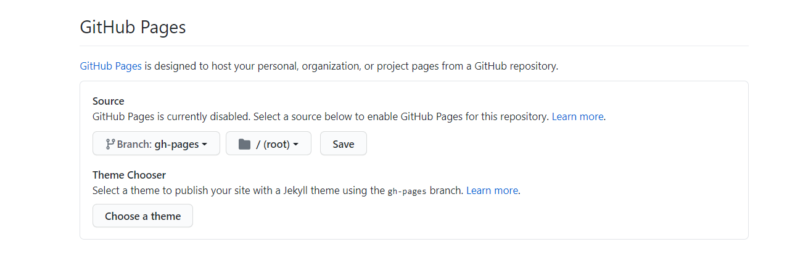
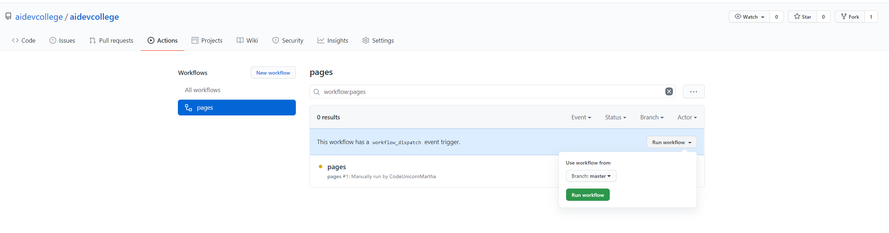
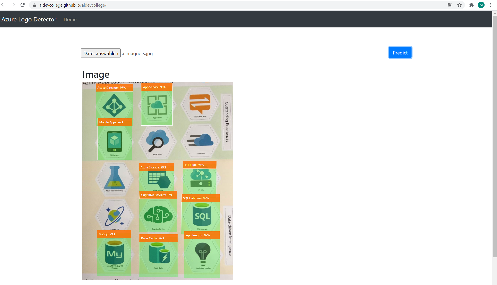

# AI Developer College Day2 - Custom Vision Application

As we have looked at Azure Machine Learning Service, MLOps, Cognitive Search, Cognitive Services so far and saw how we can enrich our applications with machine learning. As a developer I can use those REST APIs and enrich my applications without having deep ml expert knowledge. As final challenge we have prepared a small application which adopts a pre-trained object detection model. This shows the entire lifecycle and brings together best of both worlds.

## Focus of Today:


As final challenge we will explain how we trained the Custom Vision Cognitive Service and downloaded it from the Platform. As we still continue on the path of combining the ml expert view and the developer view we will then integrate this trained model in a very simple application. 

## Here is what you will learn

- How a Custom Vision Model was trained and exported on the Tensorflow Plattform
- How this model is integrated in a small application
- How to run this Node.js application
- (Optional Bonus) How to run this application on Github Pages or as a static website 

Thus we will cover the following topics in several sections:

|Topic|Section|
|---|---|
|Summary of the Custom Vision Application|[Summary of the Custom Vision Application](#summary-of-the-custom-vision-application)|
|Explanation: Training, Testing and Downloading the Model|[Explanation: Training, Testing and Downloading the Model](#explanation-training-testing-and-downloading-the-model)|
|Start the Challenge: Run the Application|[Start the Challenge: Run the Application](#start-the-challenge-run-the-application)|
|Bonus Challenge - Want more?|[Bonus Challenge - Want more?](#bonus-challenge---want-more)|


## Summary of the Custom Vision Application
<details><summary>For a detailed description of the Custom Vision Application, look here. Otherwise, please directly move onto the challenge below.</summary>
Using an Azure Custom Vision Object Detection model to detect Logos in a web browser (using TensorFlow)

This application is able to detect a logo on an image and labels it as a result. This shows how an ml expert who trained a model can then integrate this in an application as a developer would proceed. This challenge is divided into two parts, first the explanation and second the actual hands-on part. The model was trained with the [Microsoft Azure Custom Vision](https://azure.microsoft.com/en-us/services/cognitive-services/custom-vision-service/) service which we learned about in the Cognitive Services section earlier. For the training we used the [Azure Logo images](https://github.com/microsoft/AIVisualProvision/tree/master/Documents/Images/Training_DataSet). To be transparent of the origin of the data, it is used from the AI Vision Provision demo shown at the Microsoft Connect() event in 2018.

In this challenge we will use a pre-trained model which is already downloaded and run the sample code to detect logos on an uploaded image. For explanation purposes the `Training, Testing & Downloading Model part` is explained. Afterwards you will open [Visual Studio Code](https://code.visualstudio.com/docs/setup/setup-overview) using [Node.js](https://nodejs.org/en/download/) and run `npm install` as well as `node server.js` to start the project. At `http://localhost:3000` you can then test the model by uploading some of the [Azure Logo images](https://github.com/microsoft/AIVisualProvision/tree/master/Documents/Images/Training_DataSet).

## Explanation: Training, Testing and Downloading the Model

There are two options, either to choose the __Classification__ or the __Object Detection__ model. <br>
In this case to detect the objects on an image the `Object Detection Model` was chosen. For downloading purposes we chose the `General (Compact)` domain which is slightly less accurate than a standard domain with the same amount of training data.

Custom Vision Service only exports __compact__ domains. The models generated by compact domains are optimized for the constraints of real-time classification on mobile devices. Classifiers built with a compact domain may be slightly less accurate than a standard domain with the same amount of training data.
For information on improving your classifiers, see the [Improving your classifier](https://docs.microsoft.com/en-us/azure/cognitive-services/custom-vision-service/getting-started-improving-your-classifier) document. 

<br><br>


As a minimum, we recommend you use at least 30 images per tag in the initial training set. You'll also want to collect a few extra images to test your model once it's trained. For minimum viable products we recommend at least a minimum of a 100 pictures or more.

In order to train your model effectively, use images with visual variety. Select images that vary by:
- camera angle
- lighting
- background
- visual style
- individual/grouped subject(s)
- size
- type

Additionally, make sure all of your training images meet the following criteria:
- .jpg, .png, .bmp, or .gif format
- no greater than 6MB in size (4MB for prediction images)
- no less than 256 pixels on the shortest edge; any images shorter than this will be automatically scaled up by the Custom Vision Service

It's very important to tag every instance of the object(s) you want to detect, because the detector uses the untagged background area as a negative example in training. When you're done tagging, click the arrow on the right to save your tags and move on to the next image.
Labeled pictures to annotate the objects to train the model are shown below.


For training purposes - the **quick training** or the **advanced training** can be chosen.
Use advanced training for improved performance, especially on challenging and fine-grained datasets.
With advanced training, you can specify a compute time budget for training and Custom Vision will experimentally identify the best training and augmentation settings. For quick iterations, you can use the quick training.


After training has completed, the model's performance is estimated and displayed. The Custom Vision Service uses the images that you submitted for training to calculate **precision** and **recall**, using a process called k-fold cross validation. Precision and recall are two different measurements of the effectiveness of a classifier:

Precision indicates the fraction of identified classifications that were correct. For example, if the model identified 100 images as dogs, and 99 of them were actually of dogs, then the precision would be 99%.
Recall indicates the fraction of actual classifications that were correctly identified. For example, if there were actually 100 images of apples, and the model identified 80 as apples, the recall would be 80%.


Then the model is tested using the Quick Test as shown in the screenshots below:


Afterwards the Platform will be chosen, you can read more detail in the [documentation](https://docs.microsoft.com/en-us/azure/cognitive-services/custom-vision-service/export-your-model):


And finally the Model is downloaded, in this case a Tensorflow model as we use the Tensorflow framework:


### Let's look into the Code using Visual Studio Code

First we open up the Code in Visual Studio Code:


**Let's look into the code:** <br>

In the `predict.js` file there is the `Load Graph Model` Function to load the machine learning model and point it to the model.json file in the model folder:


From the custom vision service we get the `detected boxes`, `detected classes` and `detected scores` in return.
As previously shown objects are annotated by boxes, classes are detected and scores are predicted.


Further we receive the `target classes` structured in indexes and labels. Those are the labels which are shown on detected objects. 


To sum it up images are annotated by boxes, labeled with classes and receive a score to what percentage an object was detected.
</details>

## Start the Challenge: Run the Application

In the following we have two Options, either you can run the application locally or you can use a pre-deployed option and test it with the sample [images](https://github.com/microsoft/AIVisualProvision/tree/master/Documents/Images/Training_DataSet) as previously stated.

For the pre-deployed [OPTION 1](#option-1-use-a-pre-deployed-application) there is nothing to do beside copying this [url](https://tfjs-objectdetection.azureedge.net) into a Browser of your choice and uploading the sample images to test the application.

For the second [OPTION 2](#option-2-setup-your-own-application) you will have to use [Node.js](https://nodejs.org/en/download/) and [Visual Studio Code](https://code.visualstudio.com/docs/setup/setup-overview) on your local machine.
Here you will install all the depedencies and run the application.

In the [Bonus Challenge](#bonus-challenge---want-more) you can either deploy your application on [Github Pages](#option-a---github-pages) or as a [Static Website](#option-b---static-website) on a (previously created) Storage Account.

### OPTION 1: Use a pre-deployed Application

If you want, you can test the deployed application under [https://tfjs-objectdetection.azureedge.net](https://tfjs-objectdetection.azureedge.net).

### OPTION 2: Setup your own Application

As prerequisite you should install [Node.js](https://nodejs.org/en/download/) and [Visual Studio Code](https://code.visualstudio.com/docs/setup/setup-overview).

Begin by opening a **Terminal** (a Bash console, Powershell console or other environment in which you've installed Node.js):

1. Create a development directory, giving it the name `aicollege` :

    ```bash
    mkdir aicollege
    cd aicollege
    git clone https://github.com/aidevcollege/aidevcollege.git
    cd aidevcollege/day2/CustomVisionApp # Navigate `cd` to the source code folder
    code .
    ```

1. Open up a Terminal in Visual Studio Code and make sure to be in the correct directory: `aicollege/aidevcollege/day2/CustomVisionApp`
1. Install the packages for the sample with `npm install`.  This command will download the packages upon which the code depends.
1. Run the local web server script: `node server.js` and examine the results

**Final Result**

Finally you can test the model at `http://localhost:3000` by uploading some of the [Azure Logo images](https://github.com/microsoft/AIVisualProvision/tree/master/Documents/Images/Training_DataSet). <br>

This is how the model should the detect the objects as shown below:


## What we have done so far:

- How a Custom Vision Model was trained and exported on the Tensorflow Plattform
- How this model is integrated in a small application
- How to run this Node.js application

After those 2 days of combining the ml expert view and the developer view we have seen how a model is created, trained, deployed on a deployment target either manually or in an automatic manner to receive REST APIs. Further we have used REST APIs and enriched them with machine learning like the Azure Cognitive Search or used the plain Cognitive Services to enrich our application. Thus we wanted to show that there does not need to be a gap between the ml experts and the developers as both should consider the entire lifecycle which brings together best of both worlds.

ML Experts ❤︎ Developers

<br>
<br>

> **That's officially it for today - Well done! :clap:**

<br>
<br>

## Bonus Challenge - Want more?

If you have chosen Option 2 and want to run the application as a Github Pages or as a static Website you can jump either to [Option A - Github Pages](#option-a---github-pages) or [Option B - Static Website](#option-b---static-website).

#### Option A - Github Pages

**What are Github Actions?**
GitHub Actions makes it easy to automate all your software workflows, now with world-class CI/CD. Build, test, and deploy your code right from GitHub. Make code reviews, branch management, and issue triaging work the way you want. If you want more detail you can read the following [documentation](https://github.com/features/actions)

In this repository there is a github action included. You can run the `Github Action` on the root level manually using the Github User Interface. For this you need to `fork` the aidevcollege repository: https://github.com/aidevcollege/aidevcollege to your Github Account.

> If you don't have an account yet sign up [here](https://github.com/join).

Be sure to enable and **save** `Github Pages` underneath the `Settings`, beneath `Options` and select **Branch:** `gh-pages:`



Then go to `Actions`, enable the Workflows, select the workflow: `pages` and hit `Run workflow` as shown below:



Finally this application is hosted by Github Pages it should have a url like `https://<YourGithubUsername>.github.io/aidevcollege/` which you can find on your main page of your forked repository underneath `Environments`:



#### Option B - Static Website

If you want to create your own `static website` by deploying the application on a (previously created) Storage Account, we have added another `Github Action` in the folder `day2/CustomVisionApp/.github/workflows`. Read the links below how to get this sample running:

If you create a `service principal` and a [`secret from a pre deployed storage account`](https://github.com/Azure/actions-workflow-samples/blob/master/assets/create-secrets-for-GitHub-workflows.md), you can use the [`static website`](https://docs.microsoft.com/en-us/azure/storage/blobs/storage-blobs-static-site-github-actions) feature from the storage account. The documentation on how to complete the tasks are included in the links.

[Back to AI Developer College Overview](../../README.md)

### References
 YouTube Video: https://www.youtube.com/watch?v=7gOYpT732ow&list=PLZk8J6FocZbaClHkIPk4SWZHxn_9VArb5&index=2
