# Using an Azure Custom Vision Object Detection model to detect Logos in a web browser (using TensorFlow)

This example shows you how to use a Machine Learning, which was created with the [Microsoft Azure Custom Vision](https://azure.microsoft.com/en-us/services/cognitive-services/custom-vision-service/) service, in a web browser application.

The [Azure Logo images](https://github.com/microsoft/AIVisualProvision/tree/master/Documents/Images/Training_DataSet) used in this example, are from the AI Vision Provision demo shown at the Microsoft Connect() event in 2018 and are not published with this repository.

## Training, Testing and Downloading the Model

There are two options, either to choose the __Classification__ or the __Object Detection__ model. <br>
In this case to detect the objects on an image the `Object Detection Model` was chosen. For downloading purposes we chose the `General (Compact)` domain which is slightly less accurate than a standard domain with the same amount of training data.

> [!IMPORTANT]
> Custom Vision Service only exports __compact__ domains. The models generated by compact domains are optimized for the constraints of real-time classification on mobile devices. Classifiers built with a compact domain may be slightly less accurate than a standard domain with the same amount of training data.
>
> For information on improving your classifiers, see the [Improving your classifier](getting-started-improving-your-classifier.md) document. For information on improving your classifiers, see the Improving your classifier document.

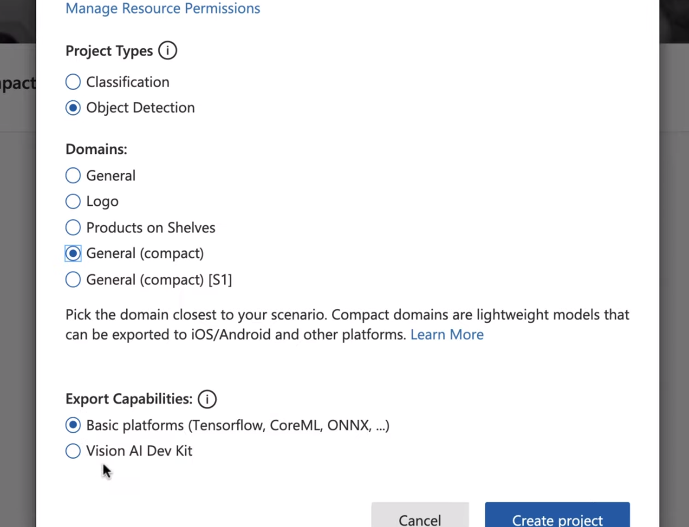

As a minimum, we recommend you use at least 30 images per tag in the initial training set. You'll also want to collect a few extra images to test your model once it's trained.

In order to train your model effectively, use images with visual variety. Select images that vary by:
- camera angle
- lighting
- background
- visual style
- individual/grouped subject(s)
- size
- type

Additionally, make sure all of your training images meet the following criteria:
- .jpg, .png, .bmp, or .gif format
- no greater than 6MB in size (4MB for prediction images)
- no less than 256 pixels on the shortest edge; any images shorter than this will be automatically scaled up by the Custom Vision Service

It's very important to tag every instance of the object(s) you want to detect, because the detector uses the untagged background area as a negative example in training. When you're done tagging, click the arrow on the right to save your tags and move on to the next image.
Labeled pictures to annotate the objects to train the model are shown below.

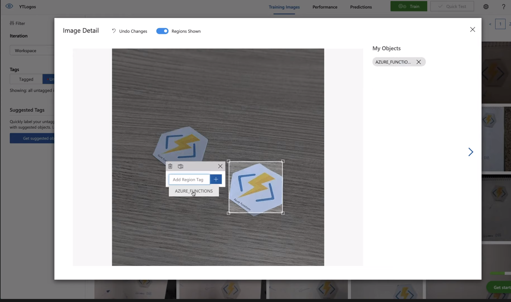

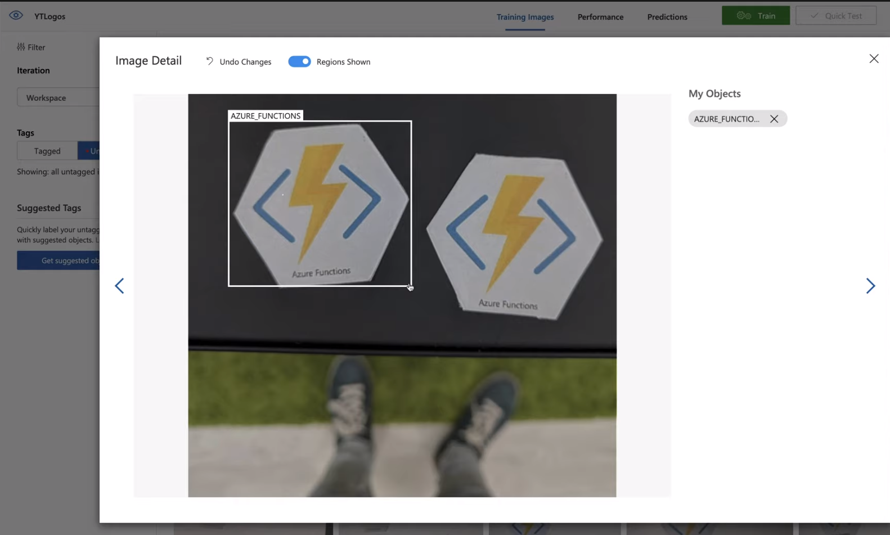

For training purposes - the **quick training** or the **advanced training** can be chosen.
Use advanced training for improved performance, especially on challenging and fine-grained datasets.
With advanced training, you can specify a compute time budget for training and Custom Vision will experimentally identify the best training and augmentation settings. For quick iterations, you can use the quick training.

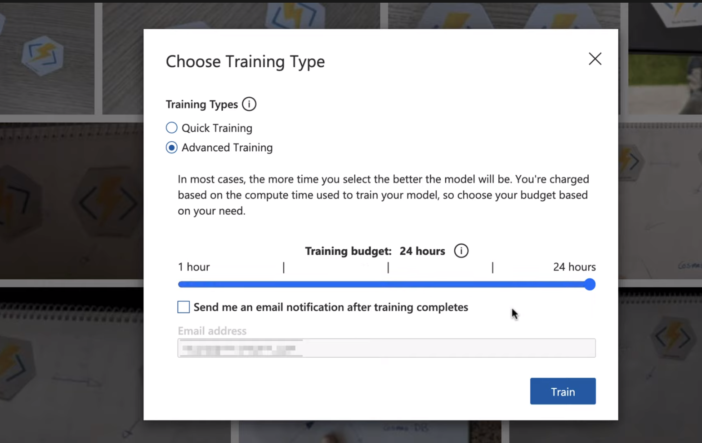

After training has completed, the model's performance is estimated and displayed. The Custom Vision Service uses the images that you submitted for training to calculate **precision** and **recall**, using a process called k-fold cross validation. Precision and recall are two different measurements of the effectiveness of a classifier:

Precision indicates the fraction of identified classifications that were correct. For example, if the model identified 100 images as dogs, and 99 of them were actually of dogs, then the precision would be 99%.
Recall indicates the fraction of actual classifications that were correctly identified. For example, if there were actually 100 images of apples, and the model identified 80 as apples, the recall would be 80%.

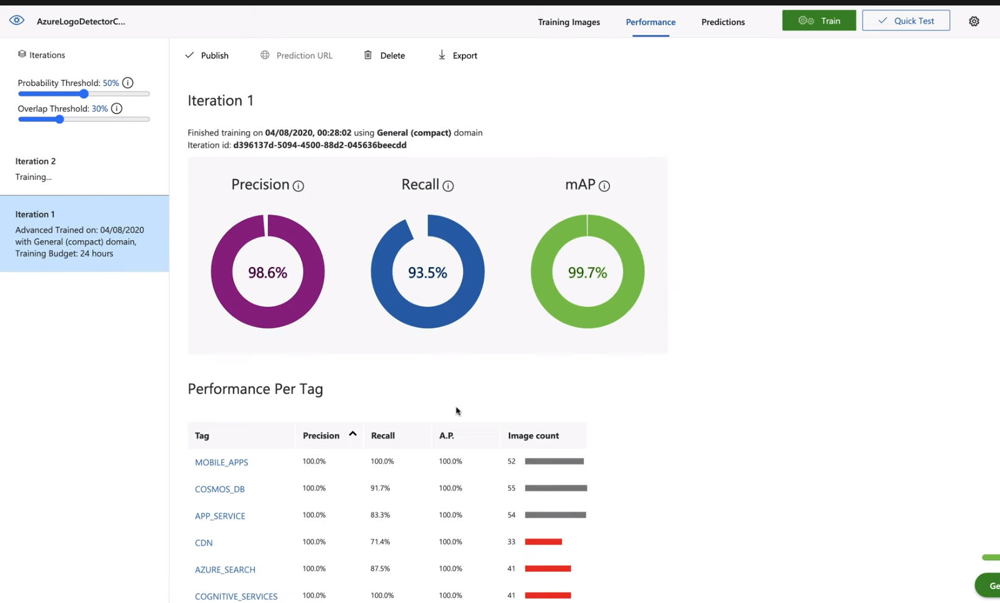

Then the model is tested using the Quick Test as shown in the screenshots below:

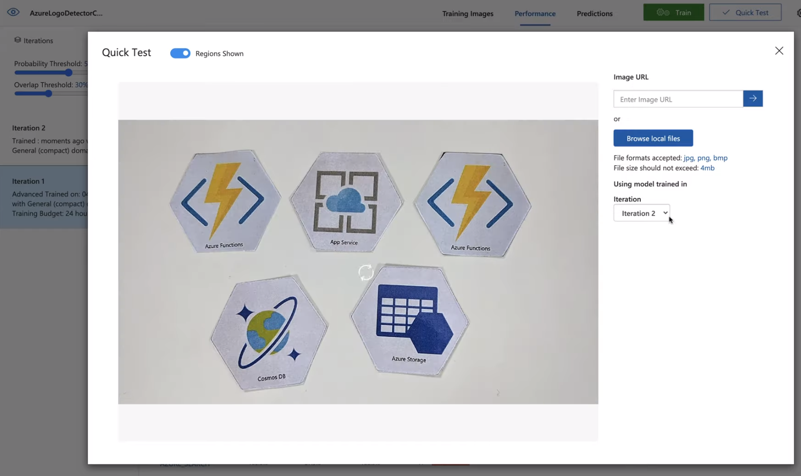

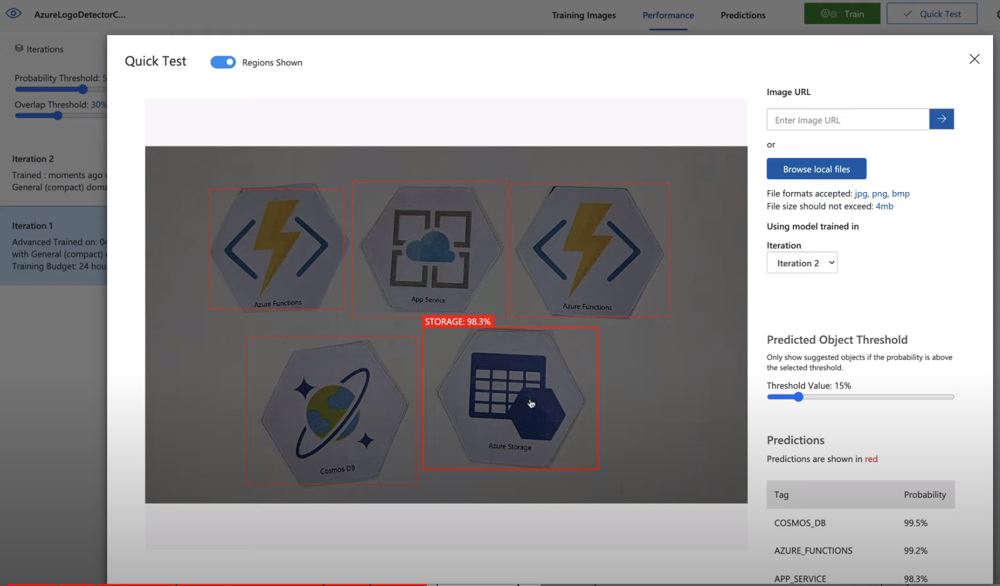

Then the Plattform will be chosen:

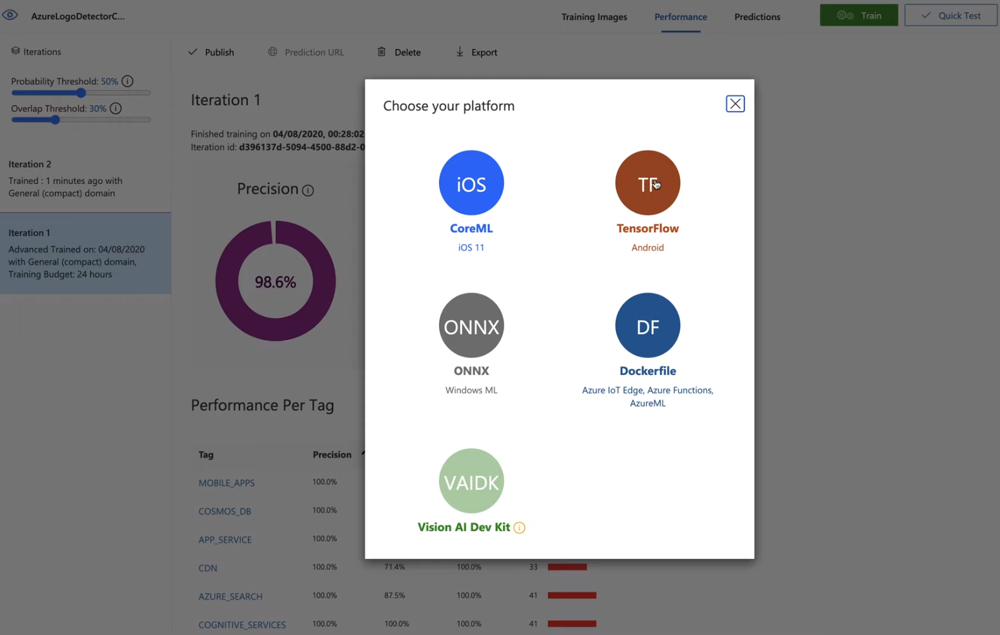

And finally the Model is downloaded:

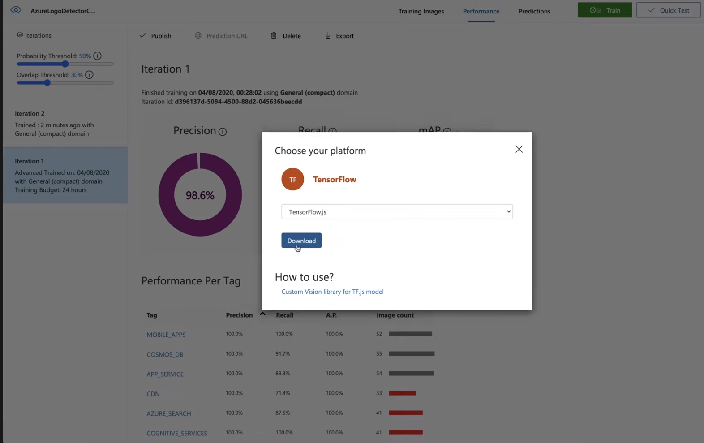

## Open the Custom Vision App in Visual Studio Code

First we open up the Code in Visual Studio:

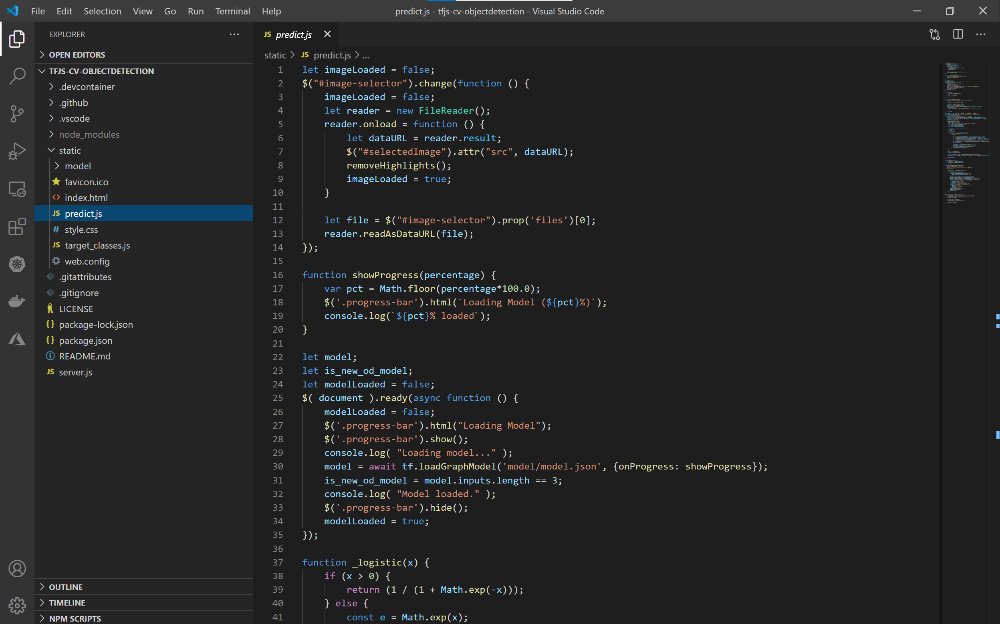

## Let's look into the code

In the `predict.js` file there is the `Load Model` Function to load the machine learning model:

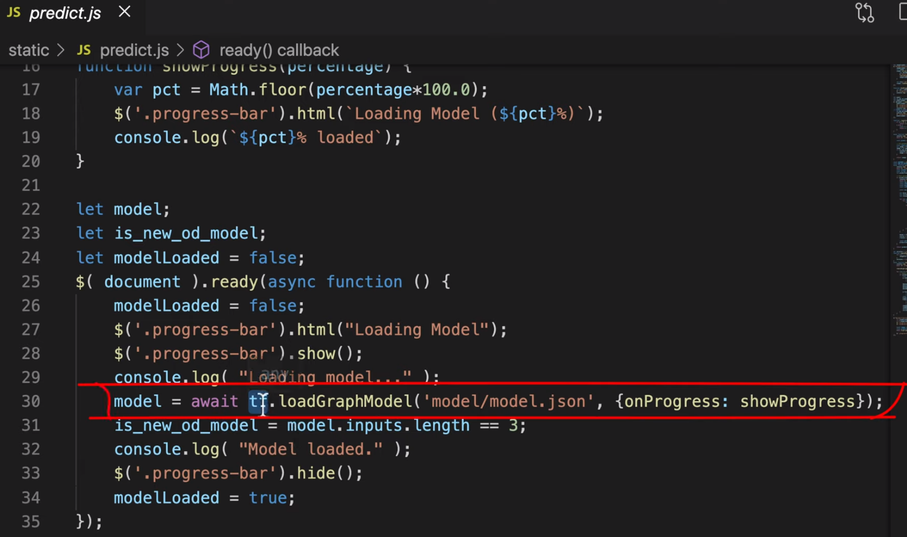

From the custom vision service we get the `detected boxes`, `detected classes` and `detected scores` in return:
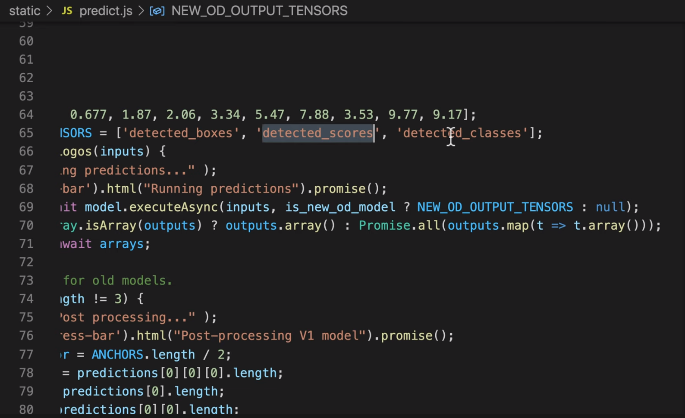

Further we receive the `target classes` structured in indexes and labels:
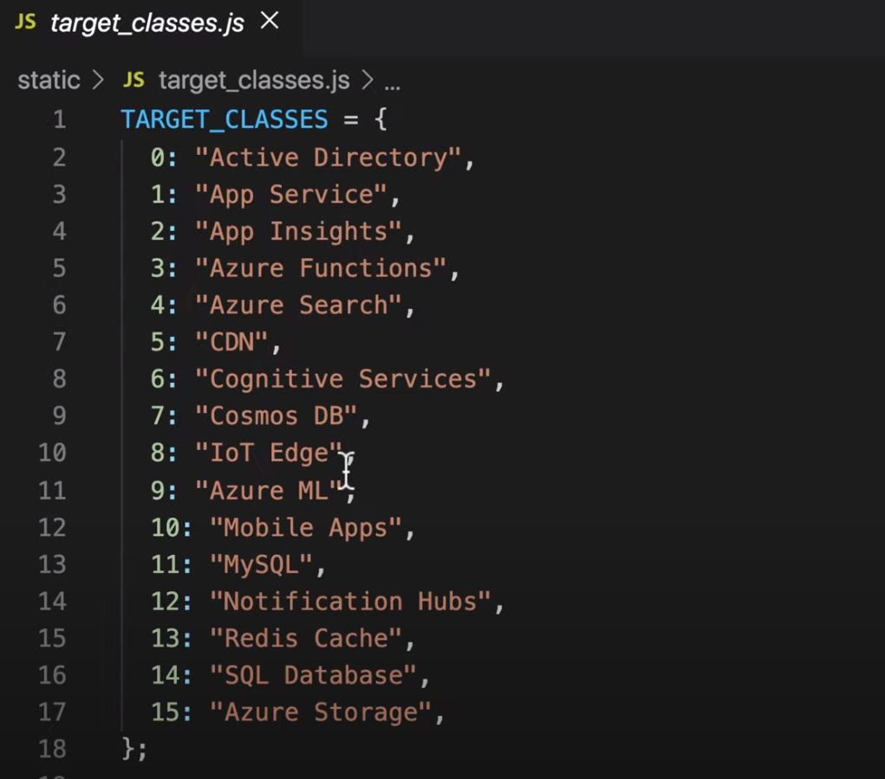

## Setup

Open up a Terminal:

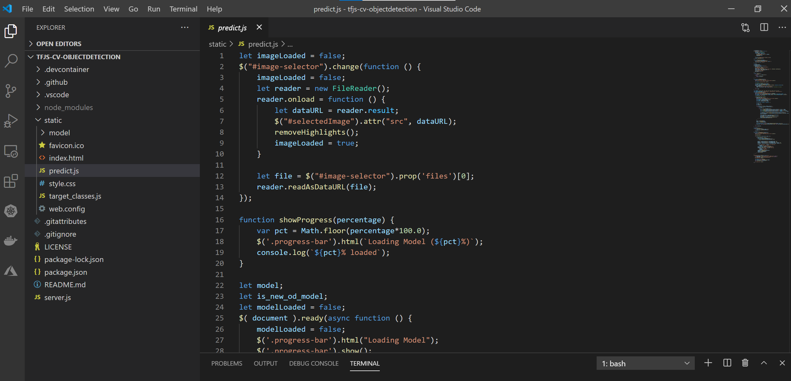

Prepare the node environments:
```sh
$ npm install
# Or
$ yarn
```

Run the local web server script:
```sh
$ node server.js
```

## Final Result

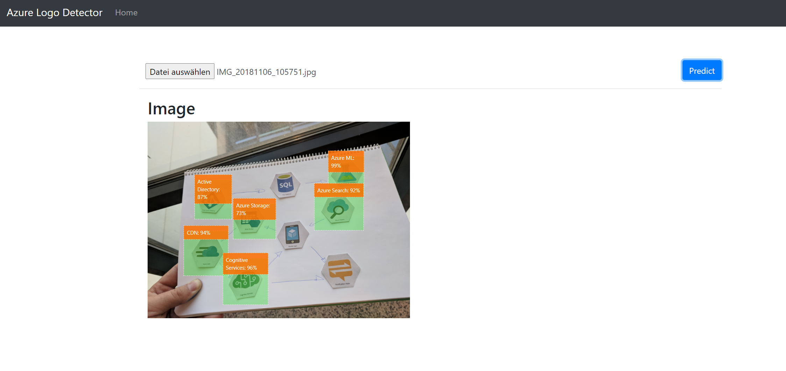

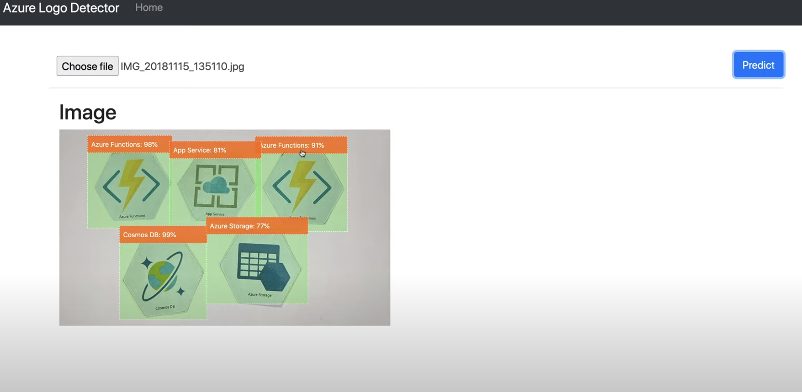

## Demo

If you want, you can test the deployed application under under [https://tfjs-objectdetection.azureedge.net](https://tfjs-objectdetection.azureedge.net).


## References
 YouTube Video: https://www.youtube.com/watch?v=7gOYpT732ow&list=PLZk8J6FocZbaClHkIPk4SWZHxn_9VArb5&index=2


