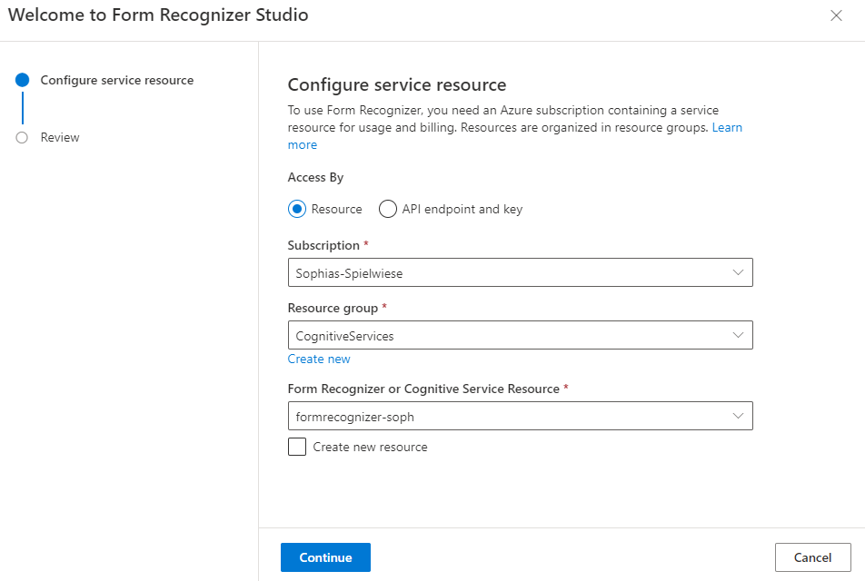
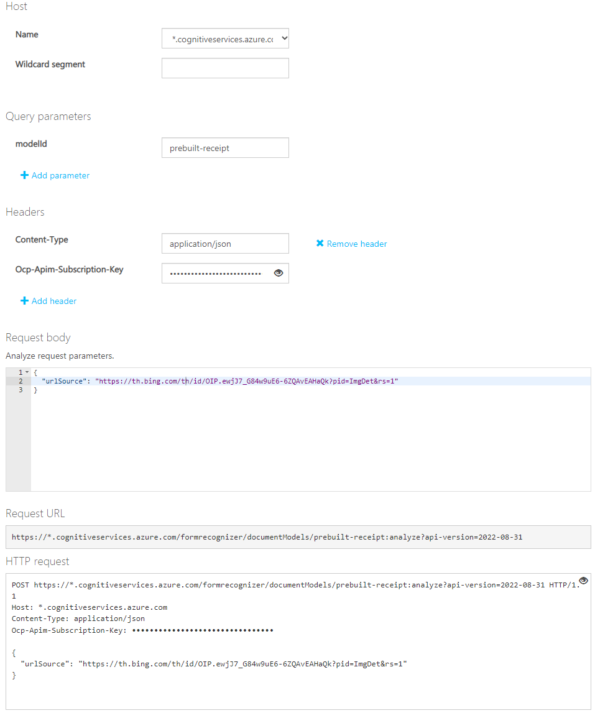
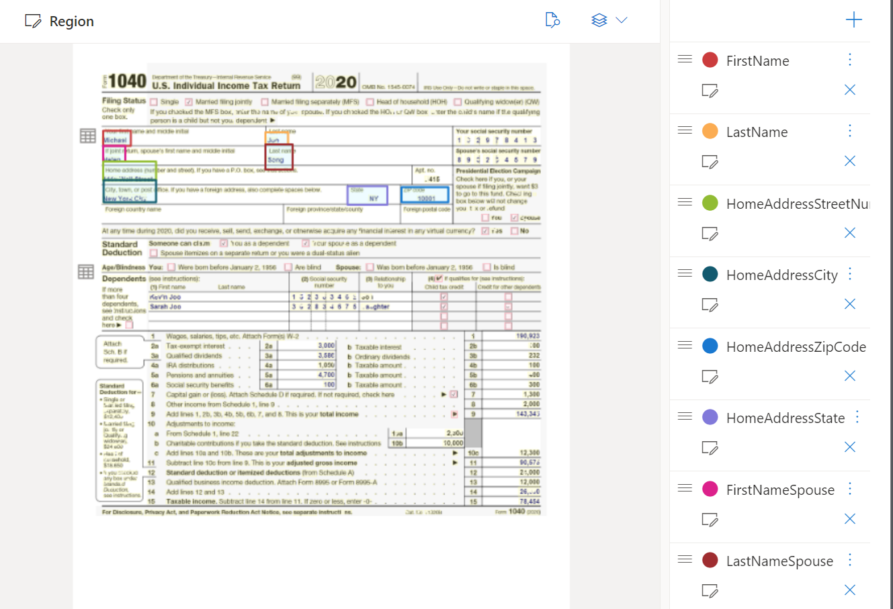

# AI Developer College Day2 - Form Recognizer

Azure Form Recognizer is a cloud-based [Azure Applied AI Service](https://learn.microsoft.com/en-us/azure/applied-ai-services/?view=form-recog-3.0.0) for developers to build intelligent document processing solutions. Form Recognizer applies machine-learning-based optical character recognition (OCR) and document understanding technologies to extract text, tables, structure, and key-value pairs from documents. You can also label and train custom models to automate data extraction from structured, semi-structured, and unstructured documents.

## Focus of Today:

Form recognizer comes with a selection of prebuilt models. It is also possible to build and train your own custom model for your specific needs. In the following challenges you will try out the different options you have when using Form Recognizer.

## Here is what you will learn

- Deploy the service using Azure CLI
- Operate the User Interface (Form Recognizer Studio), the SDK and Rest API
- Utilise Form Recognizer's prebuilt models
- Build custom models

## Challenges

1. Create Form Recognizer resource: westeurope, pricing tier free F0
1. Get key and endpoint

## Create Form Recognizer resource

Before we can start using Form Recognizer, we first need to deploy the resource in Azure. We will do this using the Azure CLI.

Like in the challenges before, open the cloud shell in the Azure portal. To ensure you are using the correct Azure subscription, type ```az account show``` and to change the subscription type ```az account set --subscription <NAME OR ID OF YOUR SUBSCRIPTION>```.

Next copy the following command, edit the needed information and paste the command into your cloud shell.

```bash
az cognitiveservices account create --name <NAME OF RESOURCE> --resou
rce-group <NAME OF YOUR RESOURCE GROUP> --kind FormRecognizer --sku F0 --location westeurope
```
**Hint**: In case you have already created a Form Recognizer resource with the free tier (F0) previously, change the sku to "S0".

Now we need to get the key and endpoint of our resource.

```bash
az cognitiveservices account keys list --name <NAME OF RESOURCE> --resource-group <NAME OF YOUR RESOURCE GROUP>
```


## Form Recognizer model types

As mentioned before, Form Recognizer has a selection of models you can leverage. In the following, you will get to try out a few of them.

### Read OCR Model

The [Form Recognizer Read OCR Model](https://learn.microsoft.com/en-us/azure/applied-ai-services/form-recognizer/concept-read?view=form-recog-3.0.0) extracts print and handwritten text from PDF documents and scanned images. It detects paragraphs, text lines, words, locations, and languages. The read model is the underlying OCR engine for other Form Recognizer prebuilt models like Layout, General Document, Invoice, Receipt, Identity (ID) document, in addition to custom models.

You will be trying this out using the User Interface - Form Recognizer Studio.

1. Go to the [Form Recognizer Studio](https://formrecognizer.appliedai.azure.com/studio) and click on _Read_.
1. In the pop-up window, select your Azure subscription, resource group and Form Recognizer resource.
</br>


1. You can analyse the sample document or upload your own sample.

1. Select the _Analyze_ button.

It is also possible to utilise the Form Recognizer APIs using the SDK or RestAPI. In the following, you will be leveraging the Prebuilt Invoice Model using the Python SDK.

### Invoice Model 

The Form Recognizer [invoice model](https://learn.microsoft.com/en-us/azure/applied-ai-services/form-recognizer/concept-invoice?view=form-recog-3.0.0) combines powerful Optical Character Recognition (OCR) capabilities with invoice understanding models to analyze and extract key fields and line items from sales invoices. Invoices can be of various formats and quality including phone-captured images, scanned documents, and digital PDFs. The Form Recognizer invoice model combines powerful Optical Character Recognition (OCR) capabilities with invoice understanding models to analyze and extract key fields and line items from sales invoices. Invoices can be of various formats and quality including phone-captured images, scanned documents, and digital PDFs.

You can reuse the Jupyter notebook created on day one of the AI College for Developers. First of all, create a new `Python 3.8 - AzureML` notebook in your Jupyter notebook.

In the first cell, install the Form Recognizer SDK:
```bash
pip install azure-ai-formrecognizer==3.2.0
```

Then import all necessary libraries:
```python
# import libraries
import os
from azure.ai.formrecognizer import DocumentAnalysisClient
from azure.core.credentials import AzureKeyCredential
```

Find out the API key and endpoint of your Form Recognizer resource using the Azure CLI:
```bash
# Get the endpoint for the form recognizer resource
az cognitiveservices account show --name "resource-name" --resource-group "resource-group-name" --query "properties.endpoint"
# Get the endpoint for the form recognizer resource
az cognitiveservices account show --name "resource-name" --resource-group "resource-group-name" --query "properties.endpoint"
```

Afterwards, add this information to the following script and paste it into a new cell in your jupyter notebook:
```python
endpoint = "<YOUR-ENDPOINT>"
key = "<YOUR-API-KEY>"
```

Finally, paste the following code in a new cell to analyse the invoice. Feel free to use the sample invoice or analyse your own invoice if you prefer. You can do this by editing `invoiceUrl`.
```python
def analyze_invoice():

    invoiceUrl = "https://raw.githubusercontent.com/Azure-Samples/cognitive-services-REST-api-samples/master/curl/form-recognizer/sample-invoice.pdf"

    document_analysis_client = DocumentAnalysisClient(
        endpoint=endpoint, credential=AzureKeyCredential(key)
    )

    poller = document_analysis_client.begin_analyze_document_from_url(
            "prebuilt-invoice", invoiceUrl)
    invoices = poller.result()

    for idx, invoice in enumerate(invoices.documents):
        print("--------Recognizing invoice #{}--------".format(idx + 1))
        vendor_name = invoice.fields.get("VendorName")
        if vendor_name:
            print(
                "Vendor Name: {} has confidence: {}".format(
                    vendor_name.value, vendor_name.confidence
                )
            )
        vendor_address = invoice.fields.get("VendorAddress")
        if vendor_address:
            print(
                "Vendor Address: {} has confidence: {}".format(
                    vendor_address.value, vendor_address.confidence
                )
            )
        customer_name = invoice.fields.get("CustomerName")
        if customer_name:
            print(
                "Customer Name: {} has confidence: {}".format(
                    customer_name.value, customer_name.confidence
                )
            )
        customer_address = invoice.fields.get("CustomerAddress")
        if customer_address:
            print(
                "Customer Address: {} has confidence: {}".format(
                    customer_address.value, customer_address.confidence
                )
            )
        invoice_date = invoice.fields.get("InvoiceDate")
        if invoice_date:
            print(
                "Invoice Date: {} has confidence: {}".format(
                    invoice_date.value, invoice_date.confidence
                )
            )
        invoice_total = invoice.fields.get("InvoiceTotal")
        if invoice_total:
            print(
                "Invoice Total: {} has confidence: {}".format(
                    invoice_total.value, invoice_total.confidence
                )
            )
        due_date = invoice.fields.get("DueDate")
        if due_date:
            print(
                "Due Date: {} has confidence: {}".format(
                    due_date.value, due_date.confidence
                )
            )
        billing_address = invoice.fields.get("BillingAddress")
        if billing_address:
            print(
                "Billing Address: {} has confidence: {}".format(
                    billing_address.value, billing_address.confidence
                )
            )
        billing_address_recipient = invoice.fields.get("BillingAddressRecipient")
        if billing_address_recipient:
            print(
                "Billing Address Recipient: {} has confidence: {}".format(
                    billing_address_recipient.value,
                    billing_address_recipient.confidence,
                )
            )
        shipping_address = invoice.fields.get("ShippingAddress")
        if shipping_address:
            print(
                "Shipping Address: {} has confidence: {}".format(
                    shipping_address.value, shipping_address.confidence
                )
            )
        shipping_address_recipient = invoice.fields.get("ShippingAddressRecipient")
        if shipping_address_recipient:
            print(
                "Shipping Address Recipient: {} has confidence: {}".format(
                    shipping_address_recipient.value,
                    shipping_address_recipient.confidence,
                )
            )
        print("Invoice items:")
        for idx, item in enumerate(invoice.fields.get("Items").value):
            print("...Item #{}".format(idx + 1))
            item_description = item.value.get("Description")
            if item_description:
                print(
                    "......Description: {} has confidence: {}".format(
                        item_description.value, item_description.confidence
                    )
                )
            item_quantity = item.value.get("Quantity")
            if item_quantity:
                print(
                    "......Quantity: {} has confidence: {}".format(
                        item_quantity.value, item_quantity.confidence
                    )
                )
            unit = item.value.get("Unit")
            if unit:
                print(
                    "......Unit: {} has confidence: {}".format(
                        unit.value, unit.confidence
                    )
                )
            unit_price = item.value.get("UnitPrice")
            if unit_price:
                print(
                    "......Unit Price: {} has confidence: {}".format(
                        unit_price.value, unit_price.confidence
                    )
                )
            item_date = item.value.get("Date")
            if item_date:
                print(
                    "......Date: {} has confidence: {}".format(
                        item_date.value, item_date.confidence
                    )
                )
            amount = item.value.get("Amount")
            if amount:
                print(
                    "......Amount: {} has confidence: {}".format(
                        amount.value, amount.confidence
                    )
                )
        total_tax = invoice.fields.get("TotalTax")
        if total_tax:
            print(
                "Total Tax: {} has confidence: {}".format(
                    total_tax.value, total_tax.confidence
                )
            )
        amount_due = invoice.fields.get("AmountDue")
        if amount_due:
            print(
                "Amount Due: {} has confidence: {}".format(
                    amount_due.value, amount_due.confidence
                )
            )


if __name__ == "__main__":
    analyze_invoice()

    print("----------------------------------------")
```


### Optional: Receipt Model

The Form Recognizer [receipt model](https://learn.microsoft.com/en-us/azure/applied-ai-services/form-recognizer/concept-receipt?view=form-recog-3.0.0) combines powerful Optical Character Recognition (OCR) capabilities with deep learning models to analyze and extract key information from sales receipts. Receipts can be of various formats and quality including printed and handwritten receipts. The API extracts key information such as merchant name, merchant phone number, transaction date, tax, and transaction total and returns structured JSON data.

Please not that the receipt model does currently not support German language receipts.

This time we will perform simple Rest API calls to utilise the API. To receive a response from the API, there are two requests necessary - POST request to send the receipt and receive the resultId and a GET request to receive the analyse result.

1. To perform the POST request go to the [Swagger](https://westus.dev.cognitive.microsoft.com/docs/services/form-recognizer-api-2022-08-31/operations/AnalyzeDocument).
1. Scroll down and select your resource region, e.g. West Europe.
1. As _Host_ select `*.cognitiveservices.azure.com` and as modelId `prebuilt-receipt`.
1. Paste the Form Recognizer API key in `Ocp-Apim-Subscription-Key`.
1. Paste a link to an image of a receipt into the Request body, for example:
    ```
    "urlSource": "https://th.bing.com/th/id/OIP.ewjJ7_G84w9uE6-6ZQAvEAHaQk?pid=ImgDet&rs=1"
    ```
1. Hit `Send`
    
1. Copy the `apim-request-id` from the response.
1. Go to the [Swagger](https://westus.dev.cognitive.microsoft.com/docs/services/form-recognizer-api-2022-08-31/operations/GetAnalyzeDocumentResult) to perform the GET request.
1. Select your resource region.
1. Type `prebuilt-receipt` in modelId.
1. Paste the previously copied `apim-request-id` in resultId.
1. Input the resource's API key again.
1. Hit Send

You should now receive a JSON response showing the information on the receipt.

### Custom Model

With Form Recognizer, you can use prebuilt or pre-trained models, of which we have introduced you to some previously.

Moreover, you can train standalone [custom models](https://learn.microsoft.com/en-us/azure/applied-ai-services/form-recognizer/concept-custom?view=form-recog-3.0.0). Custom models extract and analyze distinct data and use cases from forms and documents specific to your business.

We will train our own custom model using the Form Recognizer Studio.

1. Download some sample training data from [here](https://github.com/Azure-Samples/cognitive-services-REST-api-samples/blob/master/curl/form-recognizer/1040-training-data.zip) and unzip it or use your own sample forms for training.
1. Go into the [studio](https://formrecognizer.appliedai.azure.com/studio?source=azureportal) and Select `Custom model`.
1. Select the `Create a project` button.
1. Provide a name for your project and select `continue`.
1. On the next step, choose your Subscription and Form Recognizer resource.
1. Select or create a Storage account.
1. Review your project settings and select `Create Project`.
1. Next you want to label your data. To start labeling your dataset, you first need to upload the sample data by selecting `Browse for a file`.
1. Now, you need to label the sample data as shown in the screenshot below:

Do not label one of the documents and delete it. We will need this file for testing purposes.
1. Hit the `Train` button, enter a model name and select `Template` as Build Mode.
1. After a few minutes, the training should be completed and you can see how high the accuracy of your model is. The more training data you use, the higher the accuracy will get.
1. Select `Test` and upload the file which you didn't use for training.
1. Hit the `Analyze` button and check out the result.

Now that you have tried a selection of Form Recognizer models, you might be wondering which is the right one for your use case. This [table](https://learn.microsoft.com/en-us/azure/applied-ai-services/form-recognizer/overview?view=form-recog-3.0.0#which-form-recognizer-model-should-i-use) will give you an overview of which model to use.

## What we have done so far:

- We deployed Azure Form Recognizer using Azure CLI.
- We tried out different models using the Python SDK, Rest API and Form Recognizer studio.
- We trained a custom Form Recognizer model using the UI.

In a next step, we want to see how the cognitive services can be embedded into an application.

:zap: Let's go to **[AI Developer College Day 2 - Cognitive Services Kitchen Sink App](https://github.com/azuredevcollege/cognitive-services-kitchen-sink)**!

## House Keeping: Lab Cleanup

Remove the sample resource group at the end of the day.

```shell
$ az group delete -n <yourResourceGroupName>
```
